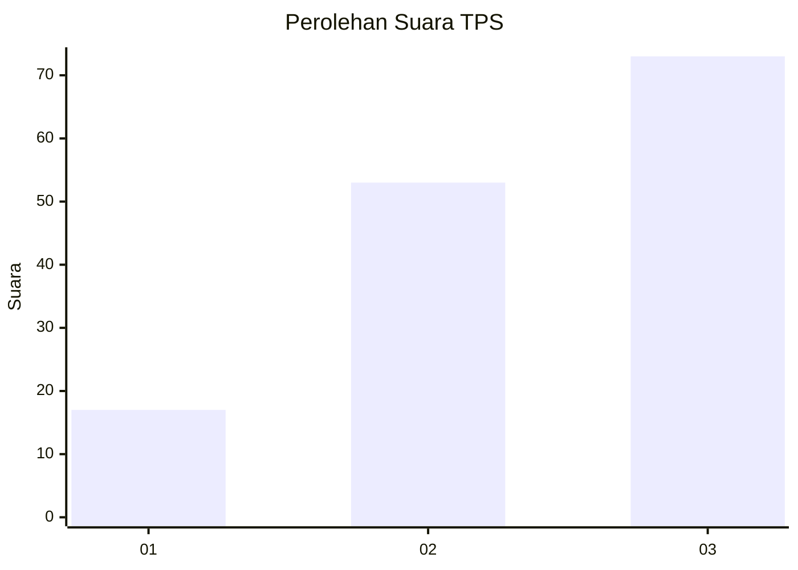
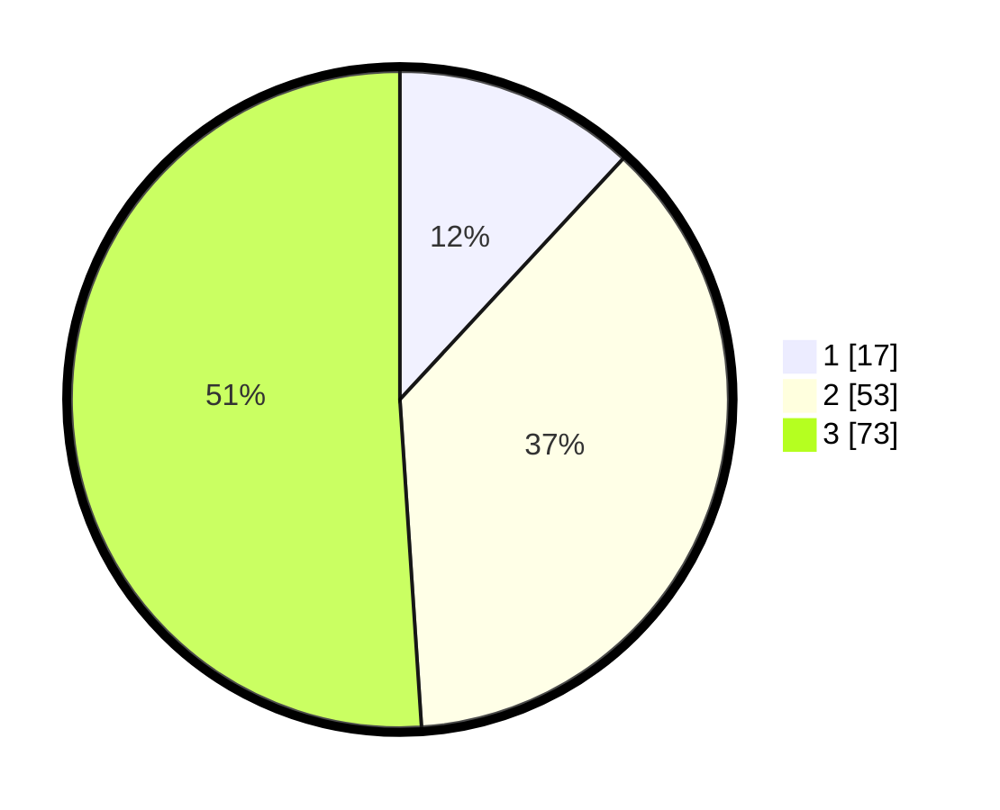

# Hasil

## Grafik

## Tabel

| No. | Nama Paslon    | Suara | Suara (raw) | Persentase |
|:--- |:-------------- | -----:| -----------:| ----------:|
| 1   | ANIES MUHAIMIN | 17    | [17][p-1]   | 11,89      |
| 2   | PRABOWO GIBRAN | 53    | [53][p-2]   | 37,06      |
| 3   | GANJAR MAHFUD  | 73    | [73][p-3]   | 51,05      |

[p-1]: https://github.com/gigit-pemilu/pemilu-2024/blob/main/pilpres/hitung-suara/sub/33-jawa-tengah/sub/10-klaten/sub/06-trucuk/sub/2011-sabranglor/sub/009-tps/sub/paslon-1.txt
[p-2]: https://github.com/gigit-pemilu/pemilu-2024/blob/main/pilpres/hitung-suara/sub/33-jawa-tengah/sub/10-klaten/sub/06-trucuk/sub/2011-sabranglor/sub/009-tps/sub/paslon-2.txt
[p-3]: https://github.com/gigit-pemilu/pemilu-2024/blob/main/pilpres/hitung-suara/sub/33-jawa-tengah/sub/10-klaten/sub/06-trucuk/sub/2011-sabranglor/sub/009-tps/sub/paslon-3.txt

## Foto C Plano

https://sirekap-obj-formc.kpu.go.id/3d1c/pemilu/ppwp/33/10/06/20/11/3310062011009-20240214-222850--249bd8b0-9681-43b8-9612-efdc47bb8d8e.jpg

https://sirekap-obj-formc.kpu.go.id/3d1c/pemilu/ppwp/33/10/06/20/11/3310062011009-20240214-222945--60b9a196-5fff-430f-a584-ab648ab7c6b6.jpg

https://sirekap-obj-formc.kpu.go.id/3d1c/pemilu/ppwp/33/10/06/20/11/3310062011009-20240214-223038--5b118eb0-8c1f-401f-826d-b9d176fcb473.jpg

## Metadata

| Key        | Value               |
| ---------- | ------------------- |
| Time Stamp | 2024-02-16 11:00:29 |

