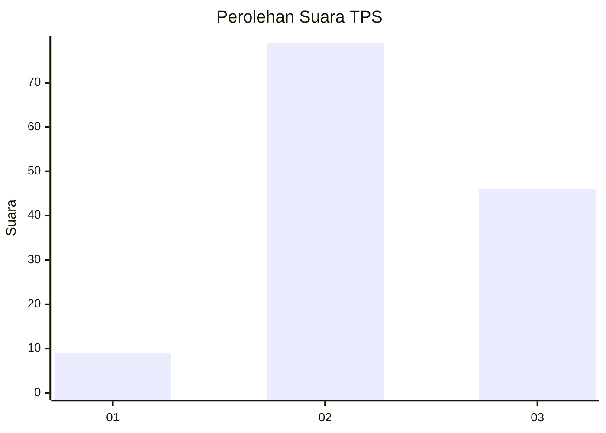
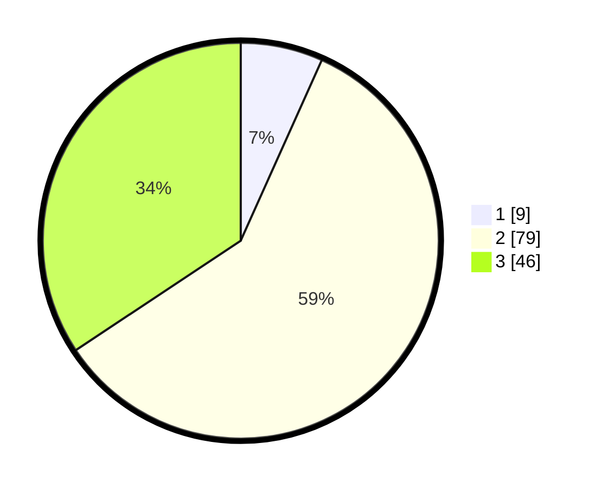

# Hasil

## Grafik

## Tabel

| No. | Nama Paslon    | Suara | Suara (raw) | Persentase |
|:--- |:-------------- | -----:| -----------:| ----------:|
| 1   | ANIES MUHAIMIN | 9     | [9][p-1]    | 6,72       |
| 2   | PRABOWO GIBRAN | 79    | [79][p-2]   | 58,96      |
| 3   | GANJAR MAHFUD  | 46    | [46][p-3]   | 34,33      |

[p-1]: https://github.com/gigit-pemilu/pemilu-2024/blob/main/pilpres/hitung-suara/sub/33-jawa-tengah/sub/10-klaten/sub/06-trucuk/sub/2012-jatipuro/sub/008-tps/sub/paslon-1.txt
[p-2]: https://github.com/gigit-pemilu/pemilu-2024/blob/main/pilpres/hitung-suara/sub/33-jawa-tengah/sub/10-klaten/sub/06-trucuk/sub/2012-jatipuro/sub/008-tps/sub/paslon-2.txt
[p-3]: https://github.com/gigit-pemilu/pemilu-2024/blob/main/pilpres/hitung-suara/sub/33-jawa-tengah/sub/10-klaten/sub/06-trucuk/sub/2012-jatipuro/sub/008-tps/sub/paslon-3.txt

## Foto C Plano

https://sirekap-obj-formc.kpu.go.id/7044/pemilu/ppwp/33/10/06/20/12/3310062012008-20240216-193232--469907f5-6c40-4bb4-812d-03e70cb62ab4.jpg

https://sirekap-obj-formc.kpu.go.id/7044/pemilu/ppwp/33/10/06/20/12/3310062012008-20240216-193322--7c429ebc-1681-4ad3-b611-ce9400de5ba5.jpg

https://sirekap-obj-formc.kpu.go.id/7044/pemilu/ppwp/33/10/06/20/12/3310062012008-20240216-193401--3fcca310-e4e3-44f7-8e7a-fd7fdd5c6ebe.jpg

## Metadata

| Key        | Value               |
| ---------- | ------------------- |
| Time Stamp | 2024-02-19 06:16:00 |

