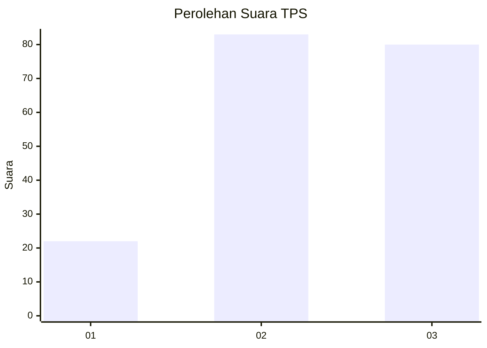
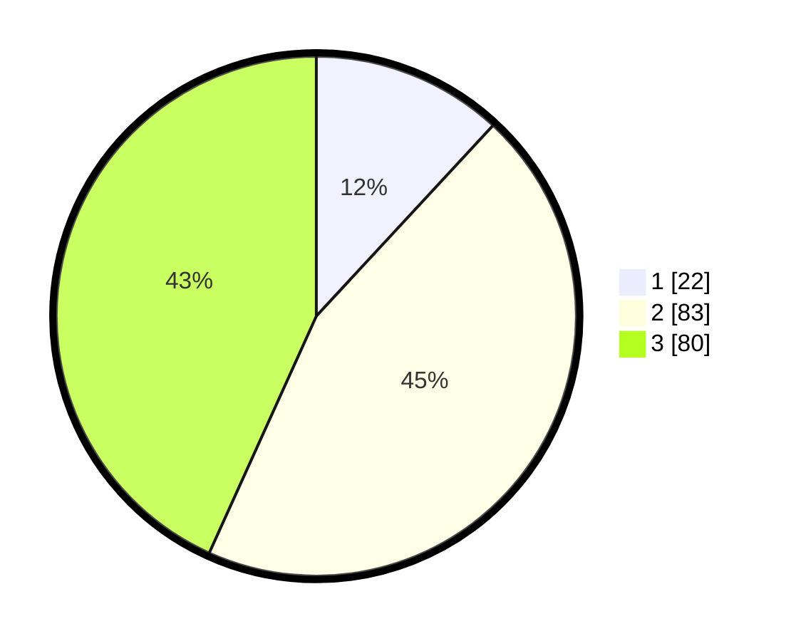

# Hasil

## Grafik

## Tabel

| No. | Nama Paslon    | Suara | Suara (raw) | Persentase |
|:--- |:-------------- | -----:| -----------:| ----------:|
| 1   | ANIES MUHAIMIN | 22    | [22][p-1]   | 11,89      |
| 2   | PRABOWO GIBRAN | 83    | [83][p-2]   | 44,86      |
| 3   | GANJAR MAHFUD  | 80    | [80][p-3]   | 43,24      |

[p-1]: https://github.com/gigit-pemilu/pemilu-2024/blob/main/pilpres/hitung-suara/sub/33-jawa-tengah/sub/10-klaten/sub/07-kebonarum/sub/2001-gondang/sub/006-tps/sub/paslon-1.txt
[p-2]: https://github.com/gigit-pemilu/pemilu-2024/blob/main/pilpres/hitung-suara/sub/33-jawa-tengah/sub/10-klaten/sub/07-kebonarum/sub/2001-gondang/sub/006-tps/sub/paslon-2.txt
[p-3]: https://github.com/gigit-pemilu/pemilu-2024/blob/main/pilpres/hitung-suara/sub/33-jawa-tengah/sub/10-klaten/sub/07-kebonarum/sub/2001-gondang/sub/006-tps/sub/paslon-3.txt

## Foto C Plano

https://sirekap-obj-formc.kpu.go.id/7892/pemilu/ppwp/33/10/07/20/01/3310072001006-20240214-235443--4d0419f4-ac8d-44b7-ab83-45172bd232af.jpg

https://sirekap-obj-formc.kpu.go.id/7892/pemilu/ppwp/33/10/07/20/01/3310072001006-20240214-235731--00a861b4-3d0e-40f1-8733-aef7116b0dfe.jpg

https://sirekap-obj-formc.kpu.go.id/7892/pemilu/ppwp/33/10/07/20/01/3310072001006-20240214-235759--dac1ebab-ff4b-4838-a6f6-eaf66722bd16.jpg

## Metadata

| Key        | Value               |
| ---------- | ------------------- |
| Time Stamp | 2024-02-15 04:00:24 |

