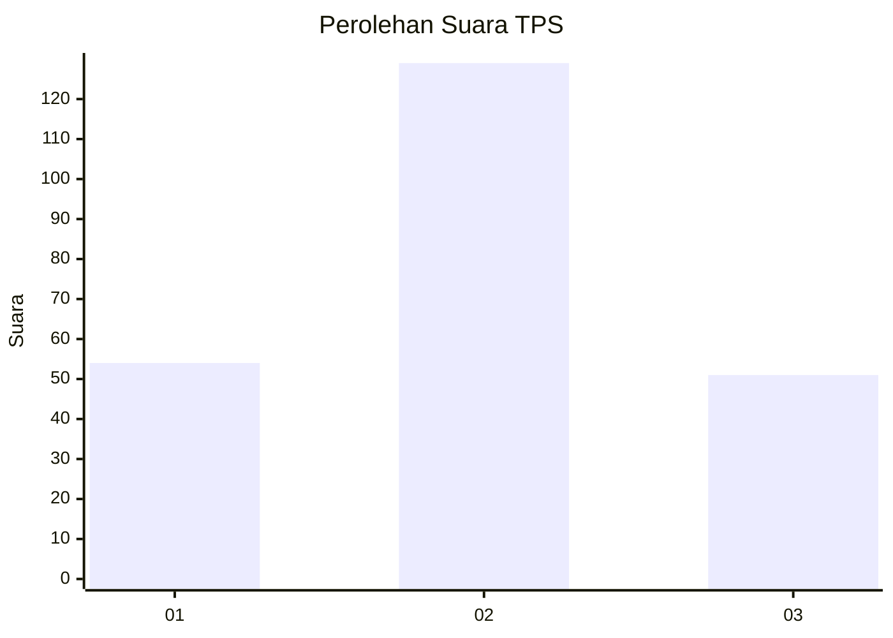
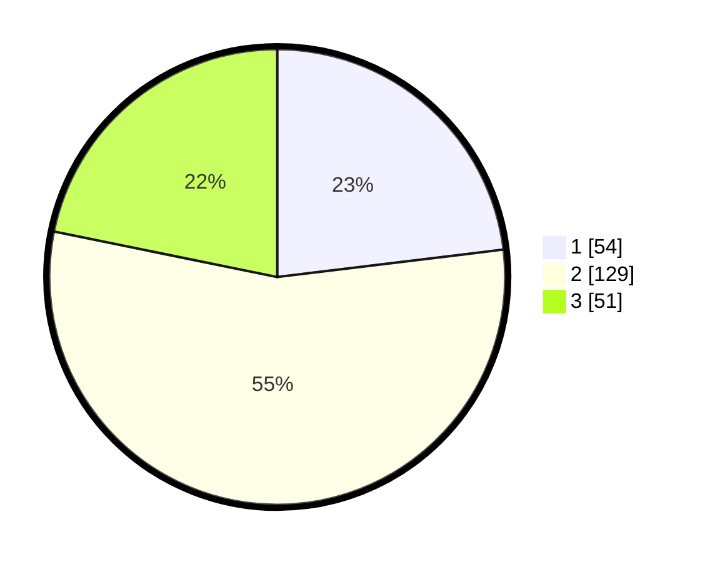

# Hasil

## Grafik

## Tabel

| No. | Nama Paslon    | Suara | Suara (raw) | Persentase |
|:--- |:-------------- | -----:| -----------:| ----------:|
| 1   | ANIES MUHAIMIN | 54    | [54][p-1]   | 23,08      |
| 2   | PRABOWO GIBRAN | 129   | [129][p-2]  | 55,13      |
| 3   | GANJAR MAHFUD  | 51    | [51][p-3]   | 21,79      |

[p-1]: https://github.com/gigit-pemilu/pemilu-2024/blob/main/pilpres/hitung-suara/sub/33-jawa-tengah/sub/10-klaten/sub/07-kebonarum/sub/2004-ngrundul/sub/004-tps/sub/paslon-1.txt
[p-2]: https://github.com/gigit-pemilu/pemilu-2024/blob/main/pilpres/hitung-suara/sub/33-jawa-tengah/sub/10-klaten/sub/07-kebonarum/sub/2004-ngrundul/sub/004-tps/sub/paslon-2.txt
[p-3]: https://github.com/gigit-pemilu/pemilu-2024/blob/main/pilpres/hitung-suara/sub/33-jawa-tengah/sub/10-klaten/sub/07-kebonarum/sub/2004-ngrundul/sub/004-tps/sub/paslon-3.txt

## Foto C Plano

https://sirekap-obj-formc.kpu.go.id/90ea/pemilu/ppwp/33/10/07/20/04/3310072004004-20240214-225732--ab6aef2c-2c31-4c84-9425-c72a803eb9c6.jpg

https://sirekap-obj-formc.kpu.go.id/90ea/pemilu/ppwp/33/10/07/20/04/3310072004004-20240214-225740--72cbf243-4632-4964-be6f-104becd71c7e.jpg

https://sirekap-obj-formc.kpu.go.id/90ea/pemilu/ppwp/33/10/07/20/04/3310072004004-20240214-225743--f96b6a4c-1bcc-4377-b3ec-43ff7940e480.jpg

## Metadata

| Key        | Value               |
| ---------- | ------------------- |
| Time Stamp | 2024-02-15 21:30:27 |

