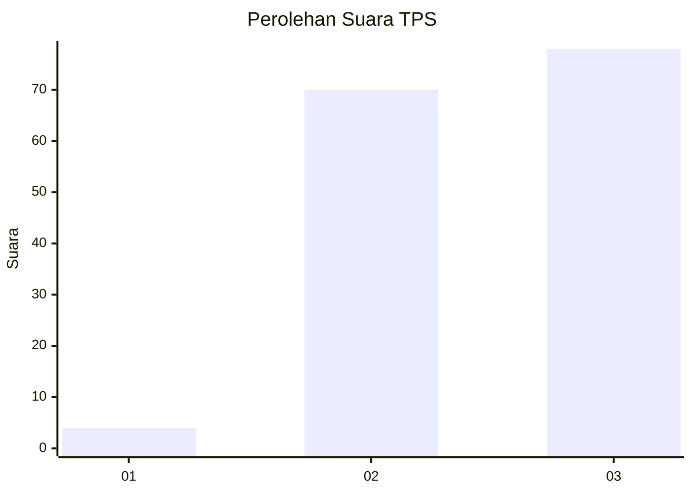
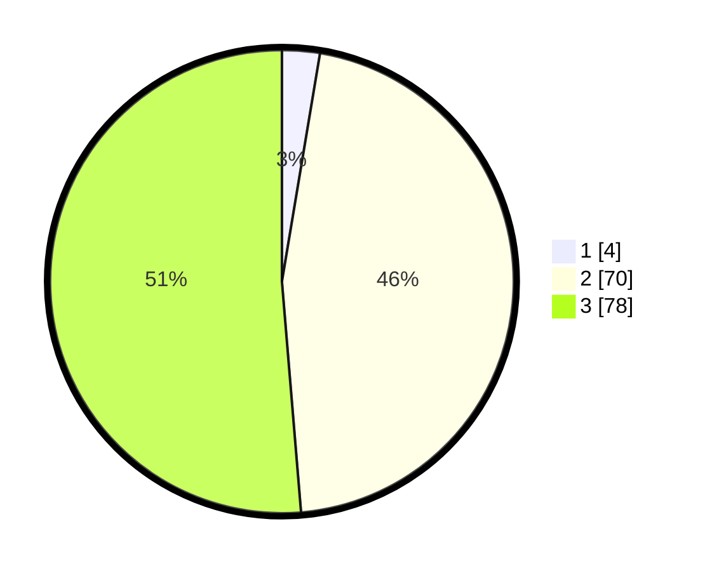

# Hasil

## Grafik

## Tabel

| No. | Nama Paslon    | Suara | Suara (raw) | Persentase |
|:--- |:-------------- | -----:| -----------:| ----------:|
| 1   | ANIES MUHAIMIN | 4     | [4][p-1]    | 2,63       |
| 2   | PRABOWO GIBRAN | 70    | [70][p-2]   | 46,05      |
| 3   | GANJAR MAHFUD  | 78    | [78][p-3]   | 51,32      |

[p-1]: https://github.com/gigit-pemilu/pemilu-2024/blob/main/pilpres/hitung-suara/sub/33-jawa-tengah/sub/10-klaten/sub/07-kebonarum/sub/2004-ngrundul/sub/011-tps/sub/paslon-1.txt
[p-2]: https://github.com/gigit-pemilu/pemilu-2024/blob/main/pilpres/hitung-suara/sub/33-jawa-tengah/sub/10-klaten/sub/07-kebonarum/sub/2004-ngrundul/sub/011-tps/sub/paslon-2.txt
[p-3]: https://github.com/gigit-pemilu/pemilu-2024/blob/main/pilpres/hitung-suara/sub/33-jawa-tengah/sub/10-klaten/sub/07-kebonarum/sub/2004-ngrundul/sub/011-tps/sub/paslon-3.txt

## Foto C Plano

https://sirekap-obj-formc.kpu.go.id/33cb/pemilu/ppwp/33/10/07/20/04/3310072004011-20240214-230643--0c9f46be-e303-497e-b58f-a5ab70ee9358.jpg

https://sirekap-obj-formc.kpu.go.id/33cb/pemilu/ppwp/33/10/07/20/04/3310072004011-20240214-230716--a9f71518-82ba-42b3-9249-66826143983b.jpg

https://sirekap-obj-formc.kpu.go.id/33cb/pemilu/ppwp/33/10/07/20/04/3310072004011-20240214-230803--8e90fc1a-75ea-4089-bb11-34e5b5f7d7eb.jpg

## Metadata

| Key        | Value               |
| ---------- | ------------------- |
| Time Stamp | 2024-02-19 06:16:00 |

