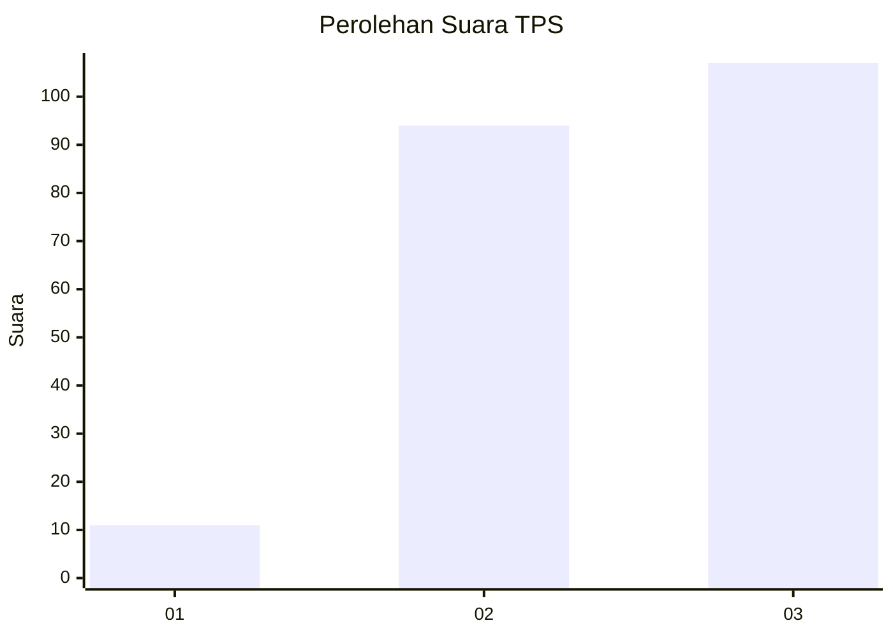
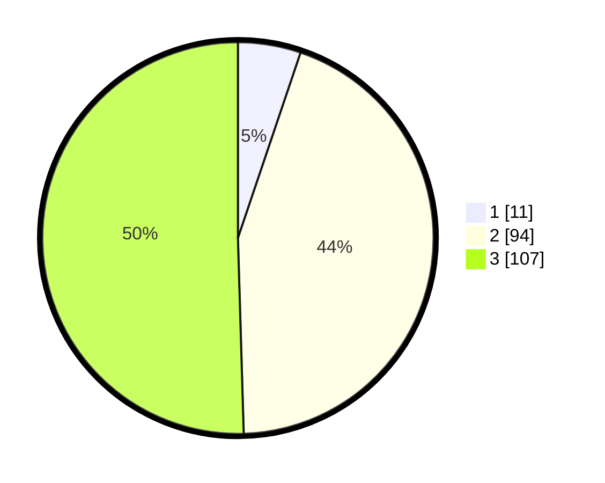

# Hasil

## Grafik

## Tabel

| No. | Nama Paslon    | Suara | Suara (raw) | Persentase |
|:--- |:-------------- | -----:| -----------:| ----------:|
| 1   | ANIES MUHAIMIN | 11    | [11][p-1]   | 5,19       |
| 2   | PRABOWO GIBRAN | 94    | [94][p-2]   | 44,34      |
| 3   | GANJAR MAHFUD  | 107   | [107][p-3]  | 50,47      |

[p-1]: https://github.com/gigit-pemilu/pemilu-2024-33-jawa-tengah/blob/main/pilpres/hitung-suara/sub/33-jawa-tengah/sub/10-klaten/sub/08-jogonalan/sub/2010-karangdukuh/sub/008-tps/sub/paslon-1.txt
[p-2]: https://github.com/gigit-pemilu/pemilu-2024-33-jawa-tengah/blob/main/pilpres/hitung-suara/sub/33-jawa-tengah/sub/10-klaten/sub/08-jogonalan/sub/2010-karangdukuh/sub/008-tps/sub/paslon-2.txt
[p-3]: https://github.com/gigit-pemilu/pemilu-2024-33-jawa-tengah/blob/main/pilpres/hitung-suara/sub/33-jawa-tengah/sub/10-klaten/sub/08-jogonalan/sub/2010-karangdukuh/sub/008-tps/sub/paslon-3.txt

## Foto C Plano

https://sirekap-obj-formc.kpu.go.id/8688/pemilu/ppwp/33/10/08/20/10/3310082010008-20240216-210922--ec24f254-5b7e-497b-975f-a3e848cf3387.jpg

https://sirekap-obj-formc.kpu.go.id/8688/pemilu/ppwp/33/10/08/20/10/3310082010008-20240215-012844--e0d771c3-9020-4638-b6da-940f0fd5eb0c.jpg

https://sirekap-obj-formc.kpu.go.id/8688/pemilu/ppwp/33/10/08/20/10/3310082010008-20240215-013101--b920ba90-0d22-4c38-a639-3ddb4ae70911.jpg

## Metadata

| Key        | Value               |
| ---------- | ------------------- |
| Time Stamp | 2024-02-16 22:01:00 |

