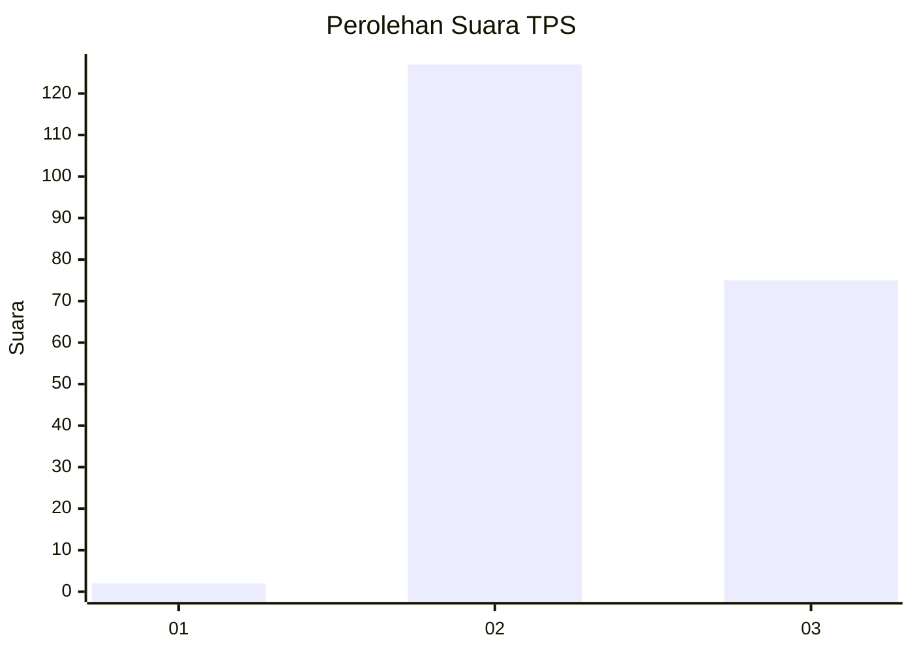
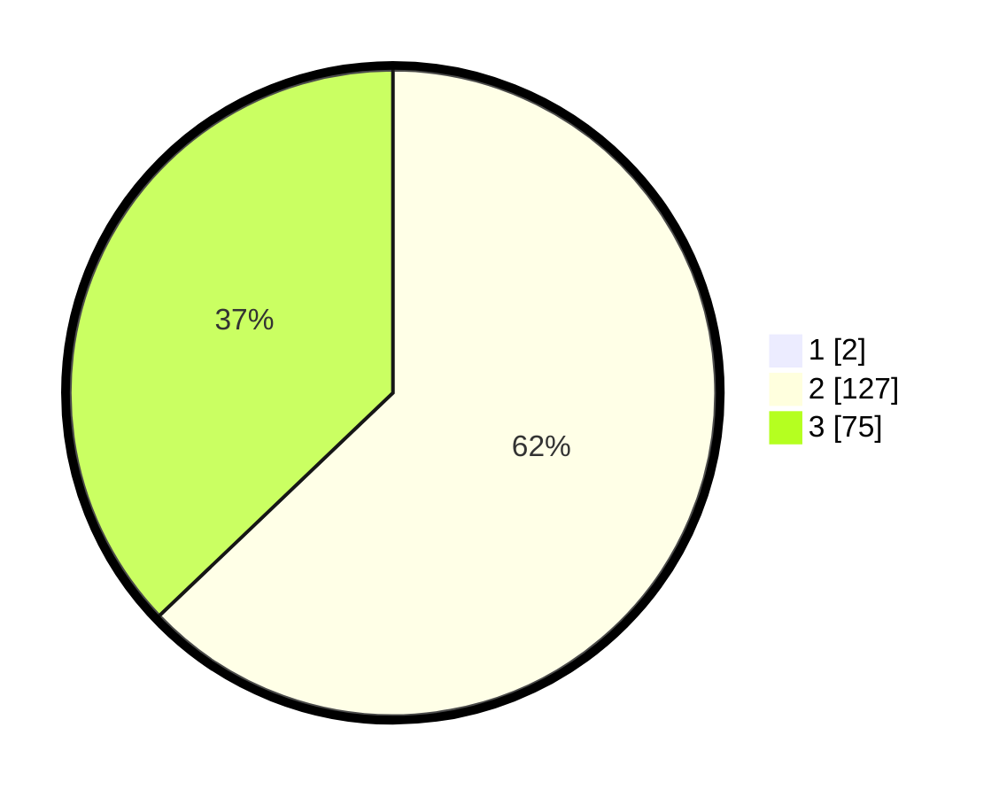

# Hasil

## Grafik

## Tabel

| No. | Nama Paslon    | Suara | Suara (raw) | Persentase |
|:--- |:-------------- | -----:| -----------:| ----------:|
| 1   | ANIES MUHAIMIN | 2     | [2][p-1]    | 0,98       |
| 2   | PRABOWO GIBRAN | 127   | [127][p-2]  | 62,25      |
| 3   | GANJAR MAHFUD  | 75    | [75][p-3]   | 36,76      |

[p-1]: https://github.com/gigit-pemilu/pemilu-2024/blob/main/pilpres/hitung-suara/sub/33-jawa-tengah/sub/10-klaten/sub/11-ceper/sub/2003-jambukidul/sub/001-tps/sub/paslon-1.txt
[p-2]: https://github.com/gigit-pemilu/pemilu-2024/blob/main/pilpres/hitung-suara/sub/33-jawa-tengah/sub/10-klaten/sub/11-ceper/sub/2003-jambukidul/sub/001-tps/sub/paslon-2.txt
[p-3]: https://github.com/gigit-pemilu/pemilu-2024/blob/main/pilpres/hitung-suara/sub/33-jawa-tengah/sub/10-klaten/sub/11-ceper/sub/2003-jambukidul/sub/001-tps/sub/paslon-3.txt

## Foto C Plano

https://sirekap-obj-formc.kpu.go.id/0856/pemilu/ppwp/33/10/11/20/03/3310112003001-20240216-190544--8e4fe642-0b2c-4ec0-9294-e34a7c0fea08.jpg

https://sirekap-obj-formc.kpu.go.id/0856/pemilu/ppwp/33/10/11/20/03/3310112003001-20240216-190723--2bbf452e-e4bb-46f8-851e-ad4eb52b837f.jpg

https://sirekap-obj-formc.kpu.go.id/0856/pemilu/ppwp/33/10/11/20/03/3310112003001-20240216-190836--04ea6d5b-2c23-4fe8-9cf7-44533036a46a.jpg

## Metadata

| Key        | Value               |
| ---------- | ------------------- |
| Time Stamp | 2024-02-16 21:01:00 |

