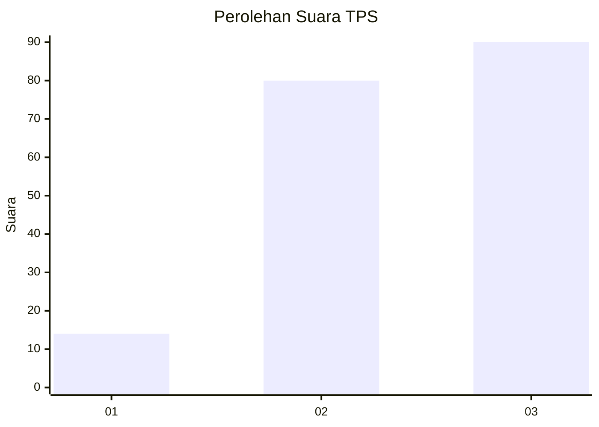
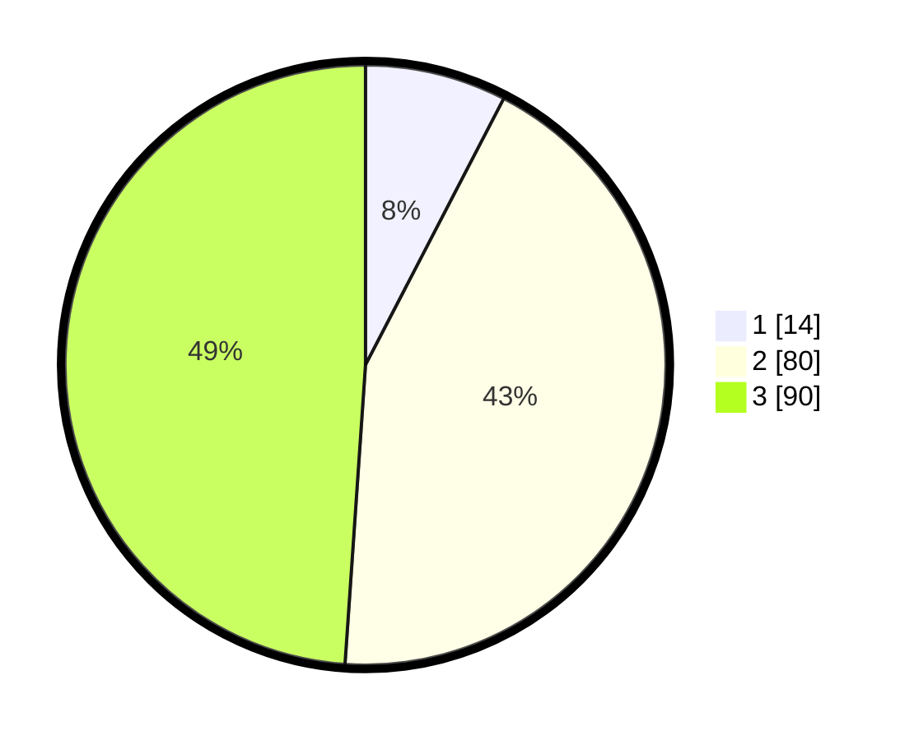

# Hasil

## Grafik

## Tabel

| No. | Nama Paslon    | Suara | Suara (raw) | Persentase |
|:--- |:-------------- | -----:| -----------:| ----------:|
| 1   | ANIES MUHAIMIN | 14    | [14][p-1]   | 7,61       |
| 2   | PRABOWO GIBRAN | 80    | [80][p-2]   | 43,48      |
| 3   | GANJAR MAHFUD  | 90    | [90][p-3]   | 48,91      |

[p-1]: https://github.com/gigit-pemilu/pemilu-2024/blob/main/pilpres/hitung-suara/sub/33-jawa-tengah/sub/10-klaten/sub/11-ceper/sub/2004-kujon/sub/005-tps/sub/paslon-1.txt
[p-2]: https://github.com/gigit-pemilu/pemilu-2024/blob/main/pilpres/hitung-suara/sub/33-jawa-tengah/sub/10-klaten/sub/11-ceper/sub/2004-kujon/sub/005-tps/sub/paslon-2.txt
[p-3]: https://github.com/gigit-pemilu/pemilu-2024/blob/main/pilpres/hitung-suara/sub/33-jawa-tengah/sub/10-klaten/sub/11-ceper/sub/2004-kujon/sub/005-tps/sub/paslon-3.txt

## Foto C Plano

https://sirekap-obj-formc.kpu.go.id/31b5/pemilu/ppwp/33/10/11/20/04/3310112004005-20240221-161822--3ead3e6f-90e9-4bb9-b254-60b2ca617a8b.jpg

https://sirekap-obj-formc.kpu.go.id/31b5/pemilu/ppwp/33/10/11/20/04/3310112004005-20240221-162005--ae20c947-8d1e-4f7f-863e-0dbce962a418.jpg

https://sirekap-obj-formc.kpu.go.id/31b5/pemilu/ppwp/33/10/11/20/04/3310112004005-20240221-162152--88131339-0bc8-44b5-b054-6bd1955b0971.jpg

## Metadata

| Key        | Value               |
| ---------- | ------------------- |
| Time Stamp | 2024-02-26 22:00:00 |

