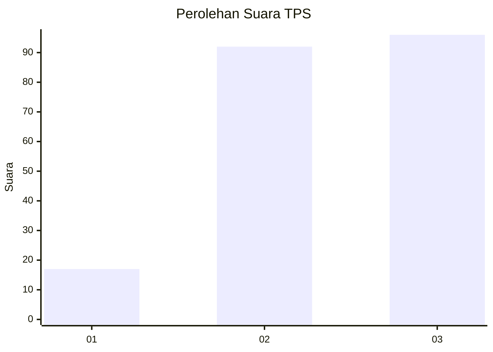
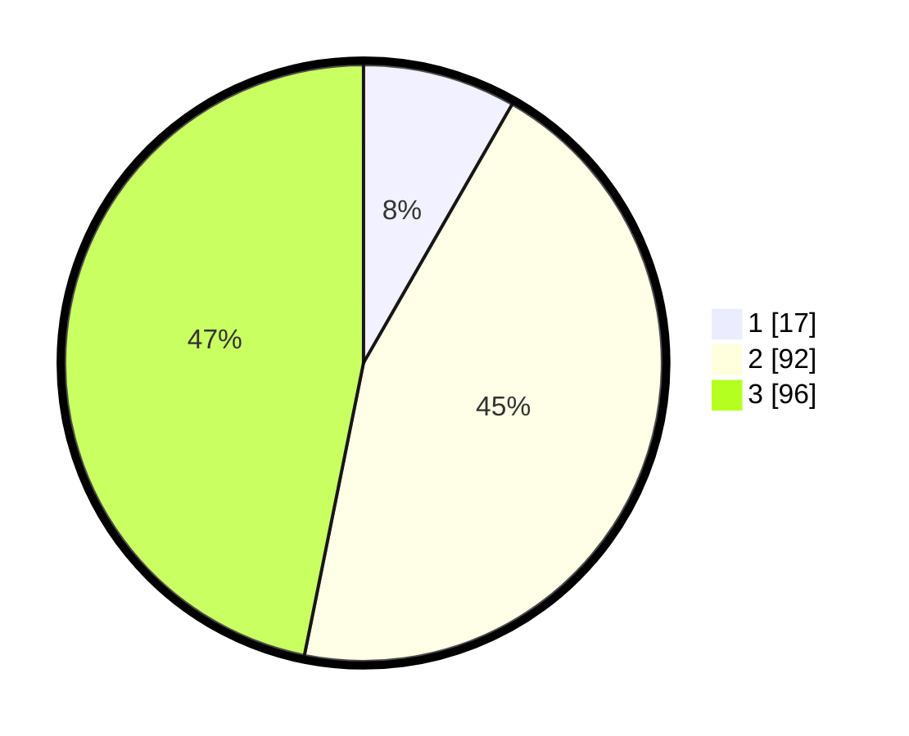

# Hasil

## Grafik

## Tabel

| No. | Nama Paslon    | Suara | Suara (raw) | Persentase |
|:--- |:-------------- | -----:| -----------:| ----------:|
| 1   | ANIES MUHAIMIN | 17    | [17][p-1]   | 8,29       |
| 2   | PRABOWO GIBRAN | 92    | [92][p-2]   | 44,88      |
| 3   | GANJAR MAHFUD  | 96    | [96][p-3]   | 46,83      |

[p-1]: https://github.com/gigit-pemilu/pemilu-2024-33-jawa-tengah/blob/main/pilpres/hitung-suara/sub/33-jawa-tengah/sub/10-klaten/sub/11-ceper/sub/2005-pokak/sub/004-tps/sub/paslon-1.txt
[p-2]: https://github.com/gigit-pemilu/pemilu-2024-33-jawa-tengah/blob/main/pilpres/hitung-suara/sub/33-jawa-tengah/sub/10-klaten/sub/11-ceper/sub/2005-pokak/sub/004-tps/sub/paslon-2.txt
[p-3]: https://github.com/gigit-pemilu/pemilu-2024-33-jawa-tengah/blob/main/pilpres/hitung-suara/sub/33-jawa-tengah/sub/10-klaten/sub/11-ceper/sub/2005-pokak/sub/004-tps/sub/paslon-3.txt

## Foto C Plano

https://sirekap-obj-formc.kpu.go.id/db46/pemilu/ppwp/33/10/11/20/05/3310112005004-20240214-175330--7d7585fb-fb38-427e-95d6-9a0ee3947b5b.jpg

https://sirekap-obj-formc.kpu.go.id/db46/pemilu/ppwp/33/10/11/20/05/3310112005004-20240214-175442--ec75be7d-b0f0-4888-b6ab-ea9f8edb3202.jpg

https://sirekap-obj-formc.kpu.go.id/db46/pemilu/ppwp/33/10/11/20/05/3310112005004-20240214-175445--537fa34d-38b2-4d38-aae3-fc2946649dcb.jpg

## Metadata

| Key        | Value               |
| ---------- | ------------------- |
| Time Stamp | 2024-02-15 23:29:50 |

