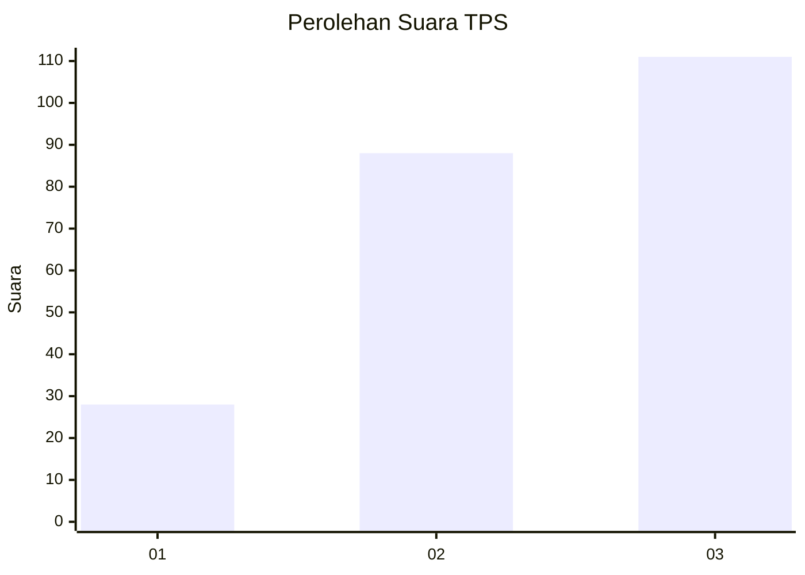
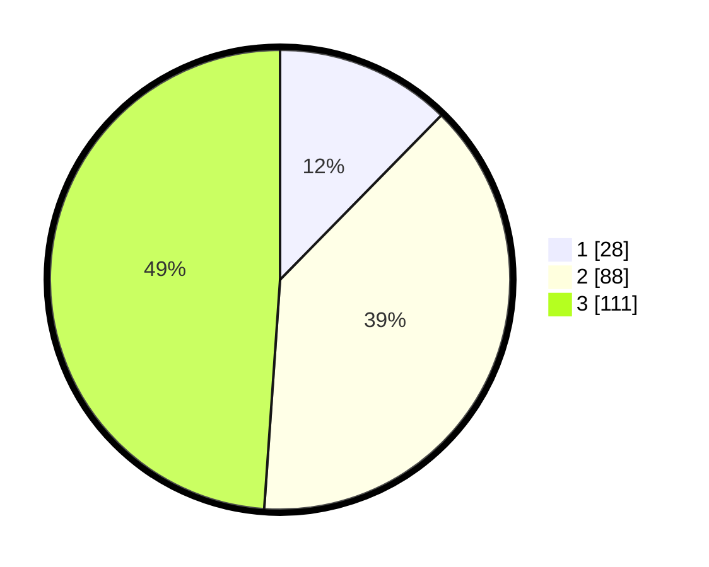

# Hasil

## Grafik

## Tabel

| No. | Nama Paslon    | Suara | Suara (raw) | Persentase |
|:--- |:-------------- | -----:| -----------:| ----------:|
| 1   | ANIES MUHAIMIN | 28    | [28][p-1]   | 12,33      |
| 2   | PRABOWO GIBRAN | 88    | [88][p-2]   | 38,77      |
| 3   | GANJAR MAHFUD  | 111   | [111][p-3]  | 48,90      |

[p-1]: https://github.com/gigit-pemilu/pemilu-2024-33-jawa-tengah/blob/main/pilpres/hitung-suara/sub/33-jawa-tengah/sub/10-klaten/sub/11-ceper/sub/2005-pokak/sub/006-tps/sub/paslon-1.txt
[p-2]: https://github.com/gigit-pemilu/pemilu-2024-33-jawa-tengah/blob/main/pilpres/hitung-suara/sub/33-jawa-tengah/sub/10-klaten/sub/11-ceper/sub/2005-pokak/sub/006-tps/sub/paslon-2.txt
[p-3]: https://github.com/gigit-pemilu/pemilu-2024-33-jawa-tengah/blob/main/pilpres/hitung-suara/sub/33-jawa-tengah/sub/10-klaten/sub/11-ceper/sub/2005-pokak/sub/006-tps/sub/paslon-3.txt

## Foto C Plano

https://sirekap-obj-formc.kpu.go.id/c7d0/pemilu/ppwp/33/10/11/20/05/3310112005006-20240221-205307--a8534403-0809-4cda-9dff-f983d12f9568.jpg

https://sirekap-obj-formc.kpu.go.id/c7d0/pemilu/ppwp/33/10/11/20/05/3310112005006-20240221-205339--b23a304f-4f8f-48fa-8813-e13c3d609bd3.jpg

https://sirekap-obj-formc.kpu.go.id/c7d0/pemilu/ppwp/33/10/11/20/05/3310112005006-20240221-205358--b6424e9a-e6f2-4e37-828b-3969652023fa.jpg

## Metadata

| Key        | Value               |
| ---------- | ------------------- |
| Time Stamp | 2024-02-25 11:00:00 |

