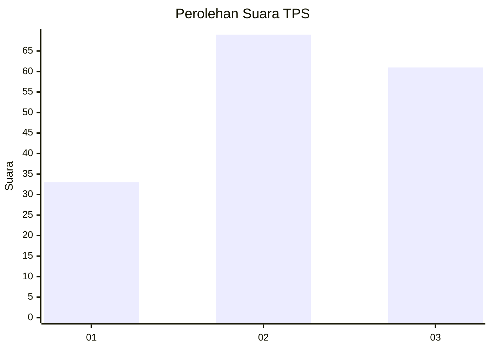
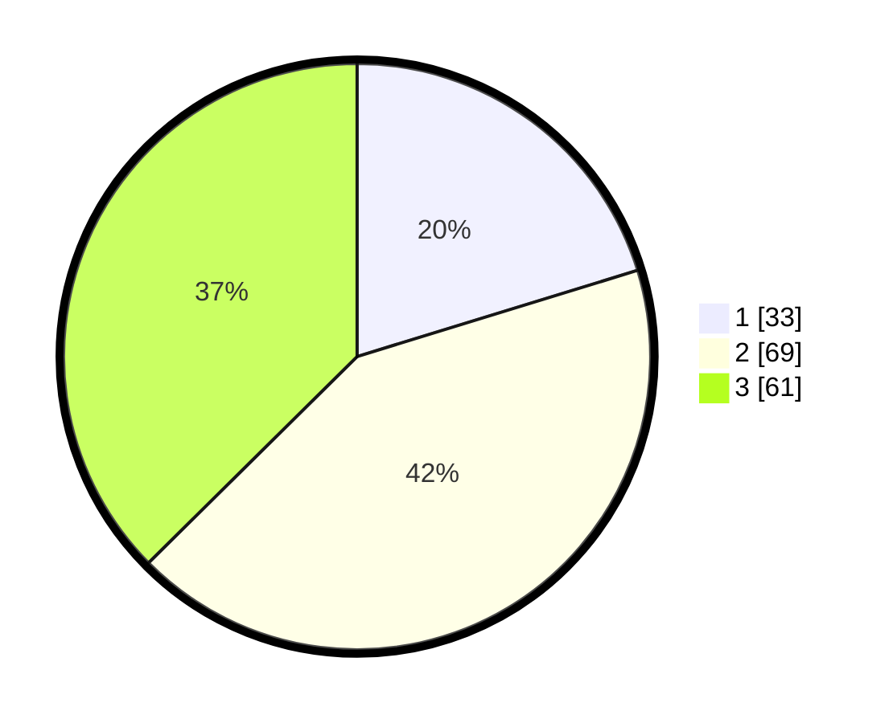

# Hasil

## Grafik

## Tabel

| No. | Nama Paslon    | Suara | Suara (raw) | Persentase |
|:--- |:-------------- | -----:| -----------:| ----------:|
| 1   | ANIES MUHAIMIN | 33    | [33][p-1]   | 20,25      |
| 2   | PRABOWO GIBRAN | 69    | [69][p-2]   | 42,33      |
| 3   | GANJAR MAHFUD  | 61    | [61][p-3]   | 37,42      |

[p-1]: https://github.com/gigit-pemilu/pemilu-2024-33-jawa-tengah/blob/main/pilpres/hitung-suara/sub/33-jawa-tengah/sub/10-klaten/sub/11-ceper/sub/2006-pasungan/sub/004-tps/sub/paslon-1.txt
[p-2]: https://github.com/gigit-pemilu/pemilu-2024-33-jawa-tengah/blob/main/pilpres/hitung-suara/sub/33-jawa-tengah/sub/10-klaten/sub/11-ceper/sub/2006-pasungan/sub/004-tps/sub/paslon-2.txt
[p-3]: https://github.com/gigit-pemilu/pemilu-2024-33-jawa-tengah/blob/main/pilpres/hitung-suara/sub/33-jawa-tengah/sub/10-klaten/sub/11-ceper/sub/2006-pasungan/sub/004-tps/sub/paslon-3.txt

## Foto C Plano

https://sirekap-obj-formc.kpu.go.id/818a/pemilu/ppwp/33/10/11/20/06/3310112006004-20240221-222215--82e5cb64-2e61-48ba-b692-7c84a65f6064.jpg

https://sirekap-obj-formc.kpu.go.id/818a/pemilu/ppwp/33/10/11/20/06/3310112006004-20240221-222234--339a6e93-cda2-4894-8756-8ab8a3a3d1a6.jpg

https://sirekap-obj-formc.kpu.go.id/818a/pemilu/ppwp/33/10/11/20/06/3310112006004-20240221-222253--ae9651b2-6a8f-426d-9ac8-e48857840096.jpg

## Metadata

| Key        | Value               |
| ---------- | ------------------- |
| Time Stamp | 2024-02-25 13:00:00 |

