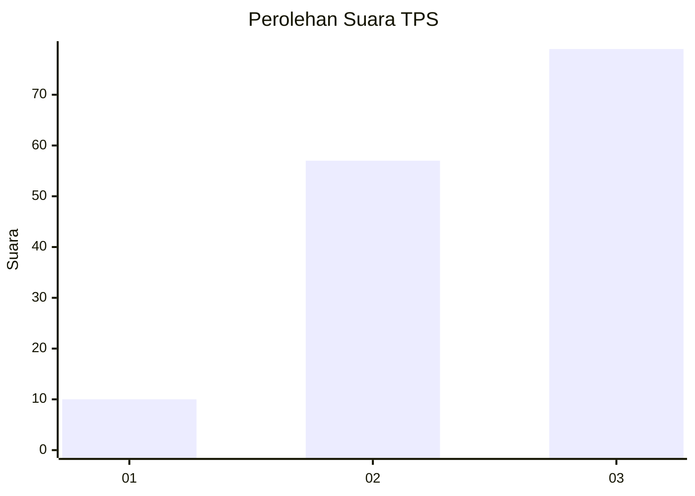
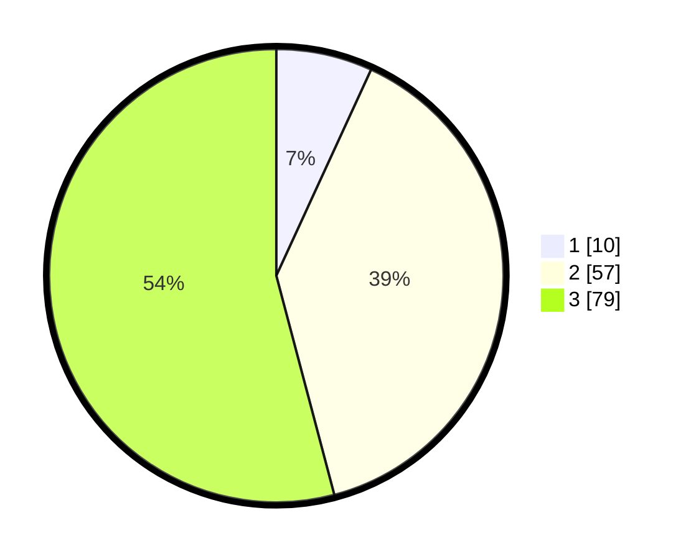

# Hasil

## Grafik

## Tabel

| No. | Nama Paslon    | Suara | Suara (raw) | Persentase |
|:--- |:-------------- | -----:| -----------:| ----------:|
| 1   | ANIES MUHAIMIN | 10    | [10][p-1]   | 6,85       |
| 2   | PRABOWO GIBRAN | 57    | [57][p-2]   | 39,04      |
| 3   | GANJAR MAHFUD  | 79    | [79][p-3]   | 54,11      |

[p-1]: https://github.com/gigit-pemilu/pemilu-2024/blob/main/pilpres/hitung-suara/sub/33-jawa-tengah/sub/10-klaten/sub/11-ceper/sub/2006-pasungan/sub/005-tps/sub/paslon-1.txt
[p-2]: https://github.com/gigit-pemilu/pemilu-2024/blob/main/pilpres/hitung-suara/sub/33-jawa-tengah/sub/10-klaten/sub/11-ceper/sub/2006-pasungan/sub/005-tps/sub/paslon-2.txt
[p-3]: https://github.com/gigit-pemilu/pemilu-2024/blob/main/pilpres/hitung-suara/sub/33-jawa-tengah/sub/10-klaten/sub/11-ceper/sub/2006-pasungan/sub/005-tps/sub/paslon-3.txt

## Foto C Plano

https://sirekap-obj-formc.kpu.go.id/fc22/pemilu/ppwp/33/10/11/20/06/3310112006005-20240220-220333--1ec79951-30fe-4262-a710-c8a7a52e6d04.jpg

https://sirekap-obj-formc.kpu.go.id/fc22/pemilu/ppwp/33/10/11/20/06/3310112006005-20240215-003058--4c259845-69bd-469f-94ac-77afd4d4348b.jpg

https://sirekap-obj-formc.kpu.go.id/fc22/pemilu/ppwp/33/10/11/20/06/3310112006005-20240214-141524--ced01aee-b4bf-4077-a9ec-dd66adf09bf1.jpg

## Metadata

| Key        | Value               |
| ---------- | ------------------- |
| Time Stamp | 2024-02-20 23:00:00 |

