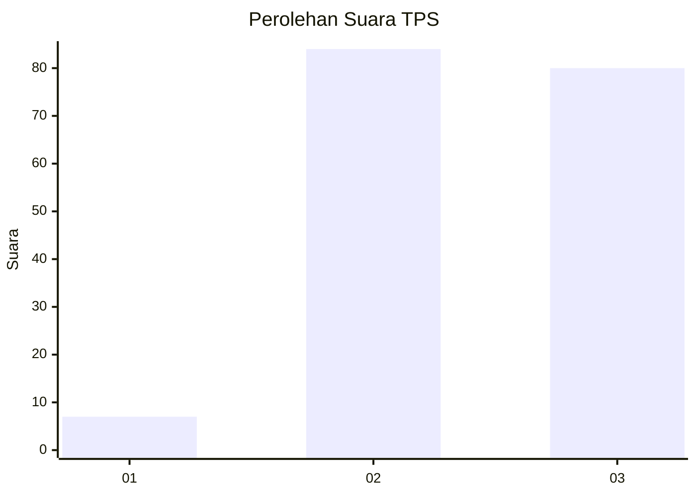
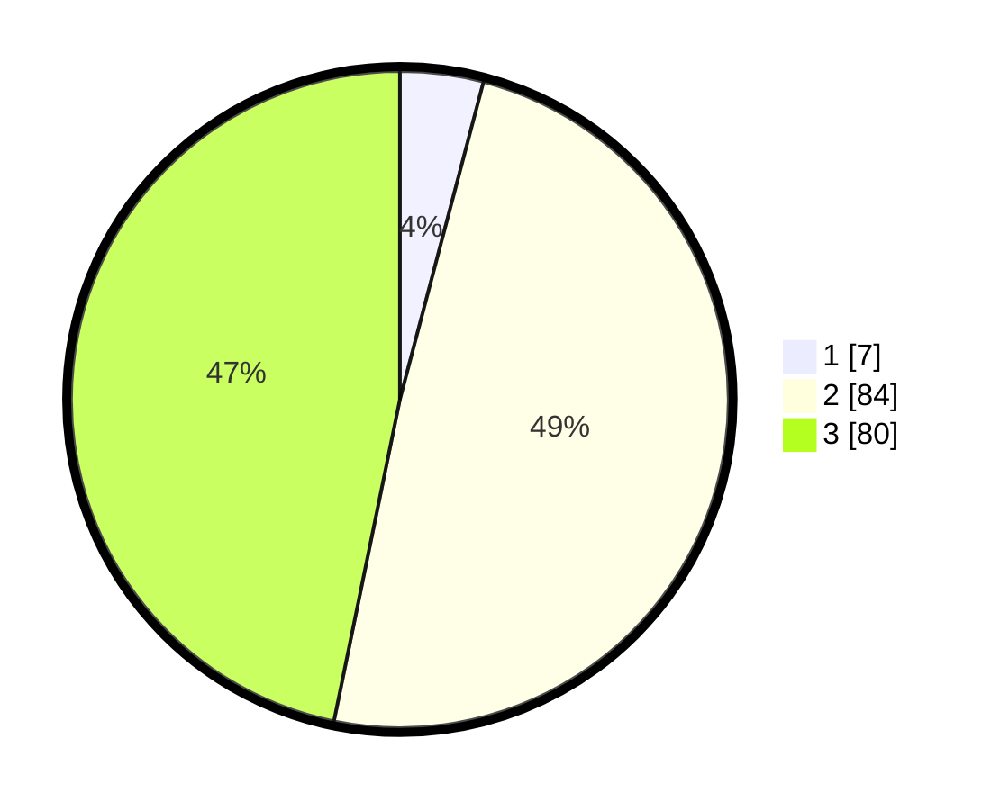

# Hasil

## Grafik

## Tabel

| No. | Nama Paslon    | Suara | Suara (raw) | Persentase |
|:--- |:-------------- | -----:| -----------:| ----------:|
| 1   | ANIES MUHAIMIN | 7     | [7][p-1]    | 4,09       |
| 2   | PRABOWO GIBRAN | 84    | [84][p-2]   | 49,12      |
| 3   | GANJAR MAHFUD  | 80    | [80][p-3]   | 46,78      |

[p-1]: https://github.com/gigit-pemilu/pemilu-2024-33-jawa-tengah/blob/main/pilpres/hitung-suara/sub/33-jawa-tengah/sub/10-klaten/sub/11-ceper/sub/2007-mlese/sub/001-tps/sub/paslon-1.txt
[p-2]: https://github.com/gigit-pemilu/pemilu-2024-33-jawa-tengah/blob/main/pilpres/hitung-suara/sub/33-jawa-tengah/sub/10-klaten/sub/11-ceper/sub/2007-mlese/sub/001-tps/sub/paslon-2.txt
[p-3]: https://github.com/gigit-pemilu/pemilu-2024-33-jawa-tengah/blob/main/pilpres/hitung-suara/sub/33-jawa-tengah/sub/10-klaten/sub/11-ceper/sub/2007-mlese/sub/001-tps/sub/paslon-3.txt

## Foto C Plano

https://sirekap-obj-formc.kpu.go.id/49f1/pemilu/ppwp/33/10/11/20/07/3310112007001-20240221-210737--59533d36-f62d-461d-979e-45e1181d8620.jpg

https://sirekap-obj-formc.kpu.go.id/49f1/pemilu/ppwp/33/10/11/20/07/3310112007001-20240221-210913--16baa04a-3650-4c20-a60a-f0c7528f3a90.jpg

https://sirekap-obj-formc.kpu.go.id/49f1/pemilu/ppwp/33/10/11/20/07/3310112007001-20240221-210847--a5f71cd4-db11-4ef8-b987-5f350bc8c5ef.jpg

## Metadata

| Key        | Value               |
| ---------- | ------------------- |
| Time Stamp | 2024-02-24 22:31:28 |

