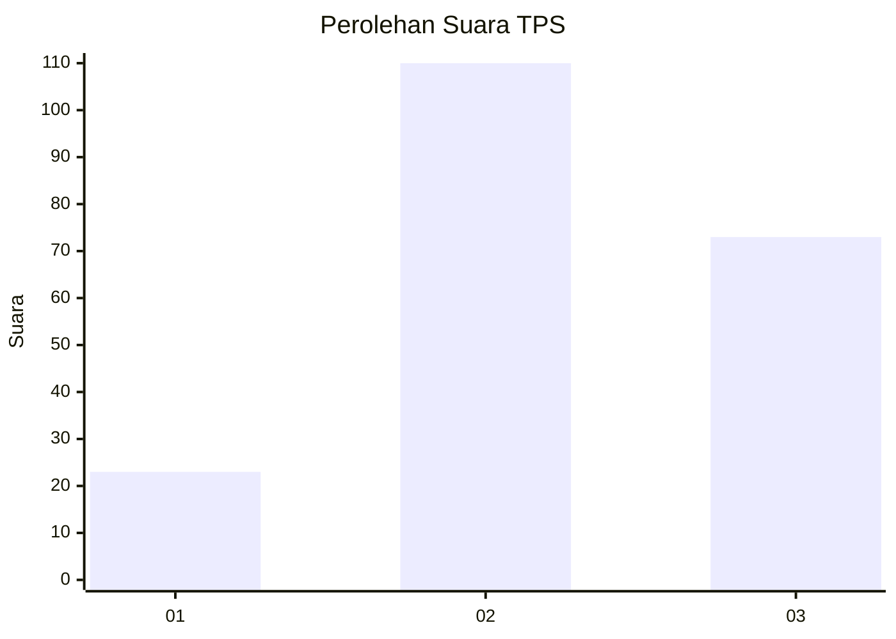
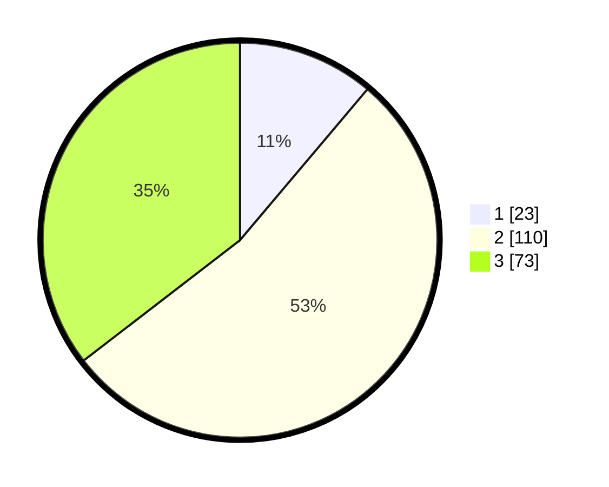

# Hasil

## Grafik

## Tabel

| No. | Nama Paslon    | Suara | Suara (raw) | Persentase |
|:--- |:-------------- | -----:| -----------:| ----------:|
| 1   | ANIES MUHAIMIN | 23    | [23][p-1]   | 11,17      |
| 2   | PRABOWO GIBRAN | 110   | [110][p-2]  | 53,40      |
| 3   | GANJAR MAHFUD  | 73    | [73][p-3]   | 35,44      |

[p-1]: https://github.com/gigit-pemilu/pemilu-2024/blob/main/pilpres/hitung-suara/sub/33-jawa-tengah/sub/10-klaten/sub/11-ceper/sub/2007-mlese/sub/002-tps/sub/paslon-1.txt
[p-2]: https://github.com/gigit-pemilu/pemilu-2024/blob/main/pilpres/hitung-suara/sub/33-jawa-tengah/sub/10-klaten/sub/11-ceper/sub/2007-mlese/sub/002-tps/sub/paslon-2.txt
[p-3]: https://github.com/gigit-pemilu/pemilu-2024/blob/main/pilpres/hitung-suara/sub/33-jawa-tengah/sub/10-klaten/sub/11-ceper/sub/2007-mlese/sub/002-tps/sub/paslon-3.txt

## Foto C Plano

https://sirekap-obj-formc.kpu.go.id/a171/pemilu/ppwp/33/10/11/20/07/3310112007002-20240221-211039--d888b267-5fbf-4b3c-ba83-e6aa6f64fc32.jpg

https://sirekap-obj-formc.kpu.go.id/a171/pemilu/ppwp/33/10/11/20/07/3310112007002-20240221-211105--88fa6126-0239-4616-a002-40a54081c0a6.jpg

https://sirekap-obj-formc.kpu.go.id/a171/pemilu/ppwp/33/10/11/20/07/3310112007002-20240221-211124--53c9d8ee-9f57-4c94-b4c0-a7a91f6af468.jpg

## Metadata

| Key        | Value               |
| ---------- | ------------------- |
| Time Stamp | 2024-02-25 14:00:00 |

