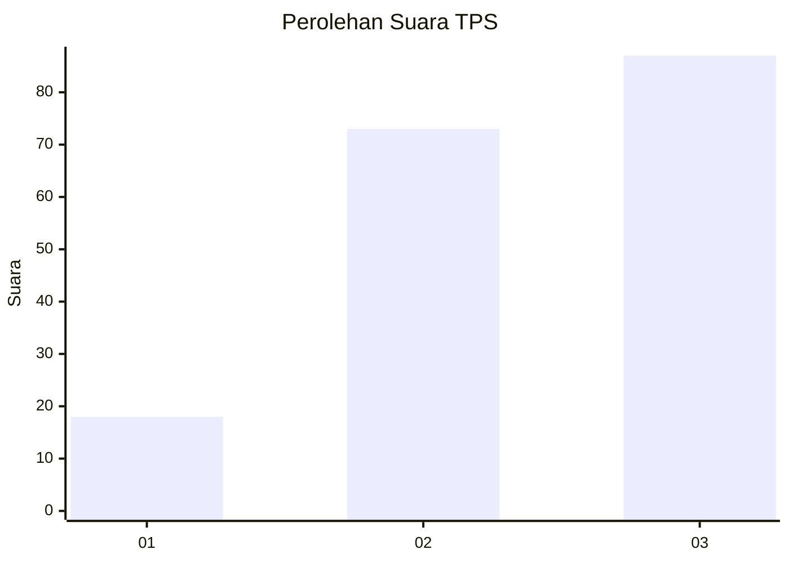
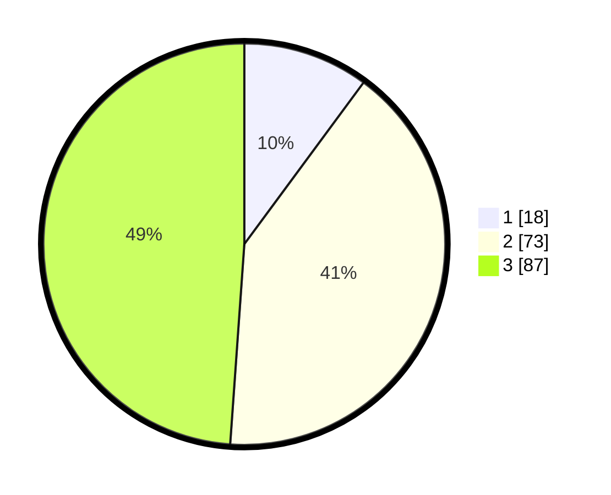

# Hasil

## Grafik

## Tabel

| No. | Nama Paslon    | Suara | Suara (raw) | Persentase |
|:--- |:-------------- | -----:| -----------:| ----------:|
| 1   | ANIES MUHAIMIN | 18    | [18][p-1]   | 10,11      |
| 2   | PRABOWO GIBRAN | 73    | [73][p-2]   | 41,01      |
| 3   | GANJAR MAHFUD  | 87    | [87][p-3]   | 48,88      |

[p-1]: https://github.com/gigit-pemilu/pemilu-2024/blob/main/pilpres/hitung-suara/sub/33-jawa-tengah/sub/10-klaten/sub/11-ceper/sub/2007-mlese/sub/004-tps/sub/paslon-1.txt
[p-2]: https://github.com/gigit-pemilu/pemilu-2024/blob/main/pilpres/hitung-suara/sub/33-jawa-tengah/sub/10-klaten/sub/11-ceper/sub/2007-mlese/sub/004-tps/sub/paslon-2.txt
[p-3]: https://github.com/gigit-pemilu/pemilu-2024/blob/main/pilpres/hitung-suara/sub/33-jawa-tengah/sub/10-klaten/sub/11-ceper/sub/2007-mlese/sub/004-tps/sub/paslon-3.txt

## Foto C Plano

https://sirekap-obj-formc.kpu.go.id/9081/pemilu/ppwp/33/10/11/20/07/3310112007004-20240221-211431--96d3bdcd-1400-48ce-8dc4-abe8f82b54dc.jpg

https://sirekap-obj-formc.kpu.go.id/9081/pemilu/ppwp/33/10/11/20/07/3310112007004-20240221-211507--30c0c774-c407-4fde-a92b-977d0dca58d3.jpg

https://sirekap-obj-formc.kpu.go.id/9081/pemilu/ppwp/33/10/11/20/07/3310112007004-20240221-211528--1562a4c5-da25-48c9-adb3-a2141955d21a.jpg

## Metadata

| Key        | Value               |
| ---------- | ------------------- |
| Time Stamp | 2024-02-25 17:00:00 |

