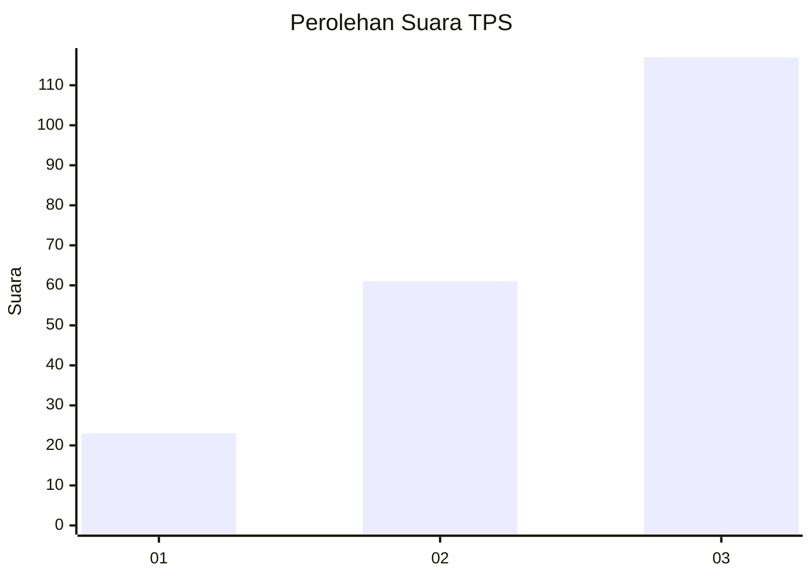
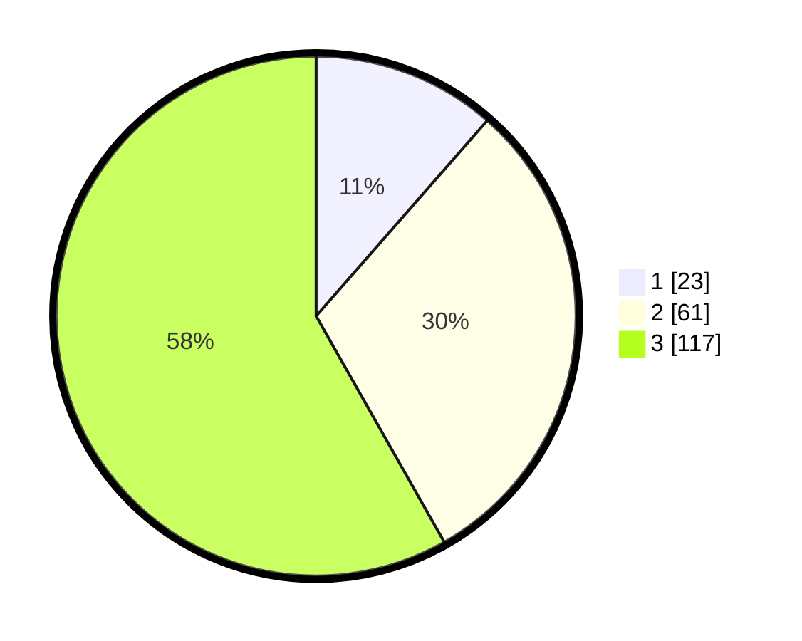

# Hasil

## Grafik

## Tabel

| No. | Nama Paslon    | Suara | Suara (raw) | Persentase |
|:--- |:-------------- | -----:| -----------:| ----------:|
| 1   | ANIES MUHAIMIN | 23    | [23][p-1]   | 11,44      |
| 2   | PRABOWO GIBRAN | 61    | [61][p-2]   | 30,35      |
| 3   | GANJAR MAHFUD  | 117   | [117][p-3]  | 58,21      |

[p-1]: https://github.com/gigit-pemilu/pemilu-2024/blob/main/pilpres/hitung-suara/sub/33-jawa-tengah/sub/10-klaten/sub/11-ceper/sub/2007-mlese/sub/008-tps/sub/paslon-1.txt
[p-2]: https://github.com/gigit-pemilu/pemilu-2024/blob/main/pilpres/hitung-suara/sub/33-jawa-tengah/sub/10-klaten/sub/11-ceper/sub/2007-mlese/sub/008-tps/sub/paslon-2.txt
[p-3]: https://github.com/gigit-pemilu/pemilu-2024/blob/main/pilpres/hitung-suara/sub/33-jawa-tengah/sub/10-klaten/sub/11-ceper/sub/2007-mlese/sub/008-tps/sub/paslon-3.txt

## Foto C Plano

https://sirekap-obj-formc.kpu.go.id/277f/pemilu/ppwp/33/10/11/20/07/3310112007008-20240221-212353--5662d9d2-3534-4320-8261-912e3a18e606.jpg

https://sirekap-obj-formc.kpu.go.id/277f/pemilu/ppwp/33/10/11/20/07/3310112007008-20240221-212421--60f5d906-4b82-40ba-94d7-dbf4ee3f30a1.jpg

https://sirekap-obj-formc.kpu.go.id/277f/pemilu/ppwp/33/10/11/20/07/3310112007008-20240221-212443--1fa83fac-525d-4836-b3ad-9a861b62d7dc.jpg

## Metadata

| Key        | Value               |
| ---------- | ------------------- |
| Time Stamp | 2024-02-24 22:31:28 |

