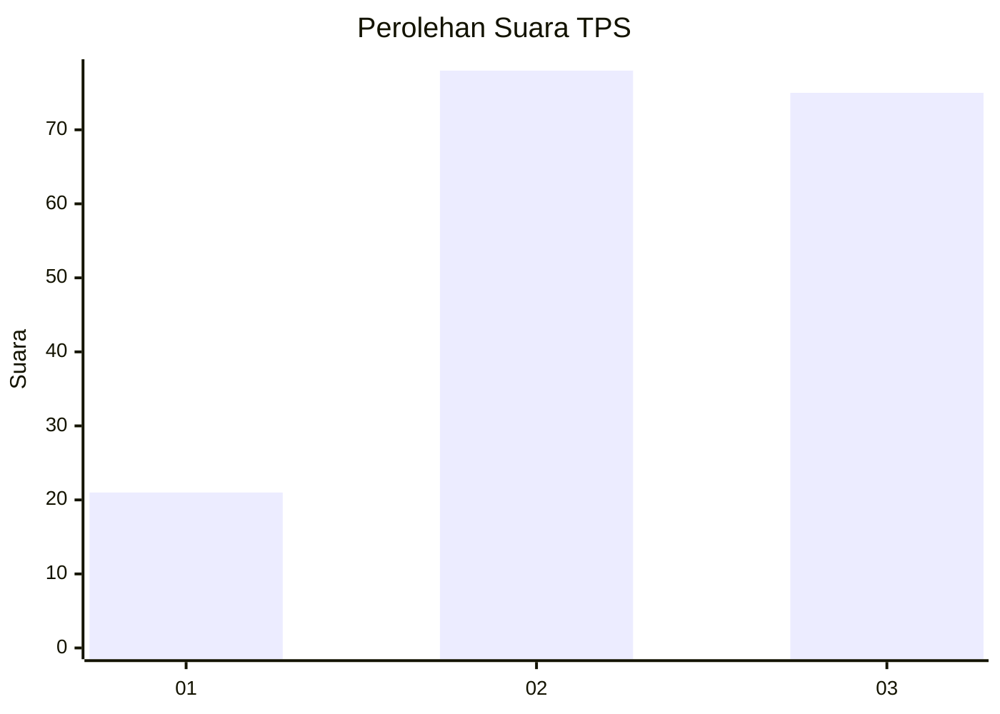
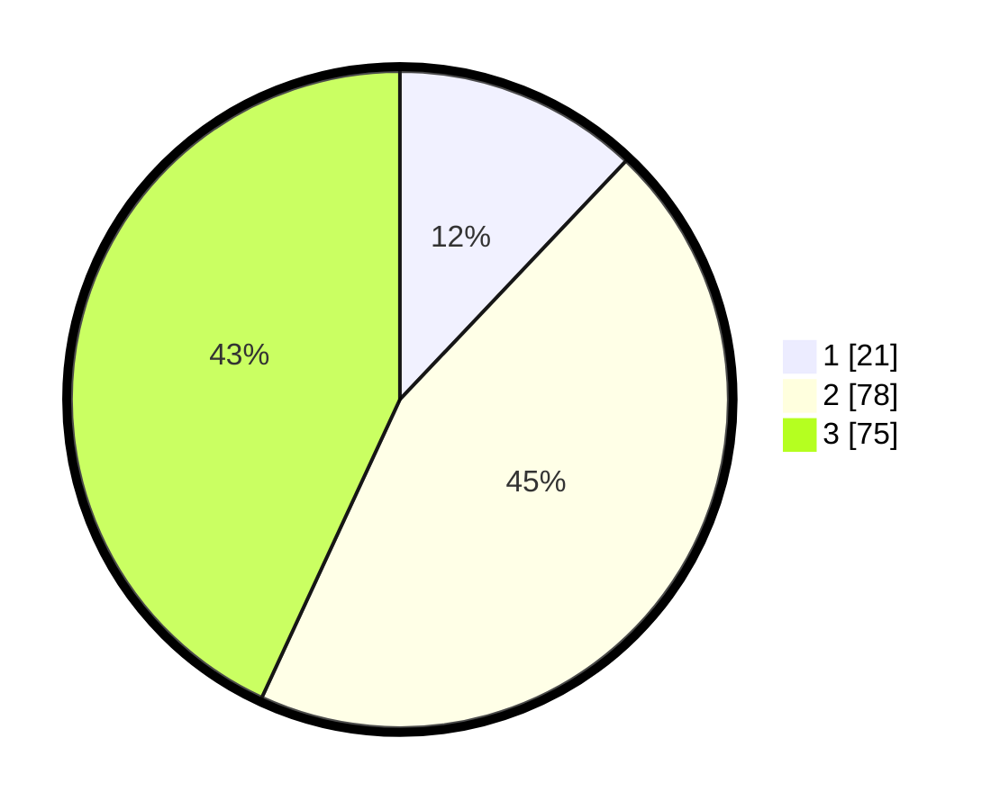

# Hasil

## Grafik

## Tabel

| No. | Nama Paslon    | Suara | Suara (raw) | Persentase |
|:--- |:-------------- | -----:| -----------:| ----------:|
| 1   | ANIES MUHAIMIN | 21    | [21][p-1]   | 12,07      |
| 2   | PRABOWO GIBRAN | 78    | [78][p-2]   | 44,83      |
| 3   | GANJAR MAHFUD  | 75    | [75][p-3]   | 43,10      |

[p-1]: https://github.com/gigit-pemilu/pemilu-2024/blob/main/pilpres/hitung-suara/sub/33-jawa-tengah/sub/10-klaten/sub/11-ceper/sub/2010-dlimas/sub/005-tps/sub/paslon-1.txt
[p-2]: https://github.com/gigit-pemilu/pemilu-2024/blob/main/pilpres/hitung-suara/sub/33-jawa-tengah/sub/10-klaten/sub/11-ceper/sub/2010-dlimas/sub/005-tps/sub/paslon-2.txt
[p-3]: https://github.com/gigit-pemilu/pemilu-2024/blob/main/pilpres/hitung-suara/sub/33-jawa-tengah/sub/10-klaten/sub/11-ceper/sub/2010-dlimas/sub/005-tps/sub/paslon-3.txt

## Foto C Plano

https://sirekap-obj-formc.kpu.go.id/fba8/pemilu/ppwp/33/10/11/20/10/3310112010005-20240221-201446--22312db8-736a-4fd6-8cfa-38a371d9c60e.jpg

https://sirekap-obj-formc.kpu.go.id/fba8/pemilu/ppwp/33/10/11/20/10/3310112010005-20240221-201625--a64f1b15-e7ee-4bbe-80c9-f0d6f2aa49c4.jpg

https://sirekap-obj-formc.kpu.go.id/fba8/pemilu/ppwp/33/10/11/20/10/3310112010005-20240218-110022--f94e2844-1507-42b5-ad81-bed517f07c48.jpg

## Metadata

| Key        | Value               |
| ---------- | ------------------- |
| Time Stamp | 2024-02-24 22:31:28 |

