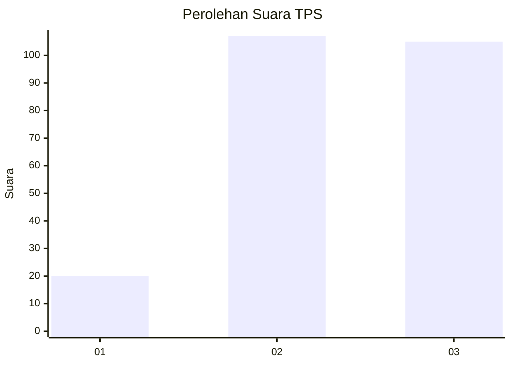
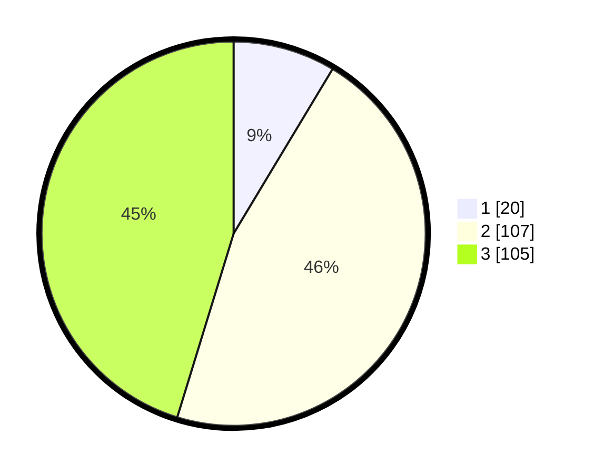

# Hasil

## Grafik

## Tabel

| No. | Nama Paslon    | Suara | Suara (raw) | Persentase |
|:--- |:-------------- | -----:| -----------:| ----------:|
| 1   | ANIES MUHAIMIN | 20    | [20][p-1]   | 8,62       |
| 2   | PRABOWO GIBRAN | 107   | [107][p-2]  | 46,12      |
| 3   | GANJAR MAHFUD  | 105   | [105][p-3]  | 45,26      |

[p-1]: https://github.com/gigit-pemilu/pemilu-2024/blob/main/pilpres/hitung-suara/sub/33-jawa-tengah/sub/10-klaten/sub/11-ceper/sub/2010-dlimas/sub/008-tps/sub/paslon-1.txt
[p-2]: https://github.com/gigit-pemilu/pemilu-2024/blob/main/pilpres/hitung-suara/sub/33-jawa-tengah/sub/10-klaten/sub/11-ceper/sub/2010-dlimas/sub/008-tps/sub/paslon-2.txt
[p-3]: https://github.com/gigit-pemilu/pemilu-2024/blob/main/pilpres/hitung-suara/sub/33-jawa-tengah/sub/10-klaten/sub/11-ceper/sub/2010-dlimas/sub/008-tps/sub/paslon-3.txt

## Foto C Plano

https://sirekap-obj-formc.kpu.go.id/cdc1/pemilu/ppwp/33/10/11/20/10/3310112010008-20240218-173536--24cf8d1c-cccc-41f5-bb86-f6c19b1d0827.jpg

https://sirekap-obj-formc.kpu.go.id/cdc1/pemilu/ppwp/33/10/11/20/10/3310112010008-20240218-104829--df9f93f5-7490-4070-80bb-c58ec58bea5e.jpg

https://sirekap-obj-formc.kpu.go.id/cdc1/pemilu/ppwp/33/10/11/20/10/3310112010008-20240218-104900--e467bb6d-ab92-4144-b8e1-2030aab67953.jpg

## Metadata

| Key        | Value               |
| ---------- | ------------------- |
| Time Stamp | 2024-02-20 11:00:00 |

