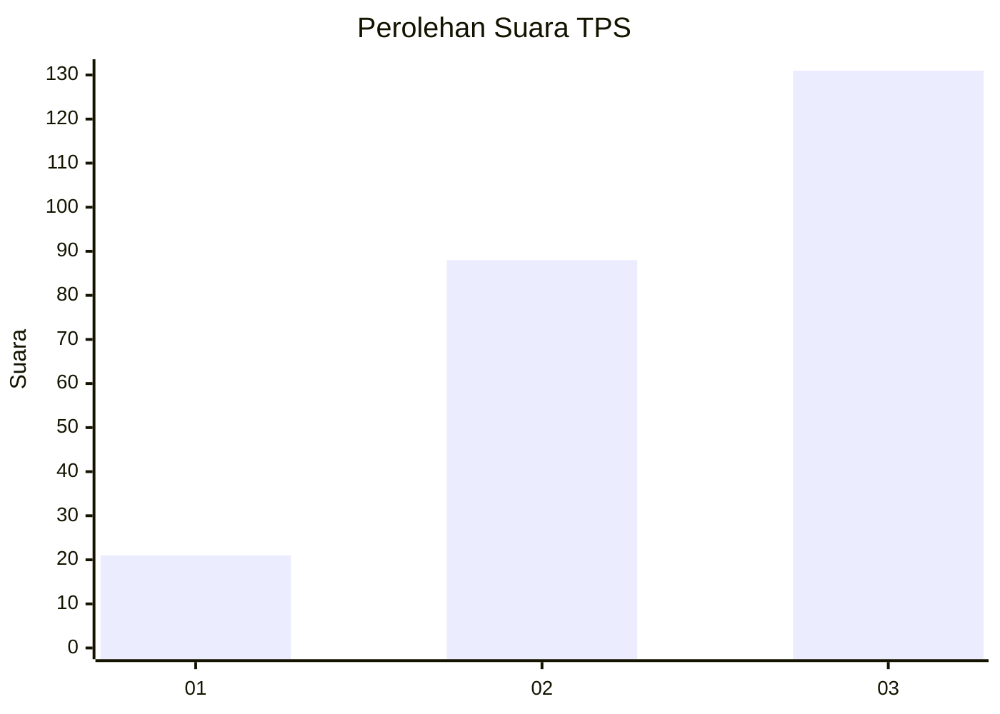
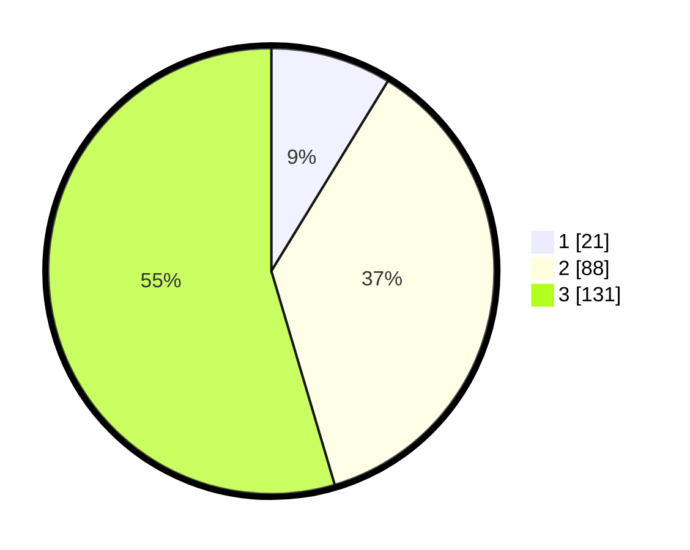

# Hasil

## Grafik

## Tabel

| No. | Nama Paslon    | Suara | Suara (raw) | Persentase |
|:--- |:-------------- | -----:| -----------:| ----------:|
| 1   | ANIES MUHAIMIN | 21    | [21][p-1]   | 8,75       |
| 2   | PRABOWO GIBRAN | 88    | [88][p-2]   | 36,67      |
| 3   | GANJAR MAHFUD  | 131   | [131][p-3]  | 54,58      |

[p-1]: https://github.com/gigit-pemilu/pemilu-2024-33-jawa-tengah/blob/main/pilpres/hitung-suara/sub/33-jawa-tengah/sub/10-klaten/sub/11-ceper/sub/2010-dlimas/sub/009-tps/sub/paslon-1.txt
[p-2]: https://github.com/gigit-pemilu/pemilu-2024-33-jawa-tengah/blob/main/pilpres/hitung-suara/sub/33-jawa-tengah/sub/10-klaten/sub/11-ceper/sub/2010-dlimas/sub/009-tps/sub/paslon-2.txt
[p-3]: https://github.com/gigit-pemilu/pemilu-2024-33-jawa-tengah/blob/main/pilpres/hitung-suara/sub/33-jawa-tengah/sub/10-klaten/sub/11-ceper/sub/2010-dlimas/sub/009-tps/sub/paslon-3.txt

## Foto C Plano

https://sirekap-obj-formc.kpu.go.id/b15f/pemilu/ppwp/33/10/11/20/10/3310112010009-20240221-204604--44ae4742-92ef-483f-9daa-3ef06219c48c.jpg

https://sirekap-obj-formc.kpu.go.id/b15f/pemilu/ppwp/33/10/11/20/10/3310112010009-20240221-204642--78a0ed28-cc1c-4bb2-b0fb-0fdc3ea8cf06.jpg

https://sirekap-obj-formc.kpu.go.id/b15f/pemilu/ppwp/33/10/11/20/10/3310112010009-20240221-203438--bfe5847f-fe57-4616-acd7-0d6998700ebe.jpg

## Metadata

| Key        | Value               |
| ---------- | ------------------- |
| Time Stamp | 2024-02-24 22:31:28 |

