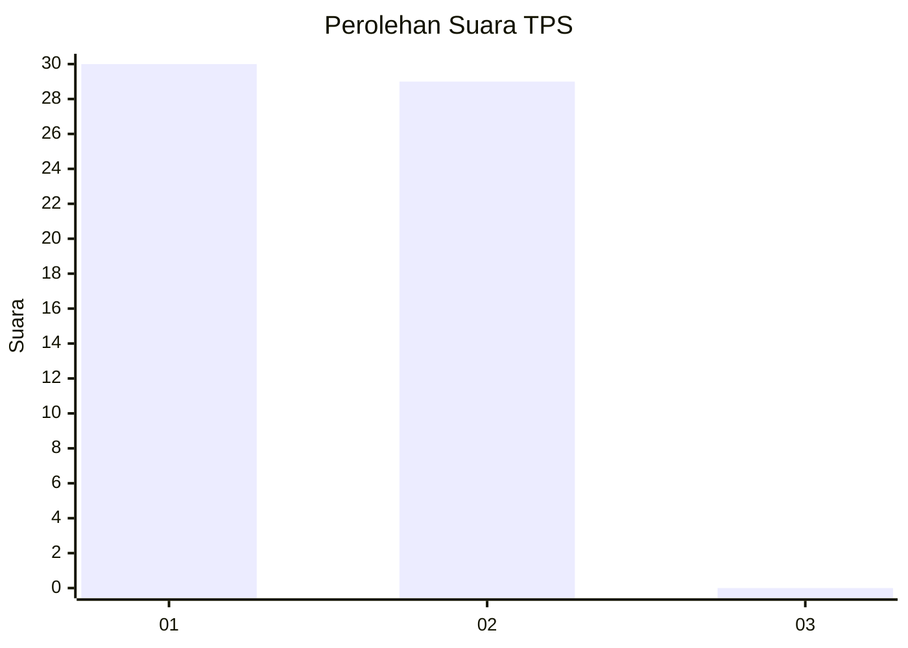
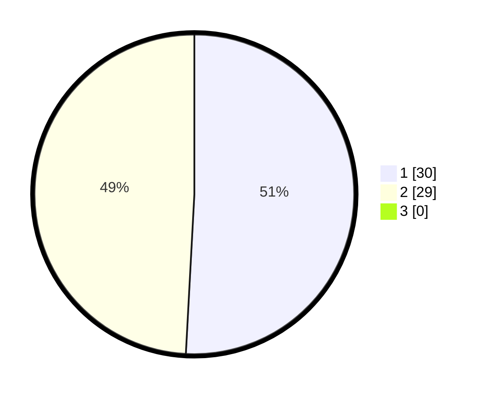

# Hasil

## Grafik

## Tabel

| No. | Nama Paslon    | Suara | Suara (raw) | Persentase |
|:--- |:-------------- | -----:| -----------:| ----------:|
| 1   | ANIES MUHAIMIN | 30    | [30][p-1]   | 50,85      |
| 2   | PRABOWO GIBRAN | 29    | [29][p-2]   | 49,15      |
| 3   | GANJAR MAHFUD  | 0     | [0][p-3]    | 0,00       |

[p-1]: https://github.com/gigit-pemilu/pemilu-2024/blob/main/pilpres/hitung-suara/sub/33-jawa-tengah/sub/10-klaten/sub/11-ceper/sub/2016-ngawonggo/sub/005-tps/sub/paslon-1.txt
[p-2]: https://github.com/gigit-pemilu/pemilu-2024/blob/main/pilpres/hitung-suara/sub/33-jawa-tengah/sub/10-klaten/sub/11-ceper/sub/2016-ngawonggo/sub/005-tps/sub/paslon-2.txt
[p-3]: https://github.com/gigit-pemilu/pemilu-2024/blob/main/pilpres/hitung-suara/sub/33-jawa-tengah/sub/10-klaten/sub/11-ceper/sub/2016-ngawonggo/sub/005-tps/sub/paslon-3.txt

## Foto C Plano

https://sirekap-obj-formc.kpu.go.id/e2ed/pemilu/ppwp/33/10/11/20/16/3310112016005-20240222-201427--377af6ee-6a2f-45f5-a294-f4ffa441c748.jpg

https://sirekap-obj-formc.kpu.go.id/e2ed/pemilu/ppwp/33/10/11/20/16/3310112016005-20240222-201511--84bb753a-8b8b-42bb-a2ae-74fb1b02c90b.jpg

https://sirekap-obj-formc.kpu.go.id/e2ed/pemilu/ppwp/33/10/11/20/16/3310112016005-20240222-201538--130c4b3b-5818-4920-89a7-3370abff7078.jpg

## Metadata

| Key        | Value               |
| ---------- | ------------------- |
| Time Stamp | 2024-02-22 21:00:00 |

