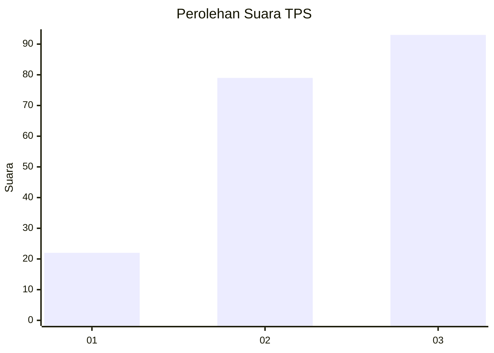
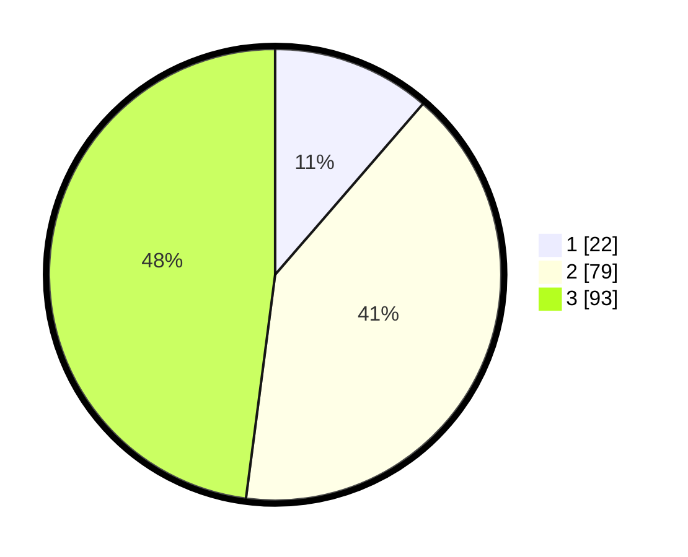

# Hasil

## Grafik

## Tabel

| No. | Nama Paslon    | Suara | Suara (raw) | Persentase |
|:--- |:-------------- | -----:| -----------:| ----------:|
| 1   | ANIES MUHAIMIN | 22    | [22][p-1]   | 11,34      |
| 2   | PRABOWO GIBRAN | 79    | [79][p-2]   | 40,72      |
| 3   | GANJAR MAHFUD  | 93    | [93][p-3]   | 47,94      |

[p-1]: https://github.com/gigit-pemilu/pemilu-2024-33-jawa-tengah/blob/main/pilpres/hitung-suara/sub/33-jawa-tengah/sub/10-klaten/sub/11-ceper/sub/2017-klepu/sub/005-tps/sub/paslon-1.txt
[p-2]: https://github.com/gigit-pemilu/pemilu-2024-33-jawa-tengah/blob/main/pilpres/hitung-suara/sub/33-jawa-tengah/sub/10-klaten/sub/11-ceper/sub/2017-klepu/sub/005-tps/sub/paslon-2.txt
[p-3]: https://github.com/gigit-pemilu/pemilu-2024-33-jawa-tengah/blob/main/pilpres/hitung-suara/sub/33-jawa-tengah/sub/10-klaten/sub/11-ceper/sub/2017-klepu/sub/005-tps/sub/paslon-3.txt

## Foto C Plano

https://sirekap-obj-formc.kpu.go.id/fcb5/pemilu/ppwp/33/10/11/20/17/3310112017005-20240222-102614--fd9d49b5-941c-420e-83ee-61dd6d0cb9fe.jpg

https://sirekap-obj-formc.kpu.go.id/fcb5/pemilu/ppwp/33/10/11/20/17/3310112017005-20240222-102906--ddc2413f-7543-4f97-9fd8-e04e8b4655c0.jpg

https://sirekap-obj-formc.kpu.go.id/fcb5/pemilu/ppwp/33/10/11/20/17/3310112017005-20240222-103511--3e3ee228-8973-4922-9319-0c142e994149.jpg

## Metadata

| Key        | Value               |
| ---------- | ------------------- |
| Time Stamp | 2024-02-25 12:00:00 |

