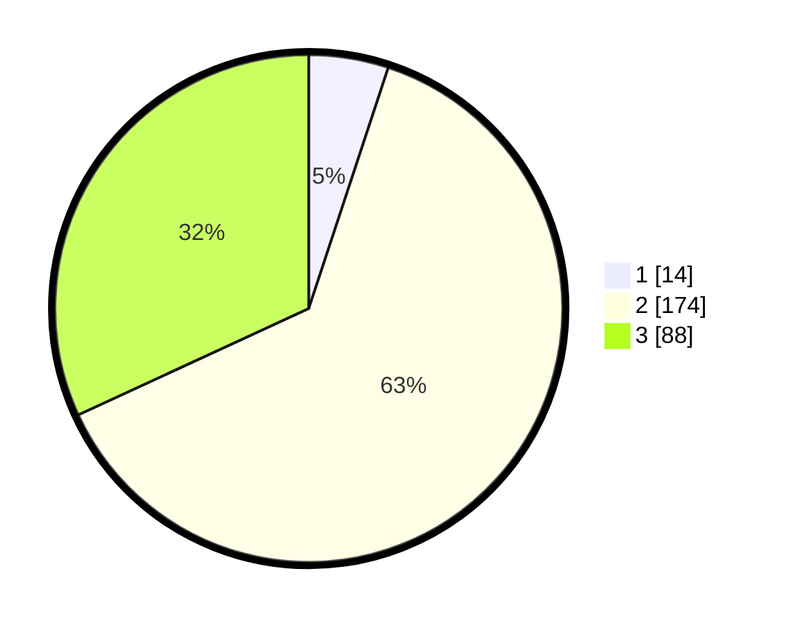

# Hasil

## Grafik

## Tabel

| No. | Nama Paslon    | Suara | Suara (raw) | Persentase |
|:--- |:-------------- | -----:| -----------:| ----------:|
| 1   | ANIES MUHAIMIN | 14    | [14][p-1]   | 5,07       |
| 2   | PRABOWO GIBRAN | 174   | [174][p-2]  | 63,04      |
| 3   | GANJAR MAHFUD  | 88    | [88][p-3]   | 31,88      |

[p-1]: https://github.com/gigit-pemilu/pemilu-2024-33-jawa-tengah/blob/main/pilpres/hitung-suara/sub/33-jawa-tengah/sub/10-klaten/sub/12-pedan/sub/2013-kaligawe/sub/002-tps/sub/paslon-1.txt
[p-2]: https://github.com/gigit-pemilu/pemilu-2024-33-jawa-tengah/blob/main/pilpres/hitung-suara/sub/33-jawa-tengah/sub/10-klaten/sub/12-pedan/sub/2013-kaligawe/sub/002-tps/sub/paslon-2.txt
[p-3]: https://github.com/gigit-pemilu/pemilu-2024-33-jawa-tengah/blob/main/pilpres/hitung-suara/sub/33-jawa-tengah/sub/10-klaten/sub/12-pedan/sub/2013-kaligawe/sub/002-tps/sub/paslon-3.txt

## Foto C Plano

https://sirekap-obj-formc.kpu.go.id/4736/pemilu/ppwp/33/10/12/20/13/3310122013002-20240214-141748--2b505107-ce8a-4e64-ba87-f5cce816286e.jpg

https://sirekap-obj-formc.kpu.go.id/4736/pemilu/ppwp/33/10/12/20/13/3310122013002-20240214-141919--17069e2b-f2db-4159-a321-61bb46fc8539.jpg

https://sirekap-obj-formc.kpu.go.id/4736/pemilu/ppwp/33/10/12/20/13/3310122013002-20240214-155908--228caeaf-22f9-4ebd-87d6-063f6324c4c1.jpg

## Metadata

| Key        | Value               |
| ---------- | ------------------- |
| Time Stamp | 2024-02-15 21:01:18 |

