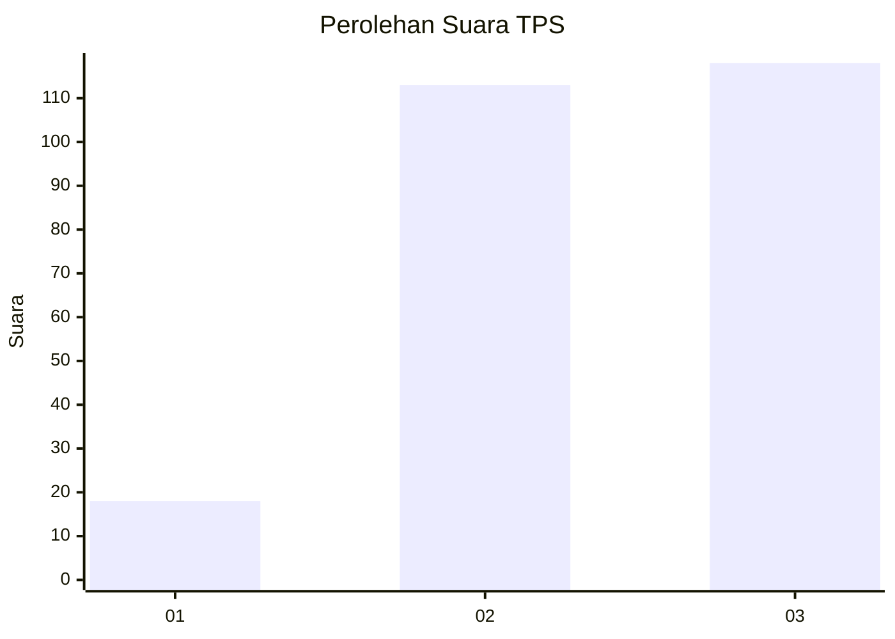
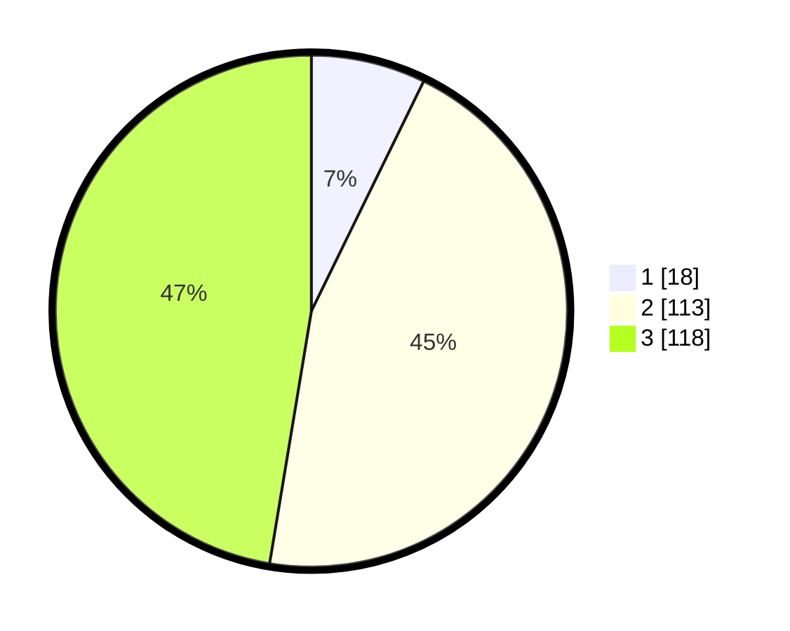

# Hasil

## Grafik

## Tabel

| No. | Nama Paslon    | Suara | Suara (raw) | Persentase |
|:--- |:-------------- | -----:| -----------:| ----------:|
| 1   | ANIES MUHAIMIN | 18    | [18][p-1]   | 7,23       |
| 2   | PRABOWO GIBRAN | 113   | [113][p-2]  | 45,38      |
| 3   | GANJAR MAHFUD  | 118   | [118][p-3]  | 47,39      |

[p-1]: https://github.com/gigit-pemilu/pemilu-2024-33-jawa-tengah/blob/main/pilpres/hitung-suara/sub/33-jawa-tengah/sub/10-klaten/sub/12-pedan/sub/2013-kaligawe/sub/004-tps/sub/paslon-1.txt
[p-2]: https://github.com/gigit-pemilu/pemilu-2024-33-jawa-tengah/blob/main/pilpres/hitung-suara/sub/33-jawa-tengah/sub/10-klaten/sub/12-pedan/sub/2013-kaligawe/sub/004-tps/sub/paslon-2.txt
[p-3]: https://github.com/gigit-pemilu/pemilu-2024-33-jawa-tengah/blob/main/pilpres/hitung-suara/sub/33-jawa-tengah/sub/10-klaten/sub/12-pedan/sub/2013-kaligawe/sub/004-tps/sub/paslon-3.txt

## Foto C Plano

https://sirekap-obj-formc.kpu.go.id/05f6/pemilu/ppwp/33/10/12/20/13/3310122013004-20240215-000417--dcaa2558-bfdd-4c17-a1db-10c402fbf740.jpg

https://sirekap-obj-formc.kpu.go.id/05f6/pemilu/ppwp/33/10/12/20/13/3310122013004-20240215-000524--9688dc20-888a-499b-8ae2-812515307180.jpg

https://sirekap-obj-formc.kpu.go.id/05f6/pemilu/ppwp/33/10/12/20/13/3310122013004-20240215-000619--d2afbd1c-976b-485f-afb2-fc6b5fe0585c.jpg

## Metadata

| Key        | Value               |
| ---------- | ------------------- |
| Time Stamp | 2024-02-15 21:01:18 |

