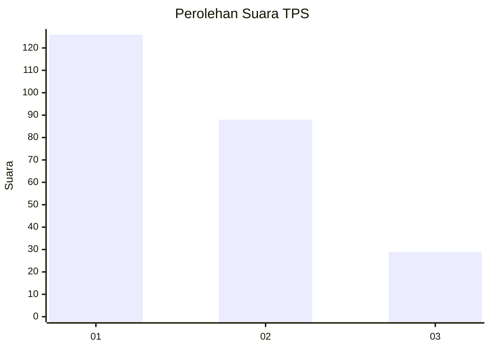
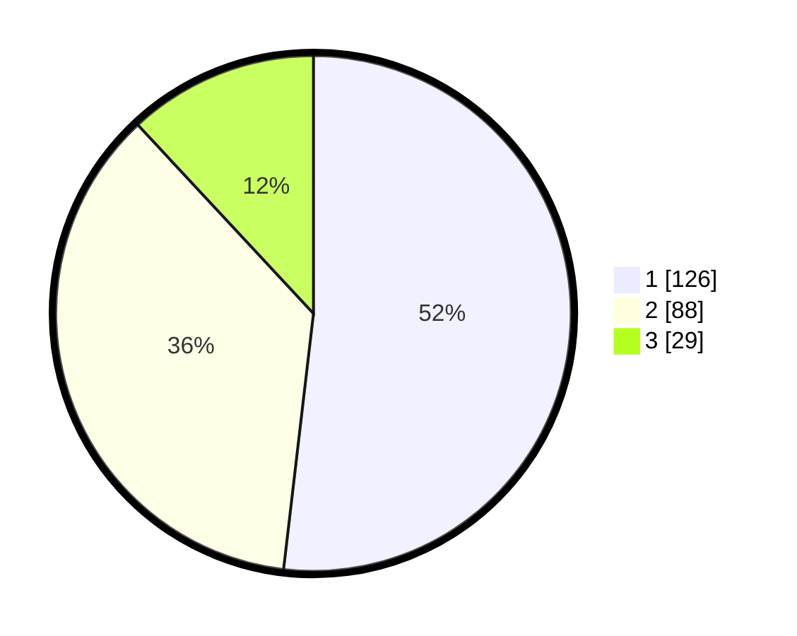

# Hasil

## Grafik

## Tabel

| No. | Nama Paslon    | Suara | Suara (raw) | Persentase |
|:--- |:-------------- | -----:| -----------:| ----------:|
| 1   | ANIES MUHAIMIN | 126   | [126][p-1]  | 51,85      |
| 2   | PRABOWO GIBRAN | 88    | [88][p-2]   | 36,21      |
| 3   | GANJAR MAHFUD  | 29    | [29][p-3]   | 11,93      |

[p-1]: https://github.com/gigit-pemilu/pemilu-2024-33-jawa-tengah/blob/main/pilpres/hitung-suara/sub/33-jawa-tengah/sub/10-klaten/sub/12-pedan/sub/2013-kaligawe/sub/008-tps/sub/paslon-1.txt
[p-2]: https://github.com/gigit-pemilu/pemilu-2024-33-jawa-tengah/blob/main/pilpres/hitung-suara/sub/33-jawa-tengah/sub/10-klaten/sub/12-pedan/sub/2013-kaligawe/sub/008-tps/sub/paslon-2.txt
[p-3]: https://github.com/gigit-pemilu/pemilu-2024-33-jawa-tengah/blob/main/pilpres/hitung-suara/sub/33-jawa-tengah/sub/10-klaten/sub/12-pedan/sub/2013-kaligawe/sub/008-tps/sub/paslon-3.txt

## Foto C Plano

https://sirekap-obj-formc.kpu.go.id/8366/pemilu/ppwp/33/10/12/20/13/3310122013008-20240214-231241--184d6fa0-144e-4082-9b25-139ee42a6423.jpg

https://sirekap-obj-formc.kpu.go.id/8366/pemilu/ppwp/33/10/12/20/13/3310122013008-20240214-232250--7c961715-e575-4397-9c1c-5a21cae1001c.jpg

https://sirekap-obj-formc.kpu.go.id/8366/pemilu/ppwp/33/10/12/20/13/3310122013008-20240214-232606--1b69dd84-836b-4ee3-b6d0-db45557e290b.jpg

## Metadata

| Key        | Value               |
| ---------- | ------------------- |
| Time Stamp | 2024-02-15 21:01:18 |

