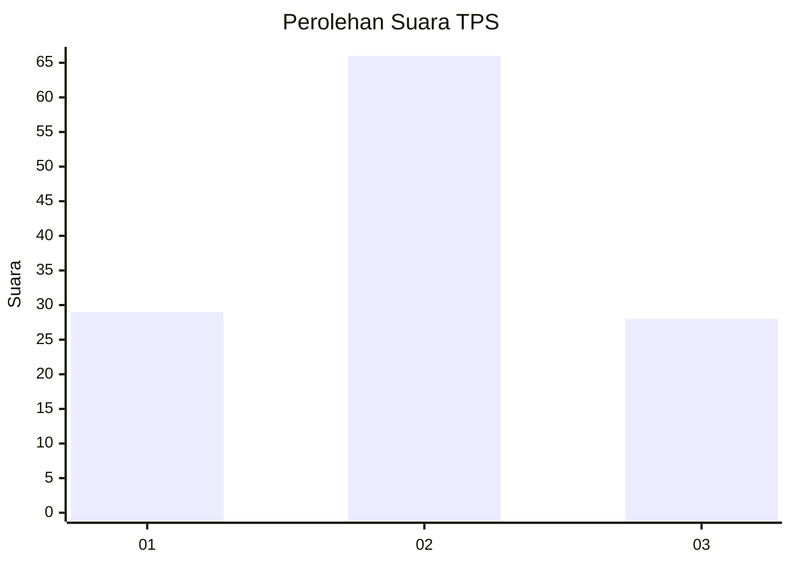
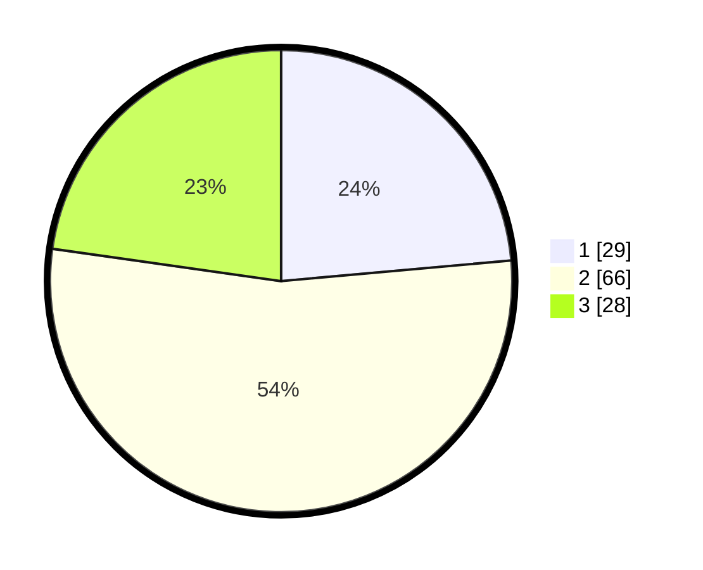

# Hasil

## Grafik

## Tabel

| No. | Nama Paslon    | Suara | Suara (raw) | Persentase |
|:--- |:-------------- | -----:| -----------:| ----------:|
| 1   | ANIES MUHAIMIN | 29    | [29][p-1]   | 23,58      |
| 2   | PRABOWO GIBRAN | 66    | [66][p-2]   | 53,66      |
| 3   | GANJAR MAHFUD  | 28    | [28][p-3]   | 22,76      |

[p-1]: https://github.com/gigit-pemilu/pemilu-2024-33-jawa-tengah/blob/main/pilpres/hitung-suara/sub/33-jawa-tengah/sub/10-klaten/sub/12-pedan/sub/2013-kaligawe/sub/009-tps/sub/paslon-1.txt
[p-2]: https://github.com/gigit-pemilu/pemilu-2024-33-jawa-tengah/blob/main/pilpres/hitung-suara/sub/33-jawa-tengah/sub/10-klaten/sub/12-pedan/sub/2013-kaligawe/sub/009-tps/sub/paslon-2.txt
[p-3]: https://github.com/gigit-pemilu/pemilu-2024-33-jawa-tengah/blob/main/pilpres/hitung-suara/sub/33-jawa-tengah/sub/10-klaten/sub/12-pedan/sub/2013-kaligawe/sub/009-tps/sub/paslon-3.txt

## Foto C Plano

https://sirekap-obj-formc.kpu.go.id/d053/pemilu/ppwp/33/10/12/20/13/3310122013009-20240214-141015--943c4c9a-396d-4d3f-b5cc-b90367c342ae.jpg

https://sirekap-obj-formc.kpu.go.id/d053/pemilu/ppwp/33/10/12/20/13/3310122013009-20240214-141111--f3200ed4-e6c0-4824-b86a-c94e2b83d329.jpg

https://sirekap-obj-formc.kpu.go.id/d053/pemilu/ppwp/33/10/12/20/13/3310122013009-20240214-141205--46cf02e2-96bb-4d63-990a-a6588d0afe16.jpg

## Metadata

| Key        | Value               |
| ---------- | ------------------- |
| Time Stamp | 2024-02-16 00:30:27 |

