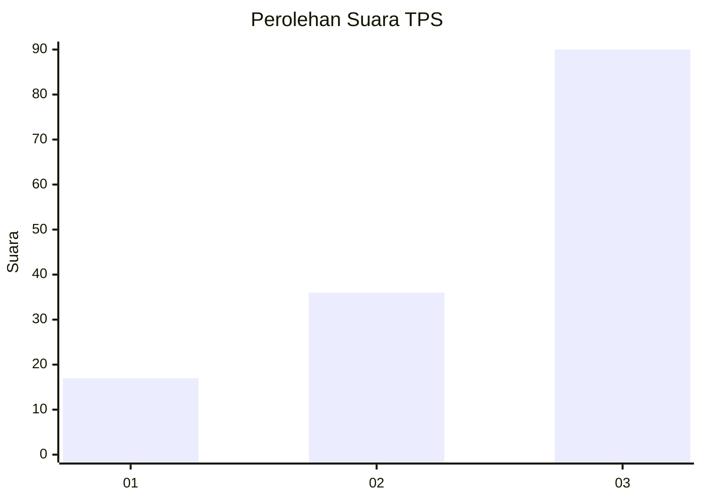
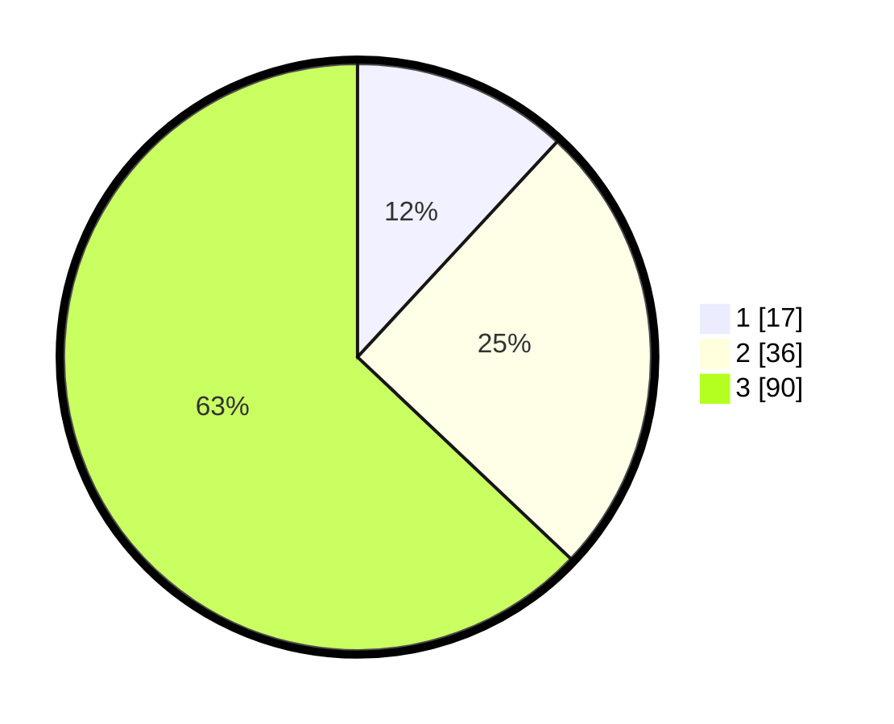

# Hasil

## Grafik

## Tabel

| No. | Nama Paslon    | Suara | Suara (raw) | Persentase |
|:--- |:-------------- | -----:| -----------:| ----------:|
| 1   | ANIES MUHAIMIN | 17    | [17][p-1]   | 11,89      |
| 2   | PRABOWO GIBRAN | 36    | [36][p-2]   | 25,17      |
| 3   | GANJAR MAHFUD  | 90    | [90][p-3]   | 62,94      |

[p-1]: https://github.com/gigit-pemilu/pemilu-2024/blob/main/pilpres/hitung-suara/sub/33-jawa-tengah/sub/10-klaten/sub/12-pedan/sub/2014-lemahireng/sub/005-tps/sub/paslon-1.txt
[p-2]: https://github.com/gigit-pemilu/pemilu-2024/blob/main/pilpres/hitung-suara/sub/33-jawa-tengah/sub/10-klaten/sub/12-pedan/sub/2014-lemahireng/sub/005-tps/sub/paslon-2.txt
[p-3]: https://github.com/gigit-pemilu/pemilu-2024/blob/main/pilpres/hitung-suara/sub/33-jawa-tengah/sub/10-klaten/sub/12-pedan/sub/2014-lemahireng/sub/005-tps/sub/paslon-3.txt

## Foto C Plano

https://sirekap-obj-formc.kpu.go.id/de15/pemilu/ppwp/33/10/12/20/14/3310122014005-20240214-210558--5c5f7a00-781c-4cbb-a29f-eb931f517edf.jpg

https://sirekap-obj-formc.kpu.go.id/de15/pemilu/ppwp/33/10/12/20/14/3310122014005-20240214-225514--eb2d3364-173c-4a31-9197-bd54454fa520.jpg

https://sirekap-obj-formc.kpu.go.id/de15/pemilu/ppwp/33/10/12/20/14/3310122014005-20240214-222218--63ec611e-4c05-4294-99df-5c9463a76b9e.jpg

## Metadata

| Key        | Value               |
| ---------- | ------------------- |
| Time Stamp | 2024-02-15 21:30:27 |

