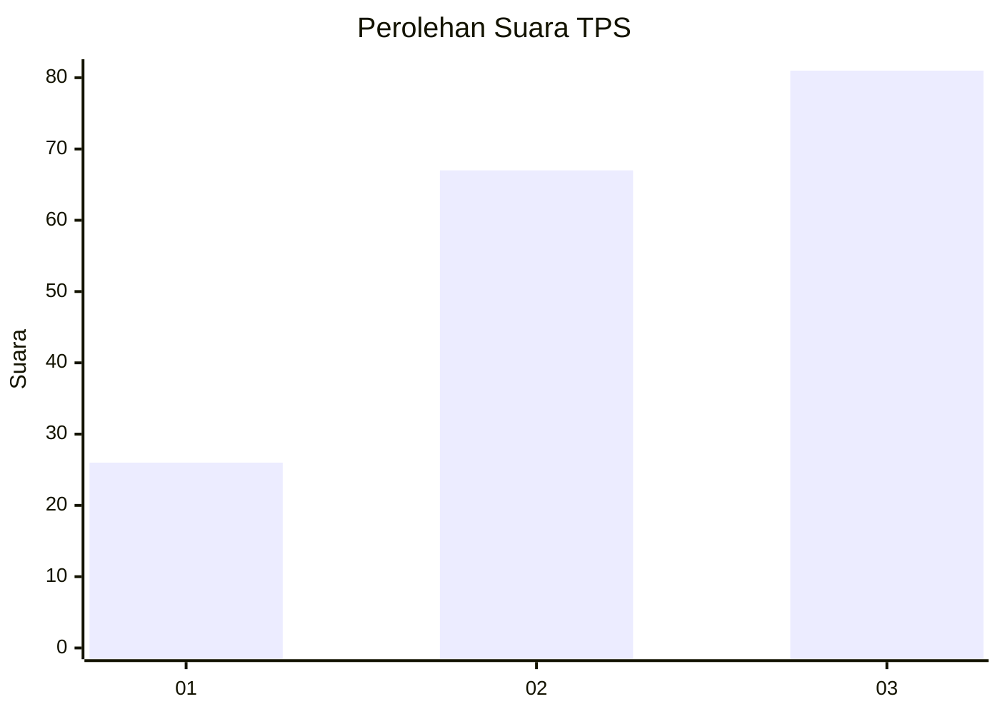
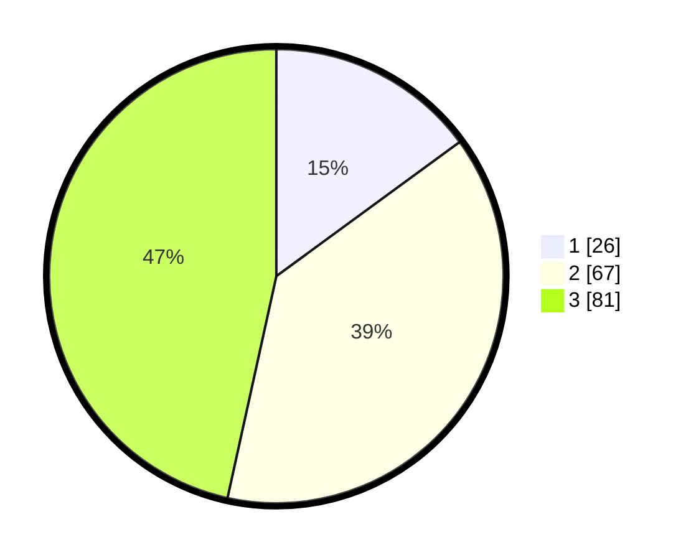

# Hasil

## Grafik

## Tabel

| No. | Nama Paslon    | Suara | Suara (raw) | Persentase |
|:--- |:-------------- | -----:| -----------:| ----------:|
| 1   | ANIES MUHAIMIN | 26    | [26][p-1]   | 14,94      |
| 2   | PRABOWO GIBRAN | 67    | [67][p-2]   | 38,51      |
| 3   | GANJAR MAHFUD  | 81    | [81][p-3]   | 46,55      |

[p-1]: https://github.com/gigit-pemilu/pemilu-2024/blob/main/pilpres/hitung-suara/sub/33-jawa-tengah/sub/10-klaten/sub/13-karangdowo/sub/2017-tegalampel/sub/001-tps/sub/paslon-1.txt
[p-2]: https://github.com/gigit-pemilu/pemilu-2024/blob/main/pilpres/hitung-suara/sub/33-jawa-tengah/sub/10-klaten/sub/13-karangdowo/sub/2017-tegalampel/sub/001-tps/sub/paslon-2.txt
[p-3]: https://github.com/gigit-pemilu/pemilu-2024/blob/main/pilpres/hitung-suara/sub/33-jawa-tengah/sub/10-klaten/sub/13-karangdowo/sub/2017-tegalampel/sub/001-tps/sub/paslon-3.txt

## Foto C Plano

https://sirekap-obj-formc.kpu.go.id/246b/pemilu/ppwp/33/10/13/20/17/3310132017001-20240215-004002--2bc64f63-b825-4b01-aedc-7d5a8645f9f2.jpg

https://sirekap-obj-formc.kpu.go.id/246b/pemilu/ppwp/33/10/13/20/17/3310132017001-20240214-141913--14ca268e-359d-4dae-b320-d8535e2a72ae.jpg

https://sirekap-obj-formc.kpu.go.id/246b/pemilu/ppwp/33/10/13/20/17/3310132017001-20240216-120616--1a2381bb-e0d0-462a-baf3-70cc76fe287f.jpg

## Metadata

| Key        | Value               |
| ---------- | ------------------- |
| Time Stamp | 2024-02-16 12:51:22 |

