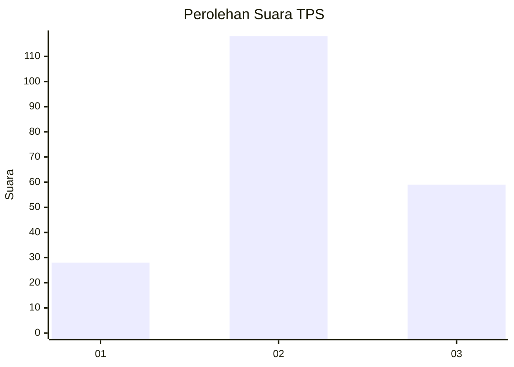
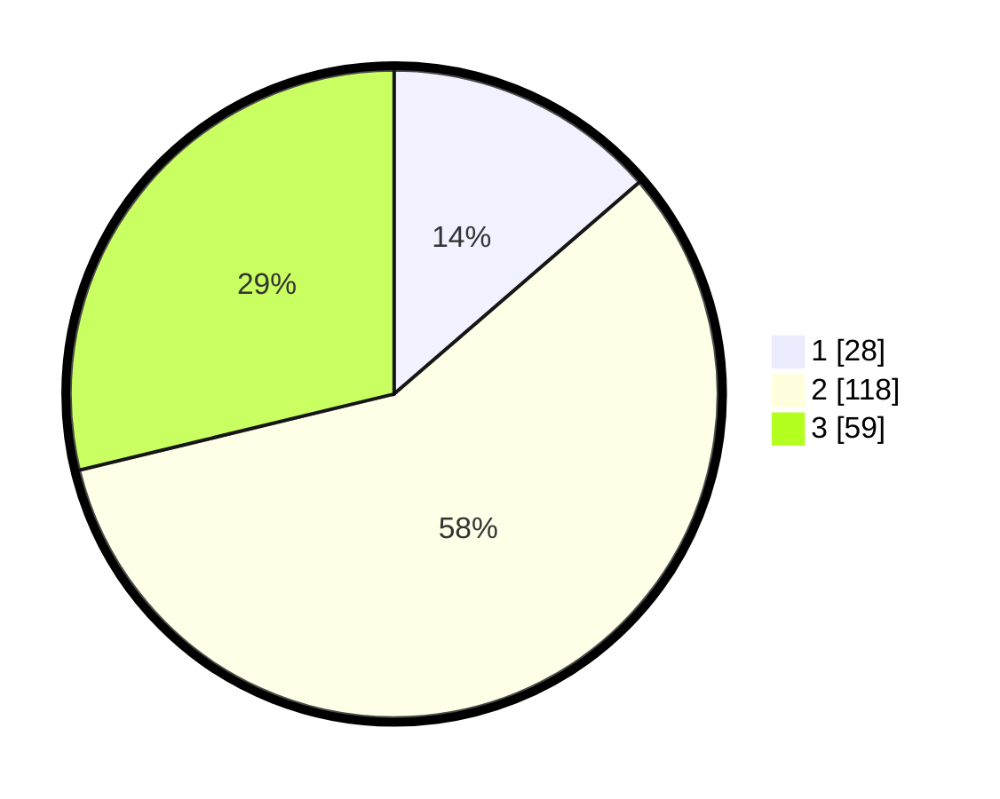

# Hasil

## Grafik

## Tabel

| No. | Nama Paslon    | Suara | Suara (raw) | Persentase |
|:--- |:-------------- | -----:| -----------:| ----------:|
| 1   | ANIES MUHAIMIN | 28    | [28][p-1]   | 13,66      |
| 2   | PRABOWO GIBRAN | 118   | [118][p-2]  | 57,56      |
| 3   | GANJAR MAHFUD  | 59    | [59][p-3]   | 28,78      |

[p-1]: https://github.com/gigit-pemilu/pemilu-2024-33-jawa-tengah/blob/main/pilpres/hitung-suara/sub/33-jawa-tengah/sub/10-klaten/sub/14-juwiring/sub/2001-trasan/sub/005-tps/sub/paslon-1.txt
[p-2]: https://github.com/gigit-pemilu/pemilu-2024-33-jawa-tengah/blob/main/pilpres/hitung-suara/sub/33-jawa-tengah/sub/10-klaten/sub/14-juwiring/sub/2001-trasan/sub/005-tps/sub/paslon-2.txt
[p-3]: https://github.com/gigit-pemilu/pemilu-2024-33-jawa-tengah/blob/main/pilpres/hitung-suara/sub/33-jawa-tengah/sub/10-klaten/sub/14-juwiring/sub/2001-trasan/sub/005-tps/sub/paslon-3.txt

## Foto C Plano

https://sirekap-obj-formc.kpu.go.id/b0c8/pemilu/ppwp/33/10/14/20/01/3310142001005-20240217-083706--b38983cd-62cb-4cdb-8a6a-2d3616259e72.jpg

https://sirekap-obj-formc.kpu.go.id/b0c8/pemilu/ppwp/33/10/14/20/01/3310142001005-20240216-105740--71b255ab-d8eb-4834-a2dc-02f7cfc12372.jpg

https://sirekap-obj-formc.kpu.go.id/b0c8/pemilu/ppwp/33/10/14/20/01/3310142001005-20240216-105836--ee5c2c77-a363-496d-bf70-898982d3e8ee.jpg

## Metadata

| Key        | Value               |
| ---------- | ------------------- |
| Time Stamp | 2024-02-17 09:00:02 |

