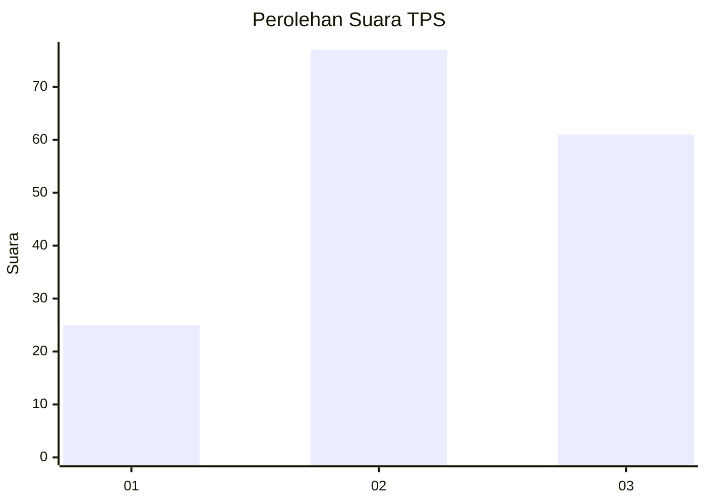
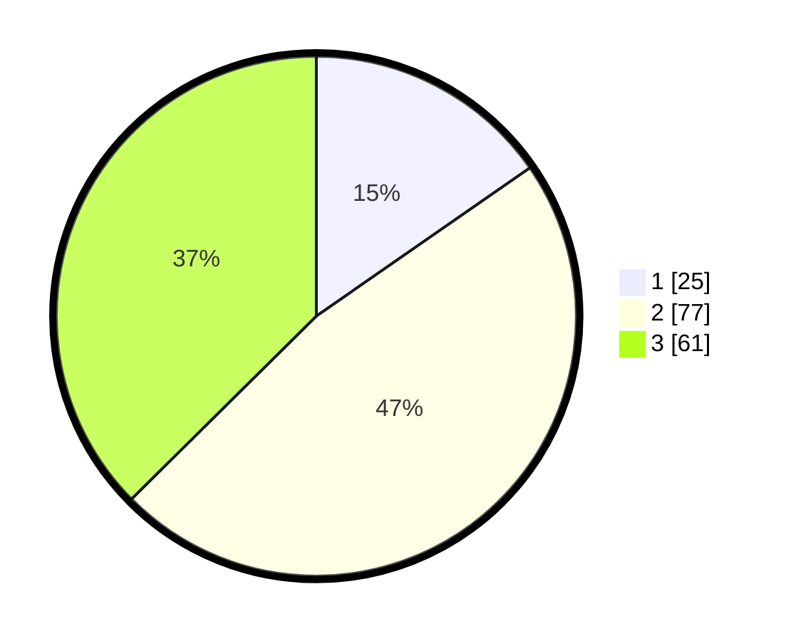

# Hasil

## Grafik

## Tabel

| No. | Nama Paslon    | Suara | Suara (raw) | Persentase |
|:--- |:-------------- | -----:| -----------:| ----------:|
| 1   | ANIES MUHAIMIN | 25    | [25][p-1]   | 15,34      |
| 2   | PRABOWO GIBRAN | 77    | [77][p-2]   | 47,24      |
| 3   | GANJAR MAHFUD  | 61    | [61][p-3]   | 37,42      |

[p-1]: https://github.com/gigit-pemilu/pemilu-2024-33-jawa-tengah/blob/main/pilpres/hitung-suara/sub/33-jawa-tengah/sub/10-klaten/sub/14-juwiring/sub/2003-juwiran/sub/003-tps/sub/paslon-1.txt
[p-2]: https://github.com/gigit-pemilu/pemilu-2024-33-jawa-tengah/blob/main/pilpres/hitung-suara/sub/33-jawa-tengah/sub/10-klaten/sub/14-juwiring/sub/2003-juwiran/sub/003-tps/sub/paslon-2.txt
[p-3]: https://github.com/gigit-pemilu/pemilu-2024-33-jawa-tengah/blob/main/pilpres/hitung-suara/sub/33-jawa-tengah/sub/10-klaten/sub/14-juwiring/sub/2003-juwiran/sub/003-tps/sub/paslon-3.txt

## Foto C Plano

https://sirekap-obj-formc.kpu.go.id/0351/pemilu/ppwp/33/10/14/20/03/3310142003003-20240317-114746--7a505421-ecf7-4aad-bb4f-e1931f211e45.jpg

https://sirekap-obj-formc.kpu.go.id/0351/pemilu/ppwp/33/10/14/20/03/3310142003003-20240215-173320--484fe8e9-73ac-473a-9d73-4527352d8e6b.jpg

https://sirekap-obj-formc.kpu.go.id/0351/pemilu/ppwp/33/10/14/20/03/3310142003003-20240317-122620--69afc0ee-b0f5-4acc-ba90-61da2c37f9cd.jpg

## Metadata

| Key        | Value               |
| ---------- | ------------------- |
| Time Stamp | 2024-03-17 12:30:00 |

