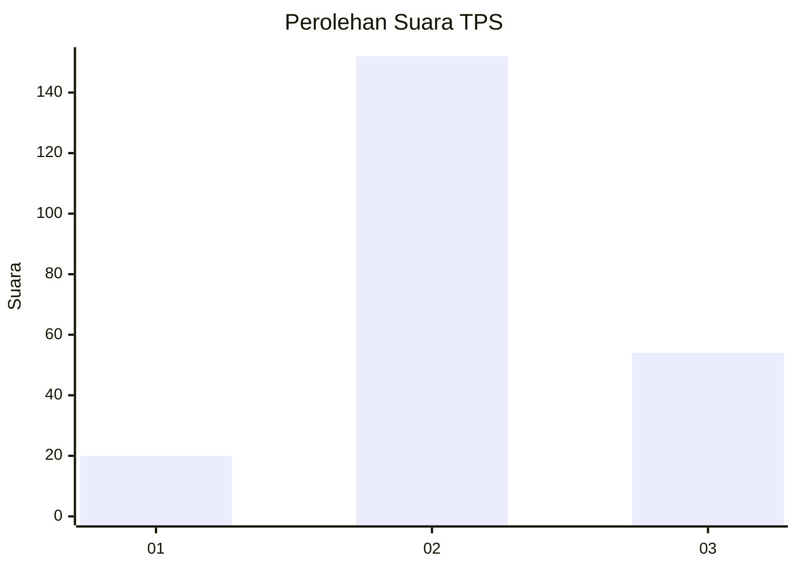
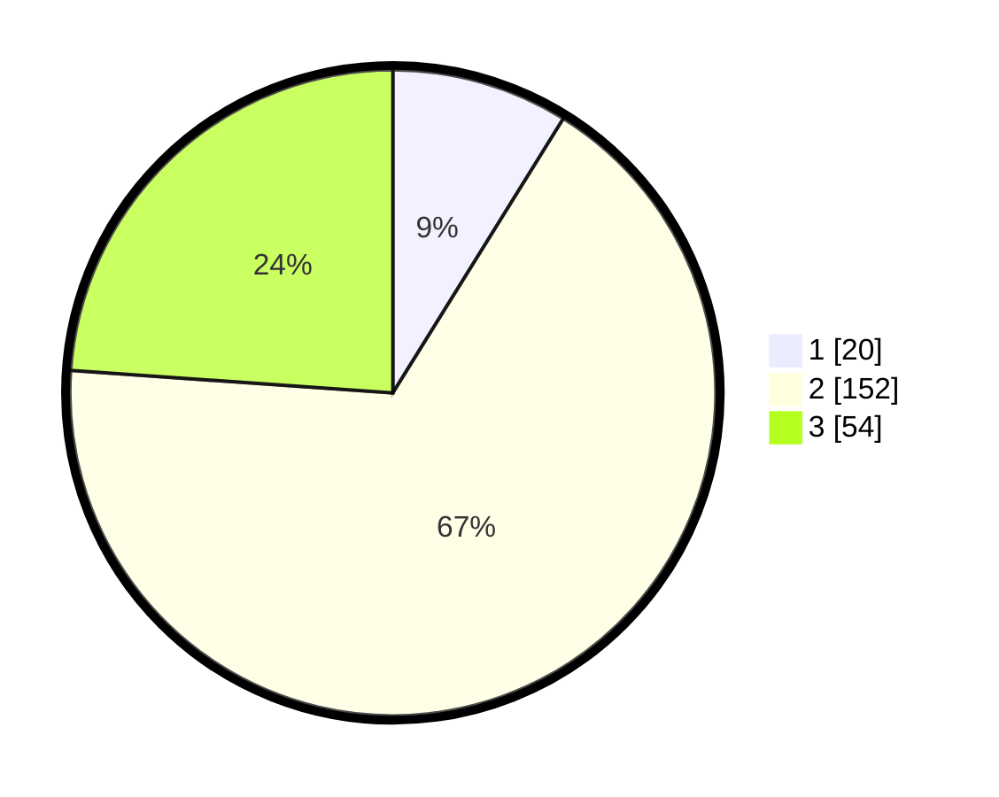

# Hasil

## Grafik

## Tabel

| No. | Nama Paslon    | Suara | Suara (raw) | Persentase |
|:--- |:-------------- | -----:| -----------:| ----------:|
| 1   | ANIES MUHAIMIN | 20    | [20][p-1]   | 8,85       |
| 2   | PRABOWO GIBRAN | 152   | [152][p-2]  | 67,26      |
| 3   | GANJAR MAHFUD  | 54    | [54][p-3]   | 23,89      |

[p-1]: https://github.com/gigit-pemilu/pemilu-2024/blob/main/pilpres/hitung-suara/sub/33-jawa-tengah/sub/10-klaten/sub/14-juwiring/sub/2005-ketitang/sub/004-tps/sub/paslon-1.txt
[p-2]: https://github.com/gigit-pemilu/pemilu-2024/blob/main/pilpres/hitung-suara/sub/33-jawa-tengah/sub/10-klaten/sub/14-juwiring/sub/2005-ketitang/sub/004-tps/sub/paslon-2.txt
[p-3]: https://github.com/gigit-pemilu/pemilu-2024/blob/main/pilpres/hitung-suara/sub/33-jawa-tengah/sub/10-klaten/sub/14-juwiring/sub/2005-ketitang/sub/004-tps/sub/paslon-3.txt

## Foto C Plano

https://sirekap-obj-formc.kpu.go.id/8acd/pemilu/ppwp/33/10/14/20/05/3310142005004-20240214-212046--122c0c20-c5d2-45b9-9cba-e193583ea4bc.jpg

https://sirekap-obj-formc.kpu.go.id/8acd/pemilu/ppwp/33/10/14/20/05/3310142005004-20240214-212419--66a457d6-0c3c-4e0a-82d4-cbe1e0347ae6.jpg

https://sirekap-obj-formc.kpu.go.id/8acd/pemilu/ppwp/33/10/14/20/05/3310142005004-20240214-212205--5f7c2672-cc4f-469c-9ca9-f430b3cf9f7f.jpg

## Metadata

| Key        | Value               |
| ---------- | ------------------- |
| Time Stamp | 2024-02-15 12:00:28 |

