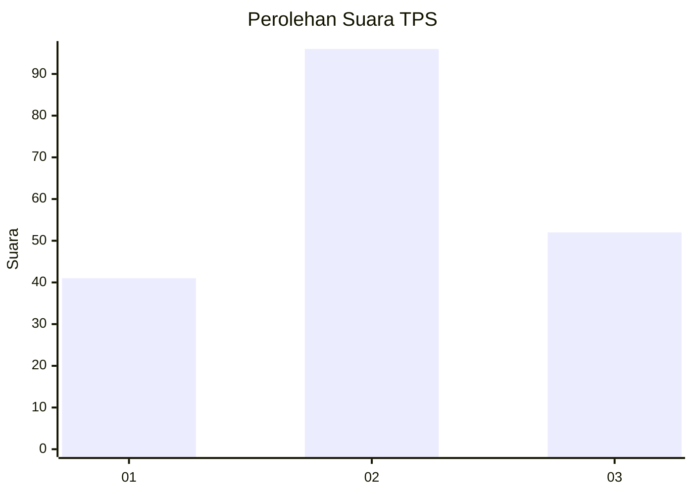
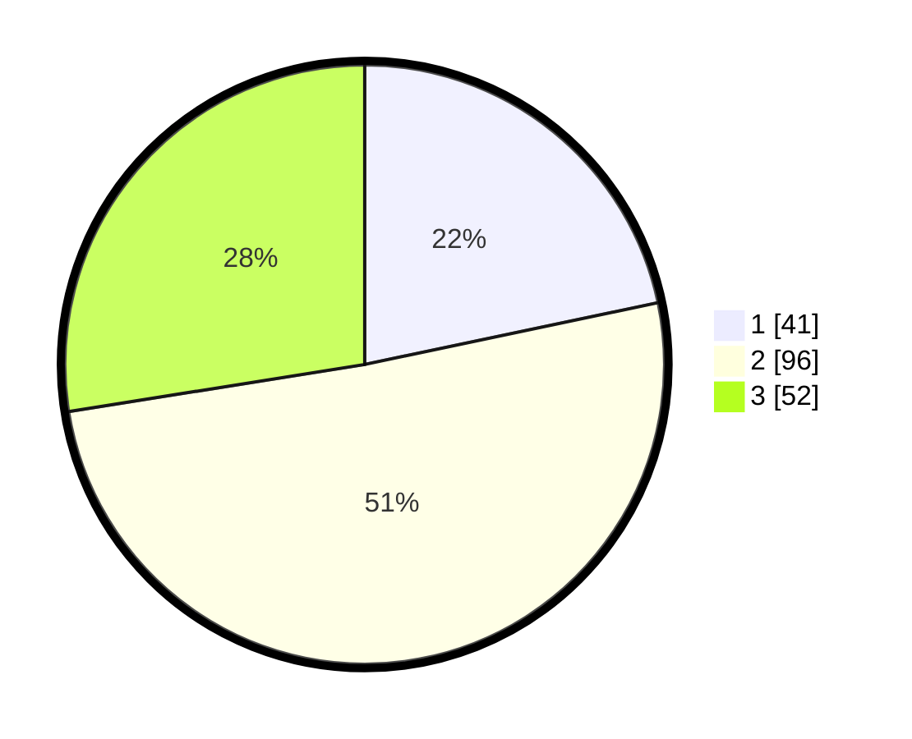

# Hasil

## Grafik

## Tabel

| No. | Nama Paslon    | Suara | Suara (raw) | Persentase |
|:--- |:-------------- | -----:| -----------:| ----------:|
| 1   | ANIES MUHAIMIN | 41    | [41][p-1]   | 21,69      |
| 2   | PRABOWO GIBRAN | 96    | [96][p-2]   | 50,79      |
| 3   | GANJAR MAHFUD  | 52    | [52][p-3]   | 27,51      |

[p-1]: https://github.com/gigit-pemilu/pemilu-2024/blob/main/pilpres/hitung-suara/sub/33-jawa-tengah/sub/10-klaten/sub/14-juwiring/sub/2008-tlogorandu/sub/002-tps/sub/paslon-1.txt
[p-2]: https://github.com/gigit-pemilu/pemilu-2024/blob/main/pilpres/hitung-suara/sub/33-jawa-tengah/sub/10-klaten/sub/14-juwiring/sub/2008-tlogorandu/sub/002-tps/sub/paslon-2.txt
[p-3]: https://github.com/gigit-pemilu/pemilu-2024/blob/main/pilpres/hitung-suara/sub/33-jawa-tengah/sub/10-klaten/sub/14-juwiring/sub/2008-tlogorandu/sub/002-tps/sub/paslon-3.txt

## Foto C Plano

https://sirekap-obj-formc.kpu.go.id/7f39/pemilu/ppwp/33/10/14/20/08/3310142008002-20240216-142323--11ac83ad-656d-4c37-afc4-f2263c5490cb.jpg

https://sirekap-obj-formc.kpu.go.id/7f39/pemilu/ppwp/33/10/14/20/08/3310142008002-20240216-142356--74fba8db-5dde-4ab0-a9c9-ee8da231f710.jpg

https://sirekap-obj-formc.kpu.go.id/7f39/pemilu/ppwp/33/10/14/20/08/3310142008002-20240216-142431--3c7bb7e1-e06e-4ec1-b035-aa272a985abd.jpg

## Metadata

| Key        | Value               |
| ---------- | ------------------- |
| Time Stamp | 2024-02-16 16:25:10 |

