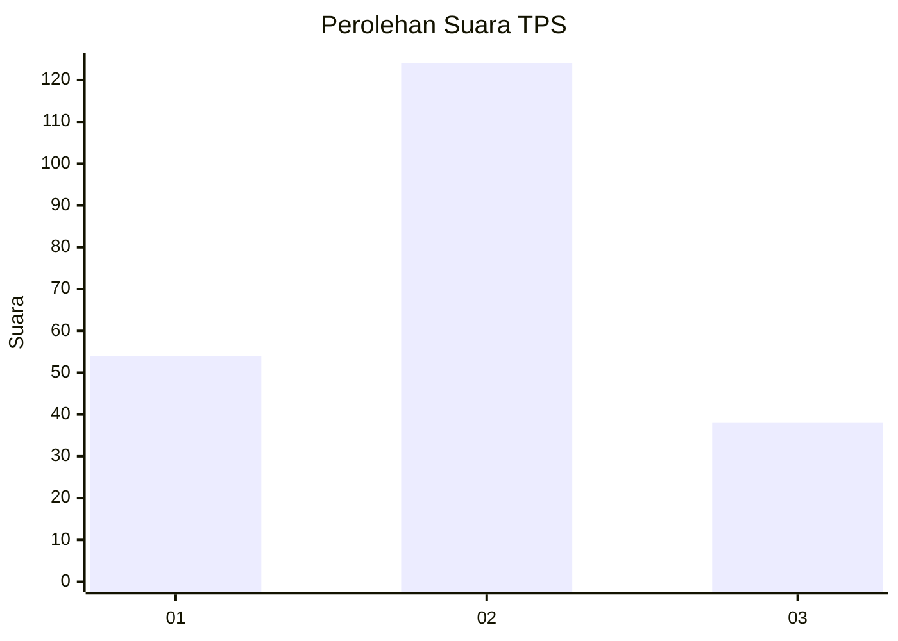
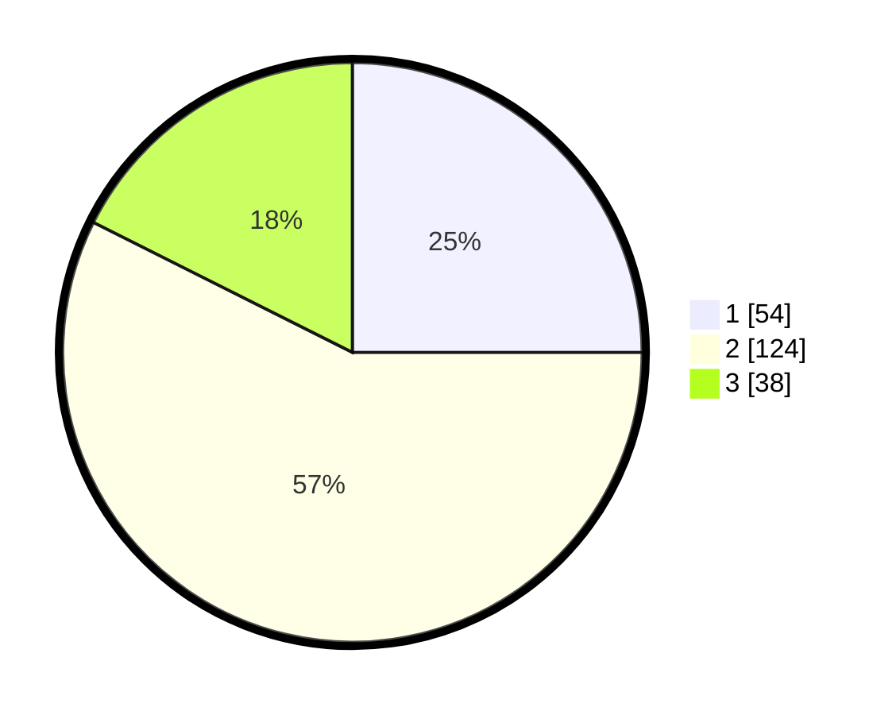

# Hasil

## Grafik

## Tabel

| No. | Nama Paslon    | Suara | Suara (raw) | Persentase |
|:--- |:-------------- | -----:| -----------:| ----------:|
| 1   | ANIES MUHAIMIN | 54    | [54][p-1]   | 25,00      |
| 2   | PRABOWO GIBRAN | 124   | [124][p-2]  | 57,41      |
| 3   | GANJAR MAHFUD  | 38    | [38][p-3]   | 17,59      |

[p-1]: https://github.com/gigit-pemilu/pemilu-2024/blob/main/pilpres/hitung-suara/sub/33-jawa-tengah/sub/10-klaten/sub/14-juwiring/sub/2011-kenaiban/sub/002-tps/sub/paslon-1.txt
[p-2]: https://github.com/gigit-pemilu/pemilu-2024/blob/main/pilpres/hitung-suara/sub/33-jawa-tengah/sub/10-klaten/sub/14-juwiring/sub/2011-kenaiban/sub/002-tps/sub/paslon-2.txt
[p-3]: https://github.com/gigit-pemilu/pemilu-2024/blob/main/pilpres/hitung-suara/sub/33-jawa-tengah/sub/10-klaten/sub/14-juwiring/sub/2011-kenaiban/sub/002-tps/sub/paslon-3.txt

## Foto C Plano

https://sirekap-obj-formc.kpu.go.id/4d80/pemilu/ppwp/33/10/14/20/11/3310142011002-20240216-151317--f9e328f1-b374-47ea-a58e-47a3a05603d2.jpg

https://sirekap-obj-formc.kpu.go.id/4d80/pemilu/ppwp/33/10/14/20/11/3310142011002-20240218-120451--6d9eb3f3-d557-48a2-b9f1-63f9aa64601a.jpg

https://sirekap-obj-formc.kpu.go.id/4d80/pemilu/ppwp/33/10/14/20/11/3310142011002-20240218-120720--0a6e5ff4-eab3-4076-ac31-c27d3103dd05.jpg

## Metadata

| Key        | Value               |
| ---------- | ------------------- |
| Time Stamp | 2024-02-19 16:00:00 |

