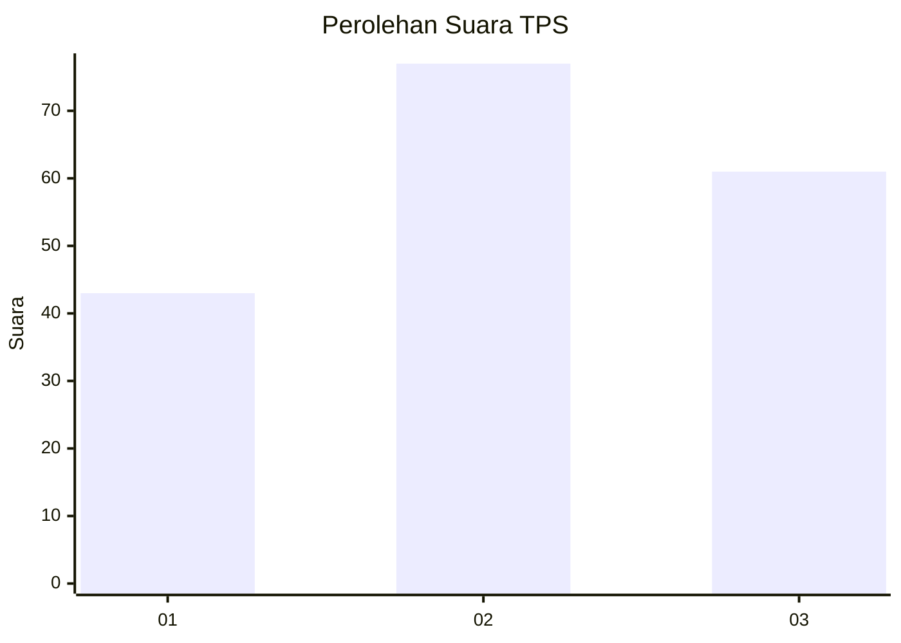
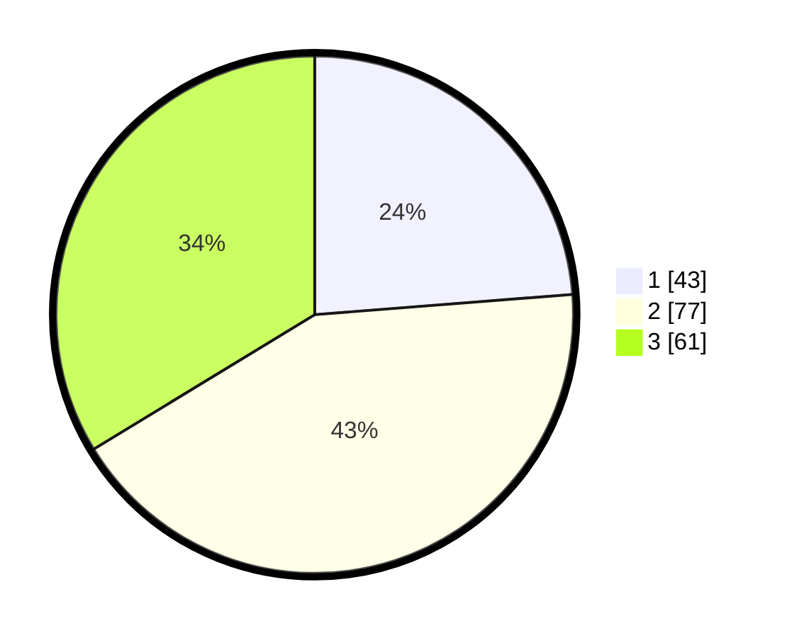

# Hasil

## Grafik

## Tabel

| No. | Nama Paslon    | Suara | Suara (raw) | Persentase |
|:--- |:-------------- | -----:| -----------:| ----------:|
| 1   | ANIES MUHAIMIN | 43    | [43][p-1]   | 23,76      |
| 2   | PRABOWO GIBRAN | 77    | [77][p-2]   | 42,54      |
| 3   | GANJAR MAHFUD  | 61    | [61][p-3]   | 33,70      |

[p-1]: https://github.com/gigit-pemilu/pemilu-2024/blob/main/pilpres/hitung-suara/sub/33-jawa-tengah/sub/10-klaten/sub/14-juwiring/sub/2014-mrisen/sub/004-tps/sub/paslon-1.txt
[p-2]: https://github.com/gigit-pemilu/pemilu-2024/blob/main/pilpres/hitung-suara/sub/33-jawa-tengah/sub/10-klaten/sub/14-juwiring/sub/2014-mrisen/sub/004-tps/sub/paslon-2.txt
[p-3]: https://github.com/gigit-pemilu/pemilu-2024/blob/main/pilpres/hitung-suara/sub/33-jawa-tengah/sub/10-klaten/sub/14-juwiring/sub/2014-mrisen/sub/004-tps/sub/paslon-3.txt

## Foto C Plano

https://sirekap-obj-formc.kpu.go.id/228a/pemilu/ppwp/33/10/14/20/14/3310142014004-20240214-141254--58b84ad8-6fe3-428d-8cc3-6399b136e4b3.jpg

https://sirekap-obj-formc.kpu.go.id/228a/pemilu/ppwp/33/10/14/20/14/3310142014004-20240214-141210--6b606a1f-dc8f-41dc-a836-54eae321b7d0.jpg

https://sirekap-obj-formc.kpu.go.id/228a/pemilu/ppwp/33/10/14/20/14/3310142014004-20240214-141337--21fe4809-a83b-41ed-b9df-f7d0fcc7500c.jpg

## Metadata

| Key        | Value               |
| ---------- | ------------------- |
| Time Stamp | 2024-02-14 21:46:01 |

