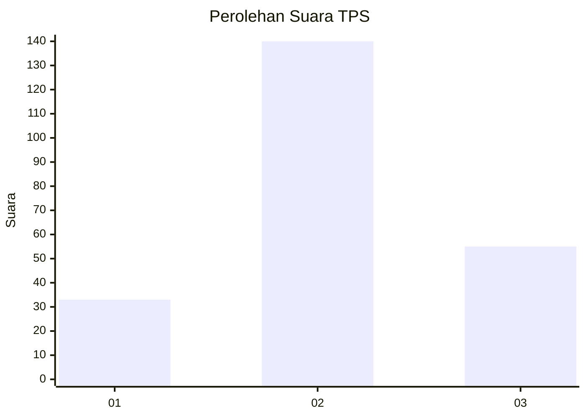
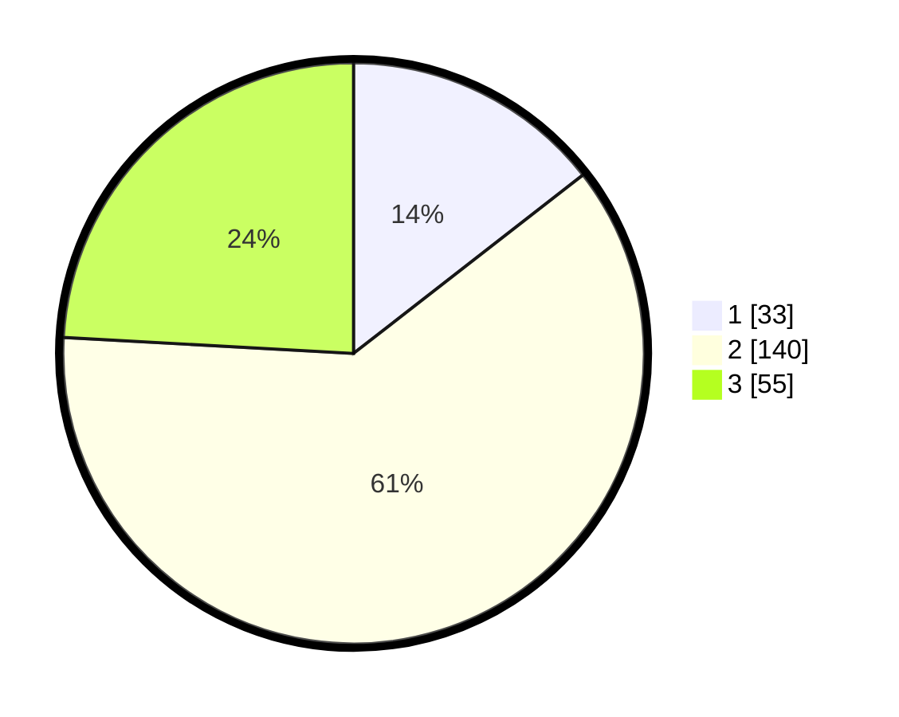

# Hasil

## Grafik

## Tabel

| No. | Nama Paslon    | Suara | Suara (raw) | Persentase |
|:--- |:-------------- | -----:| -----------:| ----------:|
| 1   | ANIES MUHAIMIN | 33    | [33][p-1]   | 14,47      |
| 2   | PRABOWO GIBRAN | 140   | [140][p-2]  | 61,40      |
| 3   | GANJAR MAHFUD  | 55    | [55][p-3]   | 24,12      |

[p-1]: https://github.com/gigit-pemilu/pemilu-2024/blob/main/pilpres/hitung-suara/sub/33-jawa-tengah/sub/10-klaten/sub/15-wonosari/sub/2001-sidowarno/sub/001-tps/sub/paslon-1.txt
[p-2]: https://github.com/gigit-pemilu/pemilu-2024/blob/main/pilpres/hitung-suara/sub/33-jawa-tengah/sub/10-klaten/sub/15-wonosari/sub/2001-sidowarno/sub/001-tps/sub/paslon-2.txt
[p-3]: https://github.com/gigit-pemilu/pemilu-2024/blob/main/pilpres/hitung-suara/sub/33-jawa-tengah/sub/10-klaten/sub/15-wonosari/sub/2001-sidowarno/sub/001-tps/sub/paslon-3.txt

## Foto C Plano

https://sirekap-obj-formc.kpu.go.id/f461/pemilu/ppwp/33/10/15/20/01/3310152001001-20240218-095053--82c1ad01-89d9-4249-bd83-20b18a8d4b30.jpg

https://sirekap-obj-formc.kpu.go.id/f461/pemilu/ppwp/33/10/15/20/01/3310152001001-20240214-194411--47d01de4-b4a5-4ac9-9b20-537d09602608.jpg

https://sirekap-obj-formc.kpu.go.id/f461/pemilu/ppwp/33/10/15/20/01/3310152001001-20240218-095217--626156e4-45e4-47d8-8a2f-28a951936b27.jpg

## Metadata

| Key        | Value               |
| ---------- | ------------------- |
| Time Stamp | 2024-02-19 06:16:00 |

