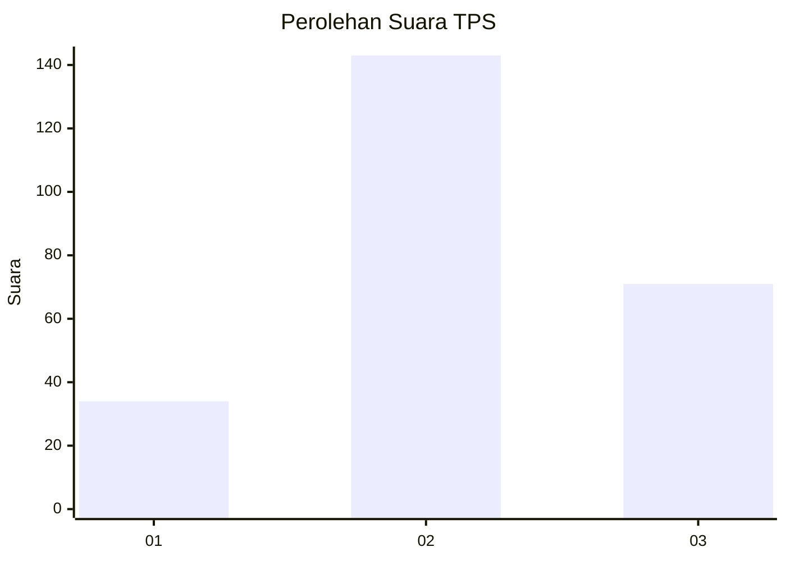
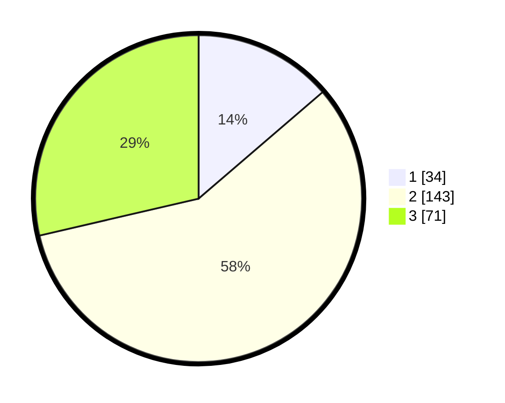

# Hasil

## Grafik

## Tabel

| No. | Nama Paslon    | Suara | Suara (raw) | Persentase |
|:--- |:-------------- | -----:| -----------:| ----------:|
| 1   | ANIES MUHAIMIN | 34    | [34][p-1]   | 13,71      |
| 2   | PRABOWO GIBRAN | 143   | [143][p-2]  | 57,66      |
| 3   | GANJAR MAHFUD  | 71    | [71][p-3]   | 28,63      |

[p-1]: https://github.com/gigit-pemilu/pemilu-2024-33-jawa-tengah/blob/main/pilpres/hitung-suara/sub/33-jawa-tengah/sub/10-klaten/sub/15-wonosari/sub/2001-sidowarno/sub/003-tps/sub/paslon-1.txt
[p-2]: https://github.com/gigit-pemilu/pemilu-2024-33-jawa-tengah/blob/main/pilpres/hitung-suara/sub/33-jawa-tengah/sub/10-klaten/sub/15-wonosari/sub/2001-sidowarno/sub/003-tps/sub/paslon-2.txt
[p-3]: https://github.com/gigit-pemilu/pemilu-2024-33-jawa-tengah/blob/main/pilpres/hitung-suara/sub/33-jawa-tengah/sub/10-klaten/sub/15-wonosari/sub/2001-sidowarno/sub/003-tps/sub/paslon-3.txt

## Foto C Plano

https://sirekap-obj-formc.kpu.go.id/9823/pemilu/ppwp/33/10/15/20/01/3310152001003-20240218-095803--e462818a-a2db-4fe9-878c-a8a9f3dba638.jpg

https://sirekap-obj-formc.kpu.go.id/9823/pemilu/ppwp/33/10/15/20/01/3310152001003-20240218-095818--4a282860-77ab-4f6c-97cc-9122e9b8d3ed.jpg

https://sirekap-obj-formc.kpu.go.id/9823/pemilu/ppwp/33/10/15/20/01/3310152001003-20240218-095835--3a6be46b-f8d0-493b-bcb1-b2a90bb009a9.jpg

## Metadata

| Key        | Value               |
| ---------- | ------------------- |
| Time Stamp | 2024-02-19 06:16:00 |

