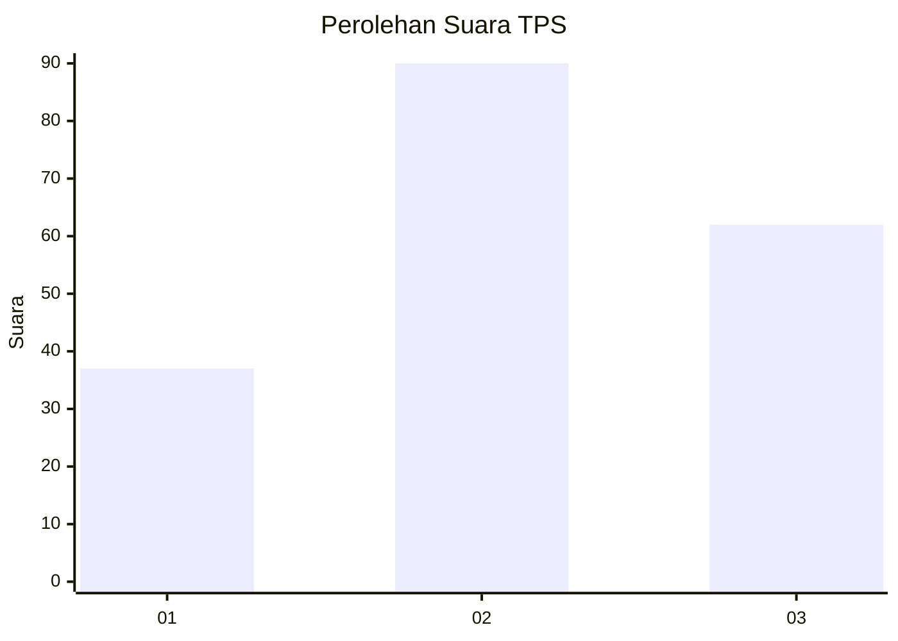
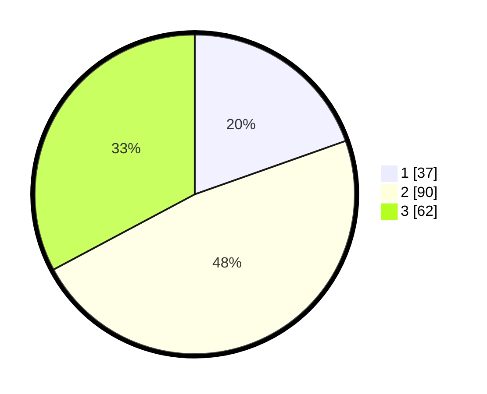

# Hasil

## Grafik

## Tabel

| No. | Nama Paslon    | Suara | Suara (raw) | Persentase |
|:--- |:-------------- | -----:| -----------:| ----------:|
| 1   | ANIES MUHAIMIN | 37    | [37][p-1]   | 19,58      |
| 2   | PRABOWO GIBRAN | 90    | [90][p-2]   | 47,62      |
| 3   | GANJAR MAHFUD  | 62    | [62][p-3]   | 32,80      |

[p-1]: https://github.com/gigit-pemilu/pemilu-2024/blob/main/pilpres/hitung-suara/sub/33-jawa-tengah/sub/10-klaten/sub/15-wonosari/sub/2001-sidowarno/sub/005-tps/sub/paslon-1.txt
[p-2]: https://github.com/gigit-pemilu/pemilu-2024/blob/main/pilpres/hitung-suara/sub/33-jawa-tengah/sub/10-klaten/sub/15-wonosari/sub/2001-sidowarno/sub/005-tps/sub/paslon-2.txt
[p-3]: https://github.com/gigit-pemilu/pemilu-2024/blob/main/pilpres/hitung-suara/sub/33-jawa-tengah/sub/10-klaten/sub/15-wonosari/sub/2001-sidowarno/sub/005-tps/sub/paslon-3.txt

## Foto C Plano

https://sirekap-obj-formc.kpu.go.id/924b/pemilu/ppwp/33/10/15/20/01/3310152001005-20240218-100146--0d036f10-3f03-42d6-8ab3-a1ecc50d29c2.jpg

https://sirekap-obj-formc.kpu.go.id/924b/pemilu/ppwp/33/10/15/20/01/3310152001005-20240218-100214--6ffd52e9-fed2-4bf3-b16c-0a11db13040b.jpg

https://sirekap-obj-formc.kpu.go.id/924b/pemilu/ppwp/33/10/15/20/01/3310152001005-20240218-100231--c3409d81-5dd3-472c-8a35-a00490f87216.jpg

## Metadata

| Key        | Value               |
| ---------- | ------------------- |
| Time Stamp | 2024-02-19 06:16:00 |

