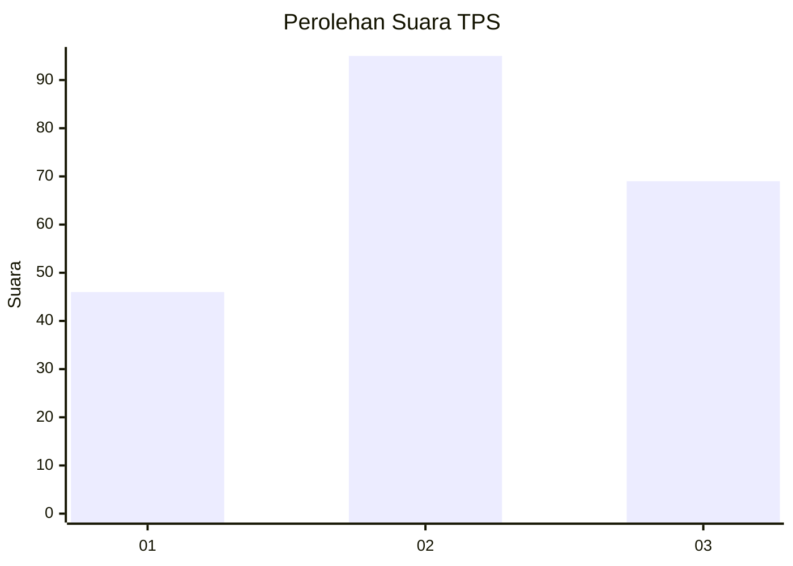
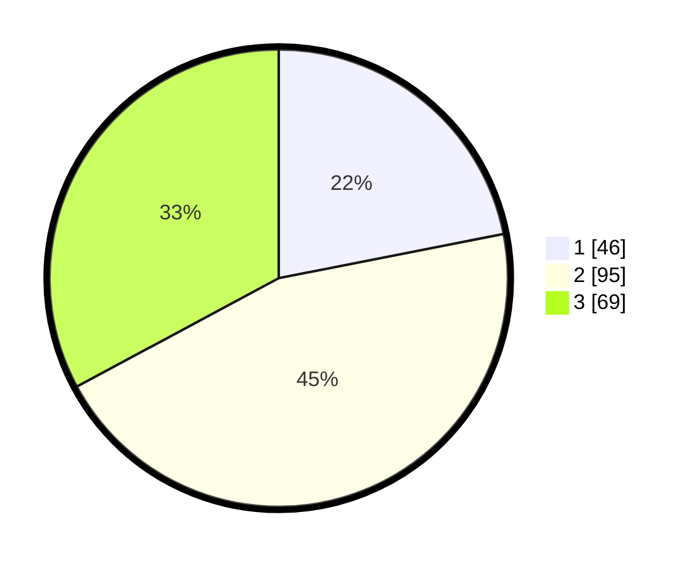

# Hasil

## Grafik

## Tabel

| No. | Nama Paslon    | Suara | Suara (raw) | Persentase |
|:--- |:-------------- | -----:| -----------:| ----------:|
| 1   | ANIES MUHAIMIN | 46    | [46][p-1]   | 21,90      |
| 2   | PRABOWO GIBRAN | 95    | [95][p-2]   | 45,24      |
| 3   | GANJAR MAHFUD  | 69    | [69][p-3]   | 32,86      |

[p-1]: https://github.com/gigit-pemilu/pemilu-2024/blob/main/pilpres/hitung-suara/sub/33-jawa-tengah/sub/10-klaten/sub/15-wonosari/sub/2005-jelobo/sub/008-tps/sub/paslon-1.txt
[p-2]: https://github.com/gigit-pemilu/pemilu-2024/blob/main/pilpres/hitung-suara/sub/33-jawa-tengah/sub/10-klaten/sub/15-wonosari/sub/2005-jelobo/sub/008-tps/sub/paslon-2.txt
[p-3]: https://github.com/gigit-pemilu/pemilu-2024/blob/main/pilpres/hitung-suara/sub/33-jawa-tengah/sub/10-klaten/sub/15-wonosari/sub/2005-jelobo/sub/008-tps/sub/paslon-3.txt

## Foto C Plano

https://sirekap-obj-formc.kpu.go.id/9759/pemilu/ppwp/33/10/15/20/05/3310152005008-20240216-173709--be4873dc-7e93-4f44-8af1-fb5a827393c6.jpg

https://sirekap-obj-formc.kpu.go.id/9759/pemilu/ppwp/33/10/15/20/05/3310152005008-20240216-180217--050b6439-d7c4-419e-8b6d-7ed602327b6c.jpg

https://sirekap-obj-formc.kpu.go.id/9759/pemilu/ppwp/33/10/15/20/05/3310152005008-20240216-181536--2526bf0b-e23d-4b86-adc4-61997115a130.jpg

## Metadata

| Key        | Value               |
| ---------- | ------------------- |
| Time Stamp | 2024-02-19 06:16:00 |

