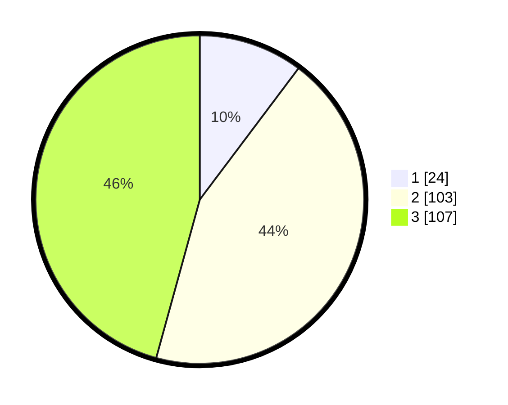

# Hasil

## Grafik

## Tabel

| No. | Nama Paslon    | Suara | Suara (raw) | Persentase |
|:--- |:-------------- | -----:| -----------:| ----------:|
| 1   | ANIES MUHAIMIN | 24    | [24][p-1]   | 10,26      |
| 2   | PRABOWO GIBRAN | 103   | [103][p-2]  | 44,02      |
| 3   | GANJAR MAHFUD  | 107   | [107][p-3]  | 45,73      |

[p-1]: https://github.com/gigit-pemilu/pemilu-2024/blob/main/pilpres/hitung-suara/sub/33-jawa-tengah/sub/10-klaten/sub/15-wonosari/sub/2013-sukorejo/sub/001-tps/sub/paslon-1.txt
[p-2]: https://github.com/gigit-pemilu/pemilu-2024/blob/main/pilpres/hitung-suara/sub/33-jawa-tengah/sub/10-klaten/sub/15-wonosari/sub/2013-sukorejo/sub/001-tps/sub/paslon-2.txt
[p-3]: https://github.com/gigit-pemilu/pemilu-2024/blob/main/pilpres/hitung-suara/sub/33-jawa-tengah/sub/10-klaten/sub/15-wonosari/sub/2013-sukorejo/sub/001-tps/sub/paslon-3.txt

## Foto C Plano

https://sirekap-obj-formc.kpu.go.id/e6a8/pemilu/ppwp/33/10/15/20/13/3310152013001-20240217-175639--69a8d279-1632-4940-addb-c4e77e876033.jpg

https://sirekap-obj-formc.kpu.go.id/e6a8/pemilu/ppwp/33/10/15/20/13/3310152013001-20240217-175454--a79086af-5d10-484c-b27b-6f363fd22928.jpg

https://sirekap-obj-formc.kpu.go.id/e6a8/pemilu/ppwp/33/10/15/20/13/3310152013001-20240217-175549--aac04796-5966-4ffb-9aab-3398a7feeb36.jpg

## Metadata

| Key        | Value               |
| ---------- | ------------------- |
| Time Stamp | 2024-02-19 10:00:00 |

