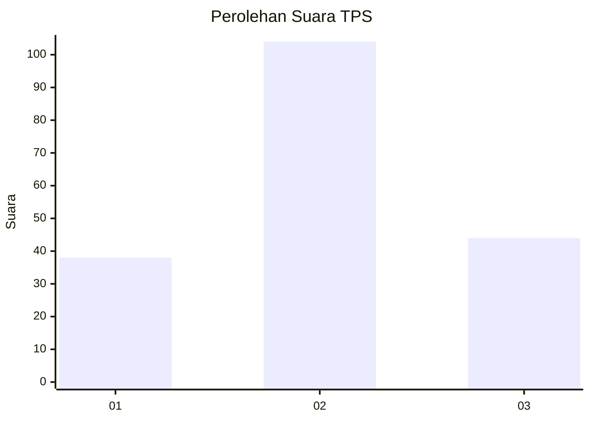
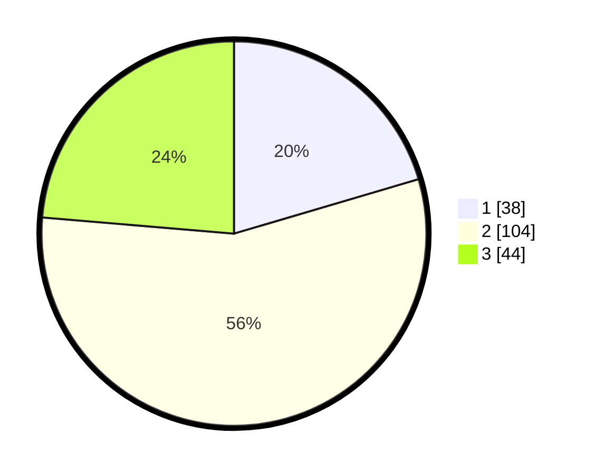

# Hasil

## Grafik

## Tabel

| No. | Nama Paslon    | Suara | Suara (raw) | Persentase |
|:--- |:-------------- | -----:| -----------:| ----------:|
| 1   | ANIES MUHAIMIN | 38    | [38][p-1]   | 20,43      |
| 2   | PRABOWO GIBRAN | 104   | [104][p-2]  | 55,91      |
| 3   | GANJAR MAHFUD  | 44    | [44][p-3]   | 23,66      |

[p-1]: https://github.com/gigit-pemilu/pemilu-2024/blob/main/pilpres/hitung-suara/sub/33-jawa-tengah/sub/10-klaten/sub/15-wonosari/sub/2017-pandanan/sub/008-tps/sub/paslon-1.txt
[p-2]: https://github.com/gigit-pemilu/pemilu-2024/blob/main/pilpres/hitung-suara/sub/33-jawa-tengah/sub/10-klaten/sub/15-wonosari/sub/2017-pandanan/sub/008-tps/sub/paslon-2.txt
[p-3]: https://github.com/gigit-pemilu/pemilu-2024/blob/main/pilpres/hitung-suara/sub/33-jawa-tengah/sub/10-klaten/sub/15-wonosari/sub/2017-pandanan/sub/008-tps/sub/paslon-3.txt

## Foto C Plano

https://sirekap-obj-formc.kpu.go.id/5d70/pemilu/ppwp/33/10/15/20/17/3310152017008-20240214-192559--b528b015-534b-4325-95b6-3cfdd0f98412.jpg

https://sirekap-obj-formc.kpu.go.id/5d70/pemilu/ppwp/33/10/15/20/17/3310152017008-20240214-155630--5adb7a36-6073-4702-a816-5792070b7404.jpg

https://sirekap-obj-formc.kpu.go.id/5d70/pemilu/ppwp/33/10/15/20/17/3310152017008-20240214-141650--6a6f2d08-c38f-4206-ba87-23c59b2b0f91.jpg

## Metadata

| Key        | Value               |
| ---------- | ------------------- |
| Time Stamp | 2024-02-24 22:31:28 |

## DATA PEMILIH TETAP

Jumlah pemilih dalam DPT: **202**.
 * L: **98**.
 * P: **403**.

## DATA PENGGUNA HAK PILIH

Jumlah pengguna hak pilih dalam DPT: **476**.
 * L: **86**.
 * P: **90**.

Jumlah pengguna hak pilih dalam DPTb: **4**.
 * L: **840**.
 * P: **884**.

Jumlah pengguna hak pilih dalam DPK: **800**.
 * L: **4**.
 * P: **80**.

Jumlah pengguna hak pilih: **888**.
 * L: **97**.
 * P: **96**.

## JUMLAH SUARA SAH DAN TIDAK SAH

JUMLAH SELURUH SUARA SAH: **186**.

JUMLAH SUARA TIDAK SAH: **2**.

JUMLAH SELURUH SUARA SAH DAN SUARA TIDAK SAH: **188**.

