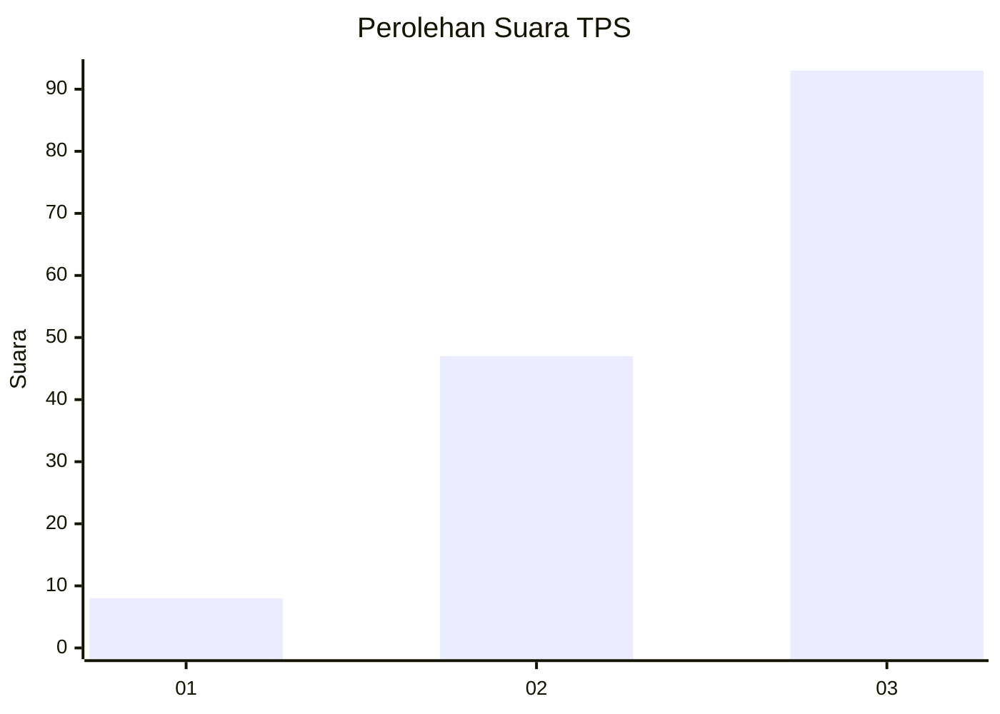
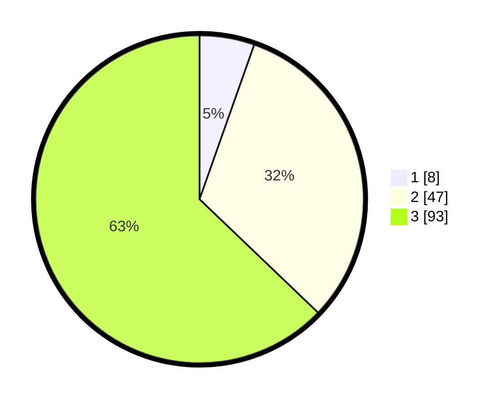

# Hasil

## Grafik

## Tabel

| No. | Nama Paslon    | Suara | Suara (raw) | Persentase |
|:--- |:-------------- | -----:| -----------:| ----------:|
| 1   | ANIES MUHAIMIN | 8     | [8][p-1]    | 5,41       |
| 2   | PRABOWO GIBRAN | 47    | [47][p-2]   | 31,76      |
| 3   | GANJAR MAHFUD  | 93    | [93][p-3]   | 62,84      |

[p-1]: https://github.com/gigit-pemilu/pemilu-2024-33-jawa-tengah/blob/main/pilpres/hitung-suara/sub/33-jawa-tengah/sub/10-klaten/sub/17-polanharjo/sub/2001-glagahwangi/sub/001-tps/sub/paslon-1.txt
[p-2]: https://github.com/gigit-pemilu/pemilu-2024-33-jawa-tengah/blob/main/pilpres/hitung-suara/sub/33-jawa-tengah/sub/10-klaten/sub/17-polanharjo/sub/2001-glagahwangi/sub/001-tps/sub/paslon-2.txt
[p-3]: https://github.com/gigit-pemilu/pemilu-2024-33-jawa-tengah/blob/main/pilpres/hitung-suara/sub/33-jawa-tengah/sub/10-klaten/sub/17-polanharjo/sub/2001-glagahwangi/sub/001-tps/sub/paslon-3.txt

## Foto C Plano

https://sirekap-obj-formc.kpu.go.id/477d/pemilu/ppwp/33/10/17/20/01/3310172001001-20240214-211353--7b700b61-9972-45eb-8465-19d4a90c2247.jpg

https://sirekap-obj-formc.kpu.go.id/477d/pemilu/ppwp/33/10/17/20/01/3310172001001-20240214-211428--de9ea158-2ccf-4d65-b05c-c8d8f89c0266.jpg

## Metadata

| Key        | Value               |
| ---------- | ------------------- |
| Time Stamp | 2024-03-02 18:00:00 |

