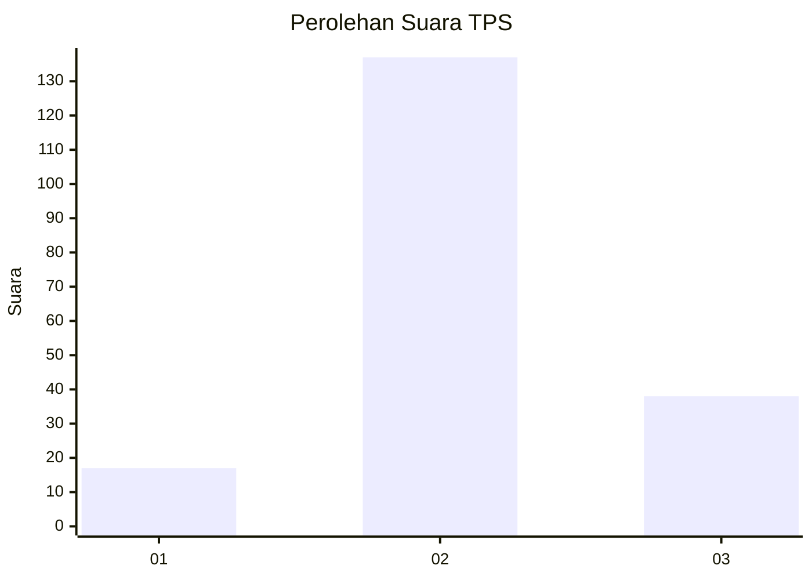
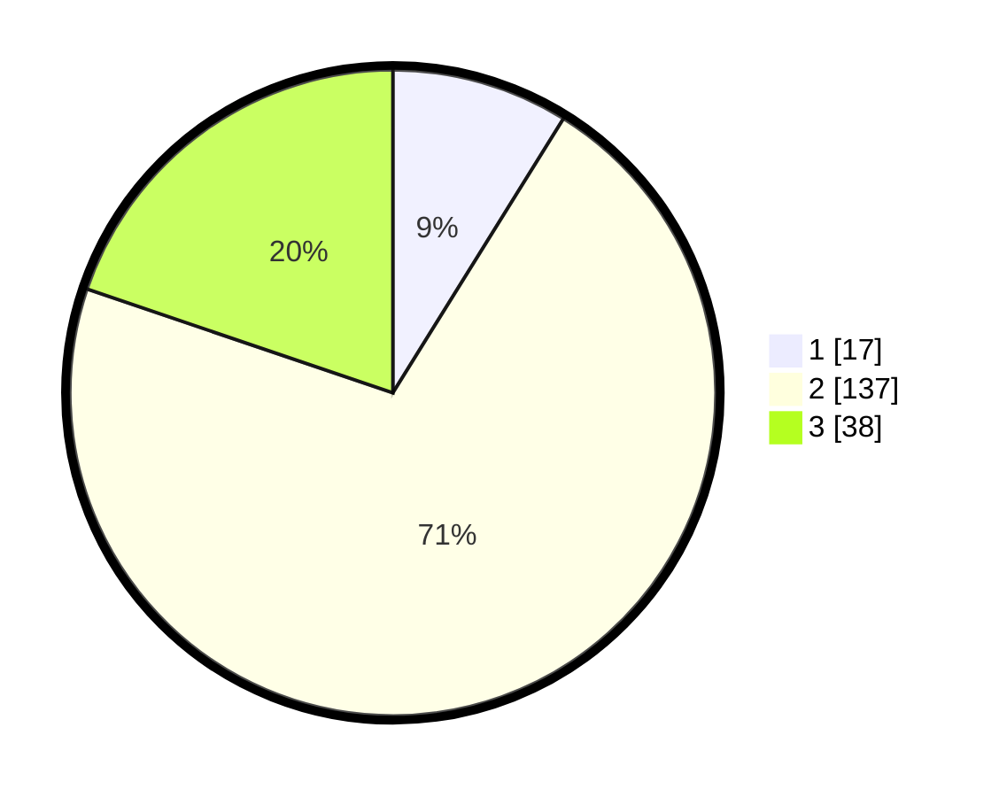

# Hasil

## Grafik

## Tabel

| No. | Nama Paslon    | Suara | Suara (raw) | Persentase |
|:--- |:-------------- | -----:| -----------:| ----------:|
| 1   | ANIES MUHAIMIN | 17    | [17][p-1]   | 8,85       |
| 2   | PRABOWO GIBRAN | 137   | [137][p-2]  | 71,35      |
| 3   | GANJAR MAHFUD  | 38    | [38][p-3]   | 19,79      |

[p-1]: https://github.com/gigit-pemilu/pemilu-2024-33-jawa-tengah/blob/main/pilpres/hitung-suara/sub/33-jawa-tengah/sub/10-klaten/sub/17-polanharjo/sub/2001-glagahwangi/sub/005-tps/sub/paslon-1.txt
[p-2]: https://github.com/gigit-pemilu/pemilu-2024-33-jawa-tengah/blob/main/pilpres/hitung-suara/sub/33-jawa-tengah/sub/10-klaten/sub/17-polanharjo/sub/2001-glagahwangi/sub/005-tps/sub/paslon-2.txt
[p-3]: https://github.com/gigit-pemilu/pemilu-2024-33-jawa-tengah/blob/main/pilpres/hitung-suara/sub/33-jawa-tengah/sub/10-klaten/sub/17-polanharjo/sub/2001-glagahwangi/sub/005-tps/sub/paslon-3.txt

## Foto C Plano

https://sirekap-obj-formc.kpu.go.id/821c/pemilu/ppwp/33/10/17/20/01/3310172001005-20240218-134724--3769439f-f3cf-4295-bf20-edb6730dd5fa.jpg

https://sirekap-obj-formc.kpu.go.id/821c/pemilu/ppwp/33/10/17/20/01/3310172001005-20240218-134818--fb586034-3535-4fdd-ae7b-7de8fbe6df70.jpg

https://sirekap-obj-formc.kpu.go.id/821c/pemilu/ppwp/33/10/17/20/01/3310172001005-20240218-135232--76e04c58-b79c-47eb-861d-ab2cdea695da.jpg

## Metadata

| Key        | Value               |
| ---------- | ------------------- |
| Time Stamp | 2024-02-20 15:00:00 |

