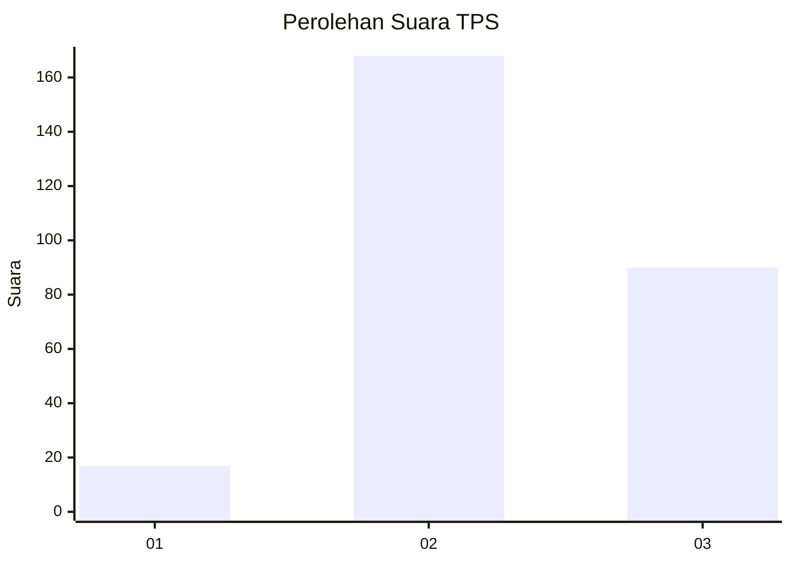
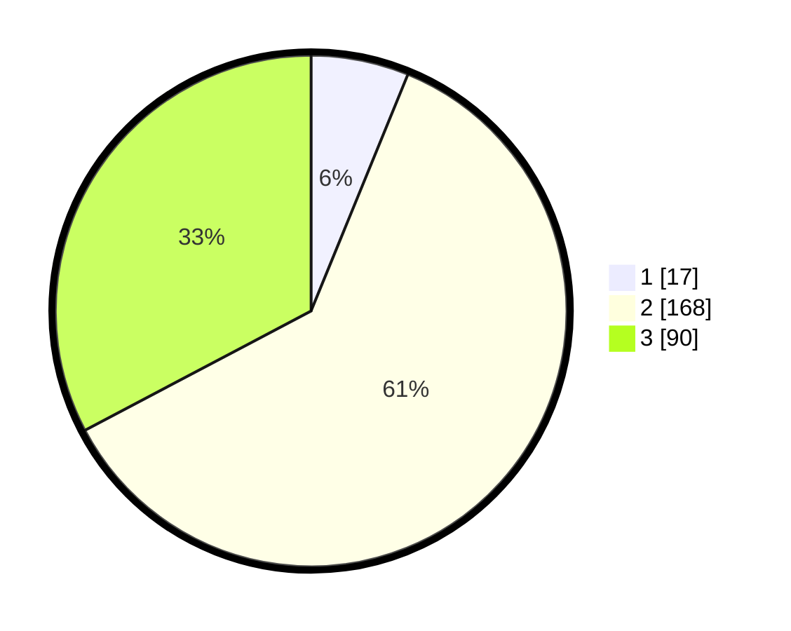

# Hasil

## Grafik

## Tabel

| No. | Nama Paslon    | Suara | Suara (raw) | Persentase |
|:--- |:-------------- | -----:| -----------:| ----------:|
| 1   | ANIES MUHAIMIN | 17    | [17][p-1]   | 6,18       |
| 2   | PRABOWO GIBRAN | 168   | [168][p-2]  | 61,09      |
| 3   | GANJAR MAHFUD  | 90    | [90][p-3]   | 32,73      |

[p-1]: https://github.com/gigit-pemilu/pemilu-2024/blob/main/pilpres/hitung-suara/sub/33-jawa-tengah/sub/10-klaten/sub/17-polanharjo/sub/2006-nganjat/sub/002-tps/sub/paslon-1.txt
[p-2]: https://github.com/gigit-pemilu/pemilu-2024/blob/main/pilpres/hitung-suara/sub/33-jawa-tengah/sub/10-klaten/sub/17-polanharjo/sub/2006-nganjat/sub/002-tps/sub/paslon-2.txt
[p-3]: https://github.com/gigit-pemilu/pemilu-2024/blob/main/pilpres/hitung-suara/sub/33-jawa-tengah/sub/10-klaten/sub/17-polanharjo/sub/2006-nganjat/sub/002-tps/sub/paslon-3.txt

## Foto C Plano

https://sirekap-obj-formc.kpu.go.id/3767/pemilu/ppwp/33/10/17/20/06/3310172006002-20240214-141222--6c7e751d-aa7f-4cd0-a17a-a8dadef1e7d6.jpg

https://sirekap-obj-formc.kpu.go.id/3767/pemilu/ppwp/33/10/17/20/06/3310172006002-20240214-141443--4b3d0958-a8c7-4617-980e-cd2637a799ab.jpg

## Metadata

| Key        | Value               |
| ---------- | ------------------- |
| Time Stamp | 2024-02-15 07:00:44 |

