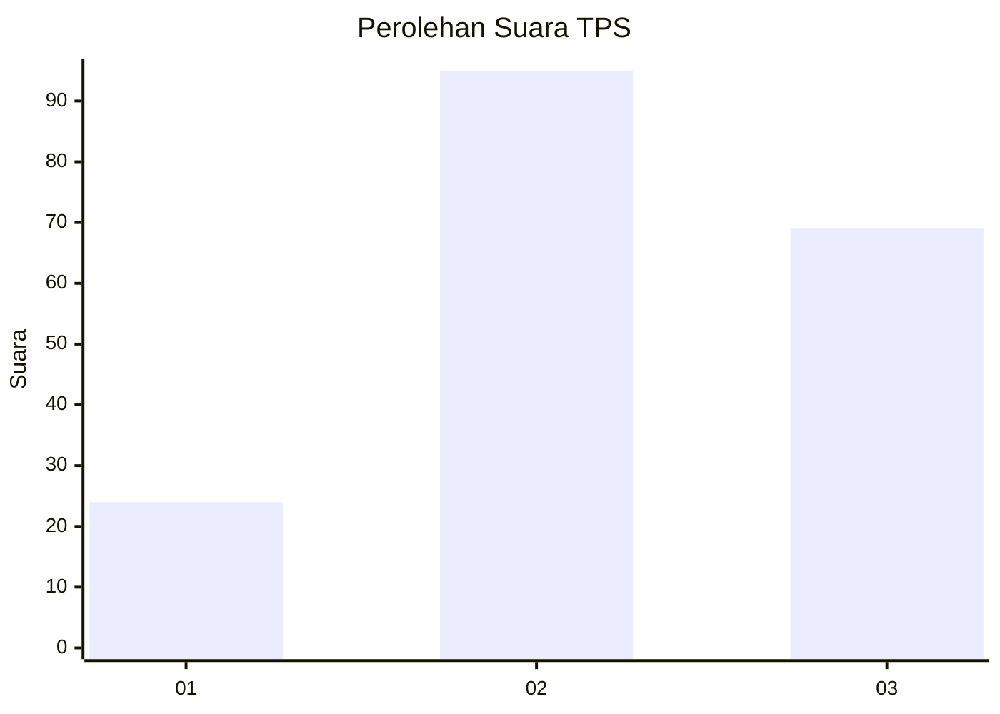
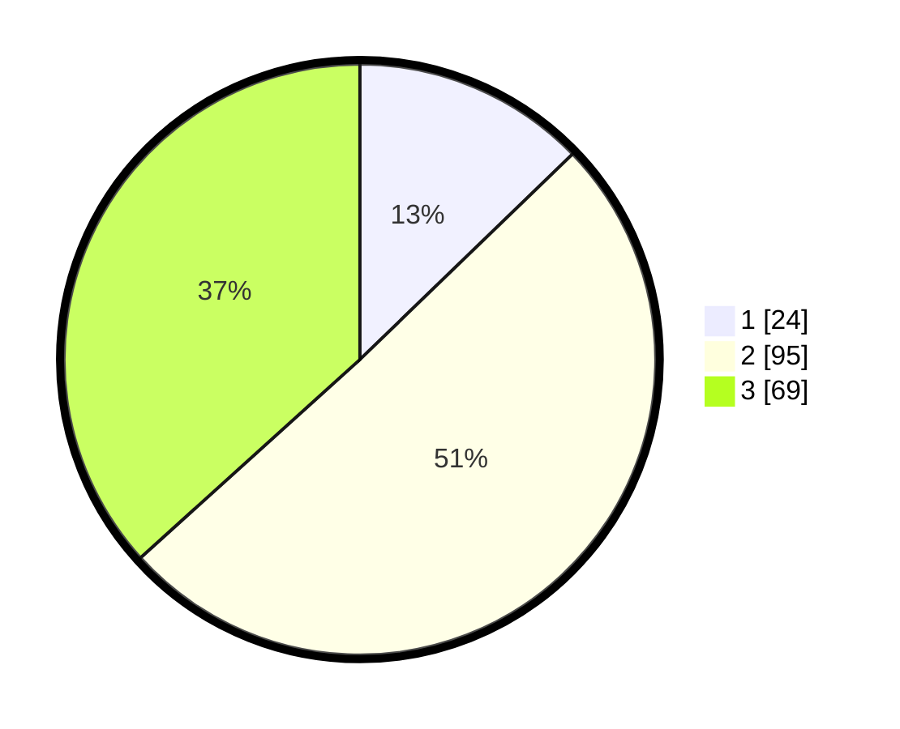

# Hasil

## Grafik

## Tabel

| No. | Nama Paslon    | Suara | Suara (raw) | Persentase |
|:--- |:-------------- | -----:| -----------:| ----------:|
| 1   | ANIES MUHAIMIN | 24    | [24][p-1]   | 12,77      |
| 2   | PRABOWO GIBRAN | 95    | [95][p-2]   | 50,53      |
| 3   | GANJAR MAHFUD  | 69    | [69][p-3]   | 36,70      |

[p-1]: https://github.com/gigit-pemilu/pemilu-2024/blob/main/pilpres/hitung-suara/sub/33-jawa-tengah/sub/10-klaten/sub/17-polanharjo/sub/2011-ponggok/sub/002-tps/sub/paslon-1.txt
[p-2]: https://github.com/gigit-pemilu/pemilu-2024/blob/main/pilpres/hitung-suara/sub/33-jawa-tengah/sub/10-klaten/sub/17-polanharjo/sub/2011-ponggok/sub/002-tps/sub/paslon-2.txt
[p-3]: https://github.com/gigit-pemilu/pemilu-2024/blob/main/pilpres/hitung-suara/sub/33-jawa-tengah/sub/10-klaten/sub/17-polanharjo/sub/2011-ponggok/sub/002-tps/sub/paslon-3.txt

## Foto C Plano

https://sirekap-obj-formc.kpu.go.id/1924/pemilu/ppwp/33/10/17/20/11/3310172011002-20240214-204755--6a6e92c4-e1d6-4e1c-a243-8c5c6f73de4b.jpg

https://sirekap-obj-formc.kpu.go.id/1924/pemilu/ppwp/33/10/17/20/11/3310172011002-20240214-204733--b4e15b08-0660-44d6-9638-ba45b7a40076.jpg

https://sirekap-obj-formc.kpu.go.id/1924/pemilu/ppwp/33/10/17/20/11/3310172011002-20240218-122157--b7ed565b-ff34-4bdd-a1c8-951238c1f640.jpg

## Metadata

| Key        | Value               |
| ---------- | ------------------- |
| Time Stamp | 2024-02-19 06:16:00 |

