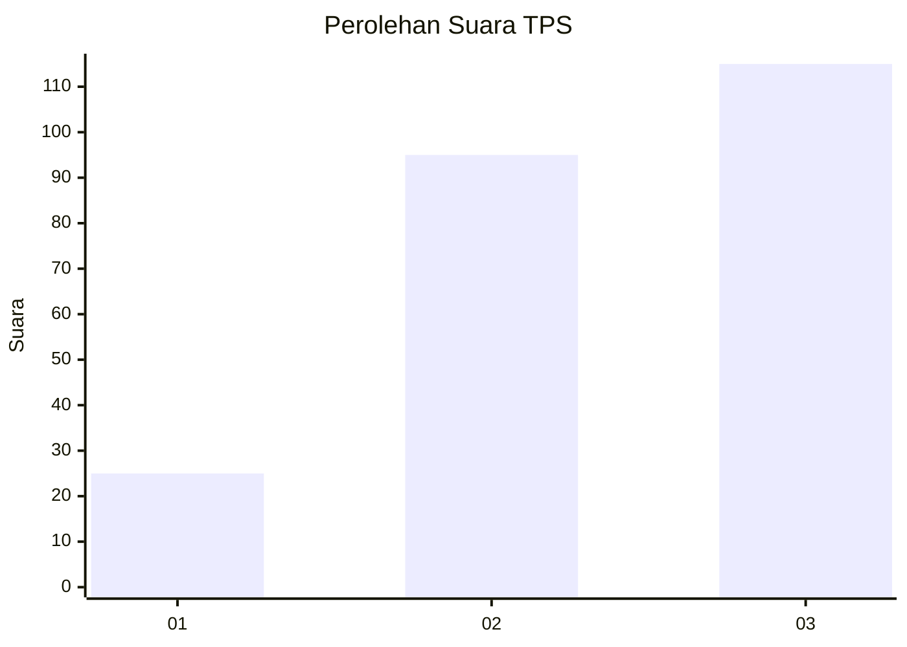
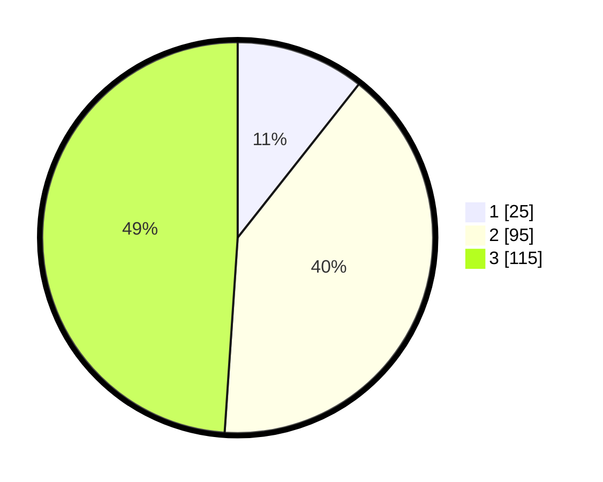

# Hasil

## Grafik

## Tabel

| No. | Nama Paslon    | Suara | Suara (raw) | Persentase |
|:--- |:-------------- | -----:| -----------:| ----------:|
| 1   | ANIES MUHAIMIN | 25    | [25][p-1]   | 10,64      |
| 2   | PRABOWO GIBRAN | 95    | [95][p-2]   | 40,43      |
| 3   | GANJAR MAHFUD  | 115   | [115][p-3]  | 48,94      |

[p-1]: https://github.com/gigit-pemilu/pemilu-2024/blob/main/pilpres/hitung-suara/sub/33-jawa-tengah/sub/10-klaten/sub/17-polanharjo/sub/2018-sidoharjo/sub/009-tps/sub/paslon-1.txt
[p-2]: https://github.com/gigit-pemilu/pemilu-2024/blob/main/pilpres/hitung-suara/sub/33-jawa-tengah/sub/10-klaten/sub/17-polanharjo/sub/2018-sidoharjo/sub/009-tps/sub/paslon-2.txt
[p-3]: https://github.com/gigit-pemilu/pemilu-2024/blob/main/pilpres/hitung-suara/sub/33-jawa-tengah/sub/10-klaten/sub/17-polanharjo/sub/2018-sidoharjo/sub/009-tps/sub/paslon-3.txt

## Foto C Plano

https://sirekap-obj-formc.kpu.go.id/2327/pemilu/ppwp/33/10/17/20/18/3310172018009-20240218-170938--e064141d-b593-40cc-9240-a1621fa45d99.jpg

https://sirekap-obj-formc.kpu.go.id/2327/pemilu/ppwp/33/10/17/20/18/3310172018009-20240214-224208--7a0ddab8-f25a-4fc1-a39c-d41e96ce446c.jpg

https://sirekap-obj-formc.kpu.go.id/2327/pemilu/ppwp/33/10/17/20/18/3310172018009-20240214-224307--6cdcb112-ca0c-4f1c-a0b3-dd6c62cba9e5.jpg

## Metadata

| Key        | Value               |
| ---------- | ------------------- |
| Time Stamp | 2024-02-19 06:16:00 |

