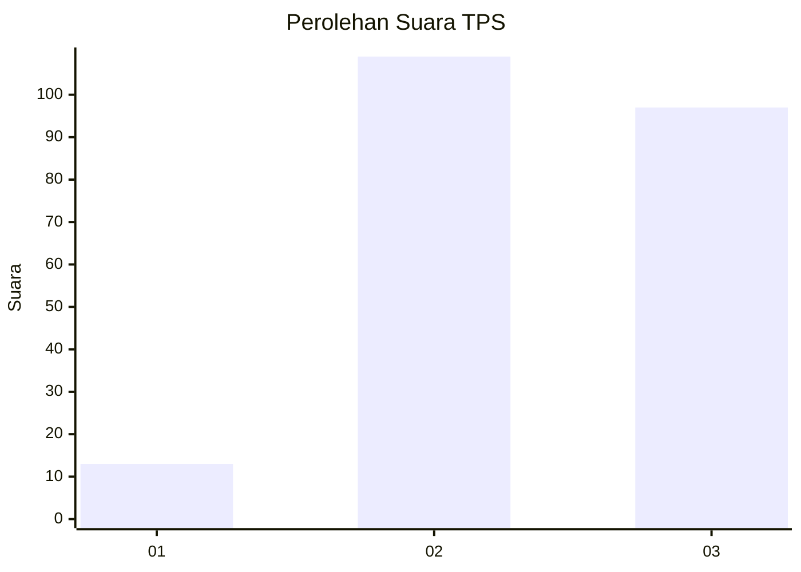
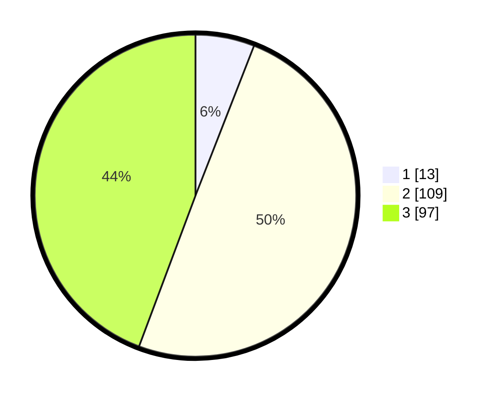

# Hasil

## Grafik

## Tabel

| No. | Nama Paslon    | Suara | Suara (raw) | Persentase |
|:--- |:-------------- | -----:| -----------:| ----------:|
| 1   | ANIES MUHAIMIN | 13    | [13][p-1]   | 5,94       |
| 2   | PRABOWO GIBRAN | 109   | [109][p-2]  | 49,77      |
| 3   | GANJAR MAHFUD  | 97    | [97][p-3]   | 44,29      |

[p-1]: https://github.com/gigit-pemilu/pemilu-2024-33-jawa-tengah/blob/main/pilpres/hitung-suara/sub/33-jawa-tengah/sub/10-klaten/sub/18-karanganom/sub/2001-jambeyan/sub/004-tps/sub/paslon-1.txt
[p-2]: https://github.com/gigit-pemilu/pemilu-2024-33-jawa-tengah/blob/main/pilpres/hitung-suara/sub/33-jawa-tengah/sub/10-klaten/sub/18-karanganom/sub/2001-jambeyan/sub/004-tps/sub/paslon-2.txt
[p-3]: https://github.com/gigit-pemilu/pemilu-2024-33-jawa-tengah/blob/main/pilpres/hitung-suara/sub/33-jawa-tengah/sub/10-klaten/sub/18-karanganom/sub/2001-jambeyan/sub/004-tps/sub/paslon-3.txt

## Foto C Plano

https://sirekap-obj-formc.kpu.go.id/4946/pemilu/ppwp/33/10/18/20/01/3310182001004-20240216-150511--9acf282f-b173-447e-b1d6-7cf6130b1928.jpg

https://sirekap-obj-formc.kpu.go.id/4946/pemilu/ppwp/33/10/18/20/01/3310182001004-20240216-150633--fb10ba36-a32e-4535-96bd-26c9ed962616.jpg

https://sirekap-obj-formc.kpu.go.id/4946/pemilu/ppwp/33/10/18/20/01/3310182001004-20240216-135213--9181529c-7a5c-4cbe-94e8-9c2242bd5569.jpg

## Metadata

| Key        | Value               |
| ---------- | ------------------- |
| Time Stamp | 2024-02-16 21:01:00 |

