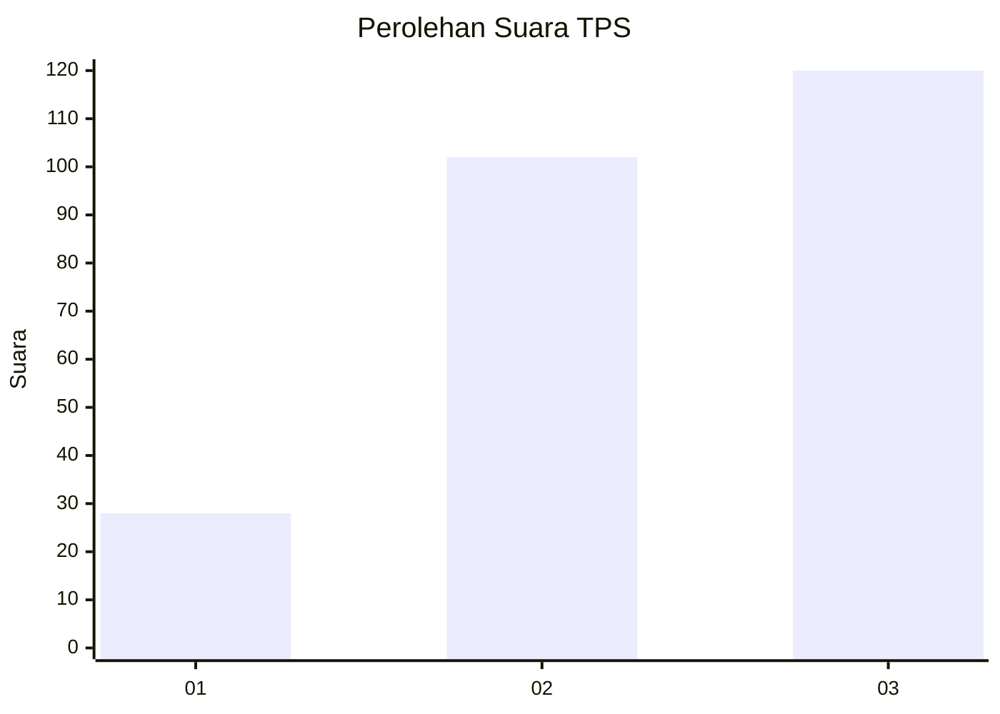
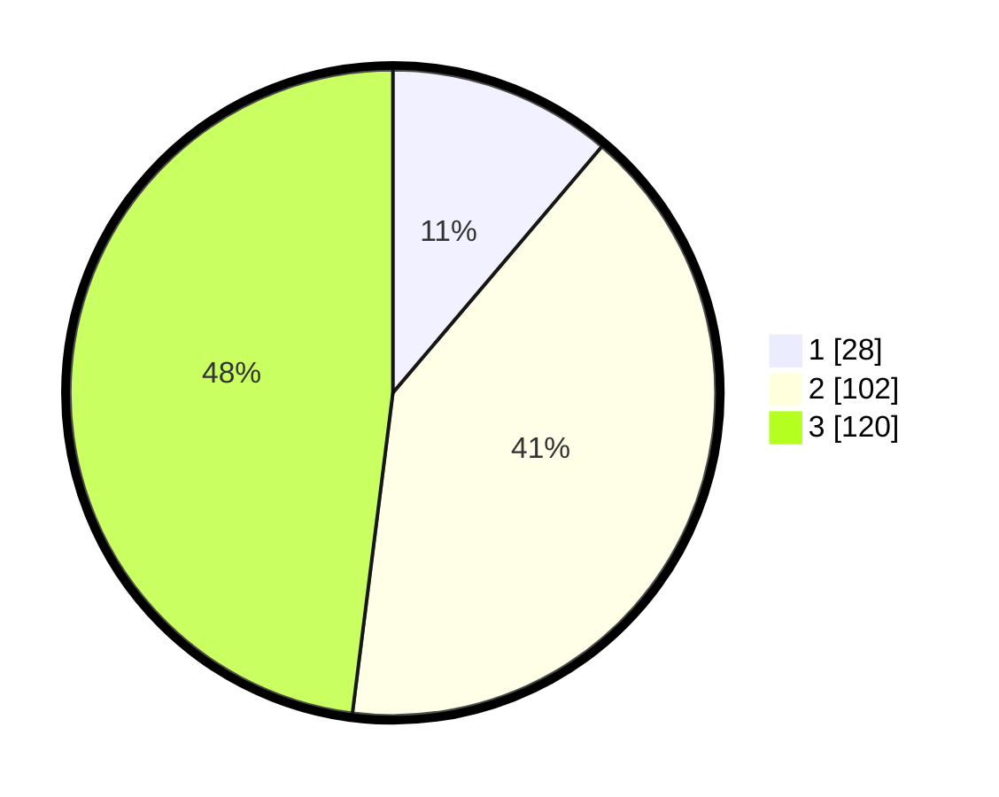

# Hasil

## Grafik

## Tabel

| No. | Nama Paslon    | Suara | Suara (raw) | Persentase |
|:--- |:-------------- | -----:| -----------:| ----------:|
| 1   | ANIES MUHAIMIN | 28    | [28][p-1]   | 11,20      |
| 2   | PRABOWO GIBRAN | 102   | [102][p-2]  | 40,80      |
| 3   | GANJAR MAHFUD  | 120   | [120][p-3]  | 48,00      |

[p-1]: https://github.com/gigit-pemilu/pemilu-2024-33-jawa-tengah/blob/main/pilpres/hitung-suara/sub/33-jawa-tengah/sub/10-klaten/sub/18-karanganom/sub/2006-blanceran/sub/010-tps/sub/paslon-1.txt
[p-2]: https://github.com/gigit-pemilu/pemilu-2024-33-jawa-tengah/blob/main/pilpres/hitung-suara/sub/33-jawa-tengah/sub/10-klaten/sub/18-karanganom/sub/2006-blanceran/sub/010-tps/sub/paslon-2.txt
[p-3]: https://github.com/gigit-pemilu/pemilu-2024-33-jawa-tengah/blob/main/pilpres/hitung-suara/sub/33-jawa-tengah/sub/10-klaten/sub/18-karanganom/sub/2006-blanceran/sub/010-tps/sub/paslon-3.txt

## Foto C Plano

https://sirekap-obj-formc.kpu.go.id/aeac/pemilu/ppwp/33/10/18/20/06/3310182006010-20240216-094447--e0f1fa0e-4094-49b9-96f9-8b3c7949a095.jpg

https://sirekap-obj-formc.kpu.go.id/aeac/pemilu/ppwp/33/10/18/20/06/3310182006010-20240216-094734--0a6c6318-ab9c-4bad-9707-a2627c78a600.jpg

https://sirekap-obj-formc.kpu.go.id/aeac/pemilu/ppwp/33/10/18/20/06/3310182006010-20240216-102140--28cedfa6-f874-4dee-a9e2-2e2ac833ed83.jpg

## Metadata

| Key        | Value               |
| ---------- | ------------------- |
| Time Stamp | 2024-02-16 11:00:29 |

