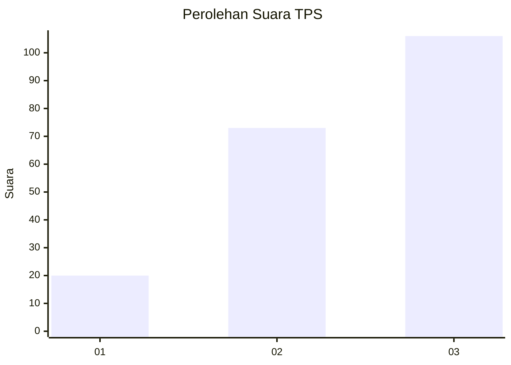
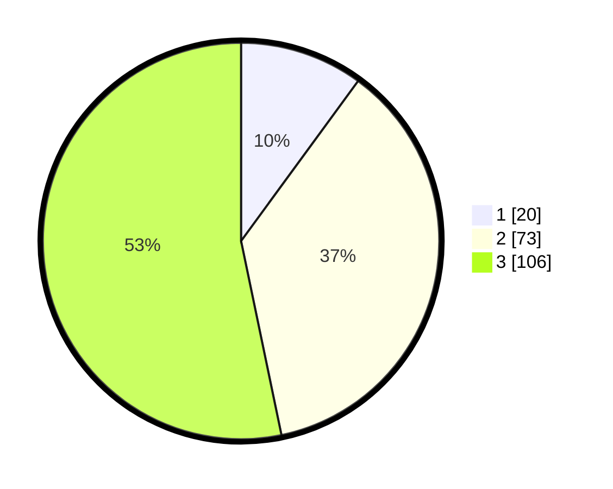

# Hasil

## Grafik

## Tabel

| No. | Nama Paslon    | Suara | Suara (raw) | Persentase |
|:--- |:-------------- | -----:| -----------:| ----------:|
| 1   | ANIES MUHAIMIN | 20    | [20][p-1]   | 10,05      |
| 2   | PRABOWO GIBRAN | 73    | [73][p-2]   | 36,68      |
| 3   | GANJAR MAHFUD  | 106   | [106][p-3]  | 53,27      |

[p-1]: https://github.com/gigit-pemilu/pemilu-2024-33-jawa-tengah/blob/main/pilpres/hitung-suara/sub/33-jawa-tengah/sub/10-klaten/sub/18-karanganom/sub/2011-karanganom/sub/001-tps/sub/paslon-1.txt
[p-2]: https://github.com/gigit-pemilu/pemilu-2024-33-jawa-tengah/blob/main/pilpres/hitung-suara/sub/33-jawa-tengah/sub/10-klaten/sub/18-karanganom/sub/2011-karanganom/sub/001-tps/sub/paslon-2.txt
[p-3]: https://github.com/gigit-pemilu/pemilu-2024-33-jawa-tengah/blob/main/pilpres/hitung-suara/sub/33-jawa-tengah/sub/10-klaten/sub/18-karanganom/sub/2011-karanganom/sub/001-tps/sub/paslon-3.txt

## Foto C Plano

https://sirekap-obj-formc.kpu.go.id/134d/pemilu/ppwp/33/10/18/20/11/3310182011001-20240216-180730--e869c598-20da-4a82-9f18-ba9a9d5e1469.jpg

https://sirekap-obj-formc.kpu.go.id/134d/pemilu/ppwp/33/10/18/20/11/3310182011001-20240216-181034--a4e668de-1852-47f4-a475-00af59852e22.jpg

https://sirekap-obj-formc.kpu.go.id/134d/pemilu/ppwp/33/10/18/20/11/3310182011001-20240216-181210--75531405-01cf-4130-adbf-c54b01f753f0.jpg

## Metadata

| Key        | Value               |
| ---------- | ------------------- |
| Time Stamp | 2024-02-16 21:01:00 |

