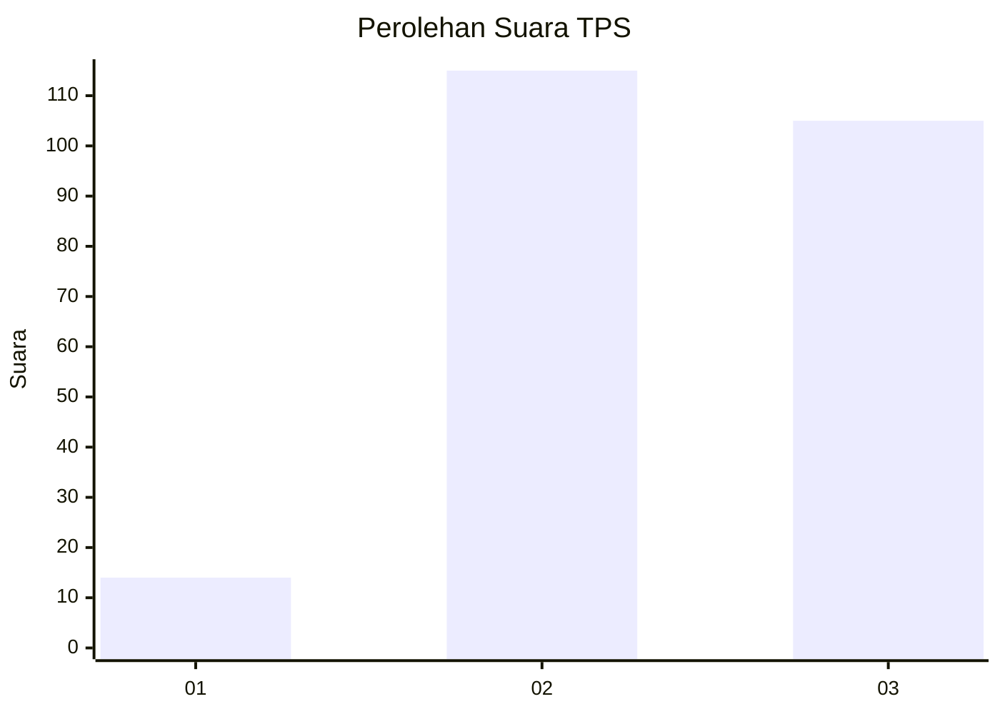
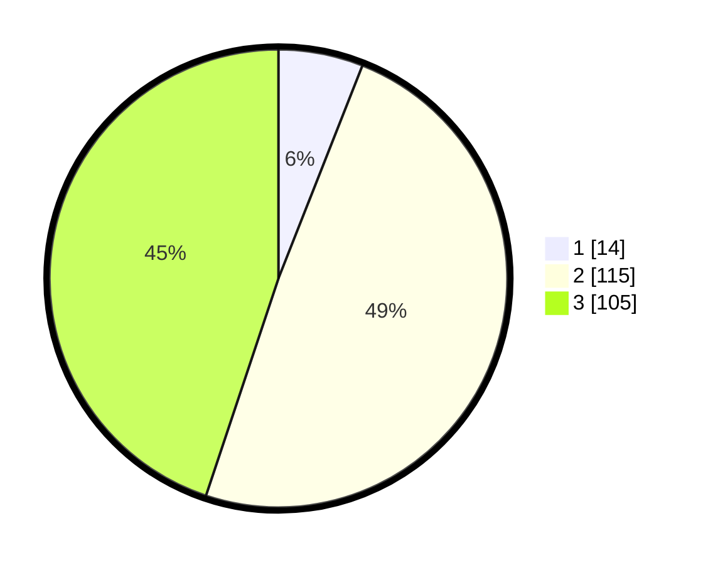

# Hasil

## Grafik

## Tabel

| No. | Nama Paslon    | Suara | Suara (raw) | Persentase |
|:--- |:-------------- | -----:| -----------:| ----------:|
| 1   | ANIES MUHAIMIN | 14    | [14][p-1]   | 5,98       |
| 2   | PRABOWO GIBRAN | 115   | [115][p-2]  | 49,15      |
| 3   | GANJAR MAHFUD  | 105   | [105][p-3]  | 44,87      |

[p-1]: https://github.com/gigit-pemilu/pemilu-2024/blob/main/pilpres/hitung-suara/sub/33-jawa-tengah/sub/10-klaten/sub/18-karanganom/sub/2012-padas/sub/003-tps/sub/paslon-1.txt
[p-2]: https://github.com/gigit-pemilu/pemilu-2024/blob/main/pilpres/hitung-suara/sub/33-jawa-tengah/sub/10-klaten/sub/18-karanganom/sub/2012-padas/sub/003-tps/sub/paslon-2.txt
[p-3]: https://github.com/gigit-pemilu/pemilu-2024/blob/main/pilpres/hitung-suara/sub/33-jawa-tengah/sub/10-klaten/sub/18-karanganom/sub/2012-padas/sub/003-tps/sub/paslon-3.txt

## Foto C Plano

https://sirekap-obj-formc.kpu.go.id/0be5/pemilu/ppwp/33/10/18/20/12/3310182012003-20240216-190248--15ff5d13-b25e-4275-9e1c-1537454cd312.jpg

https://sirekap-obj-formc.kpu.go.id/0be5/pemilu/ppwp/33/10/18/20/12/3310182012003-20240215-220053--6c690a02-0a78-4da5-9e37-36a721593467.jpg

https://sirekap-obj-formc.kpu.go.id/0be5/pemilu/ppwp/33/10/18/20/12/3310182012003-20240215-153937--d32dd37f-141f-4bfe-aee8-b5ef9be1ce10.jpg

## Metadata

| Key        | Value               |
| ---------- | ------------------- |
| Time Stamp | 2024-02-16 21:01:00 |

