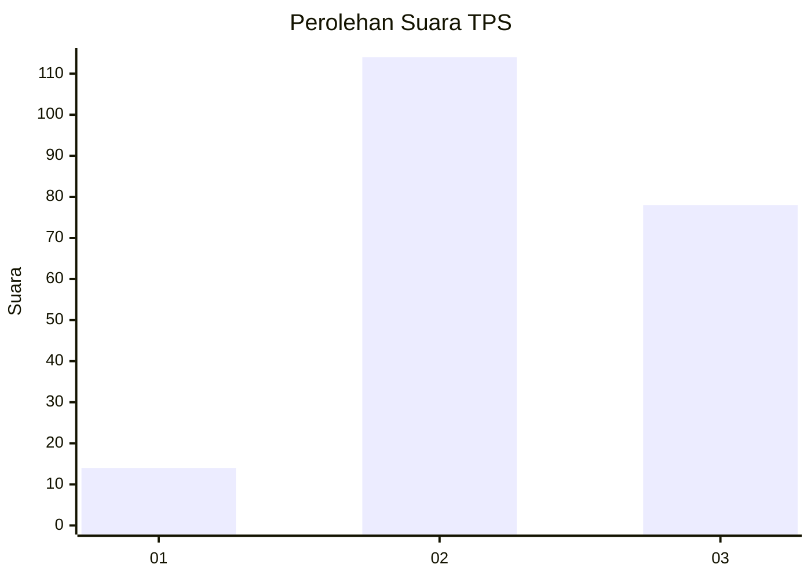
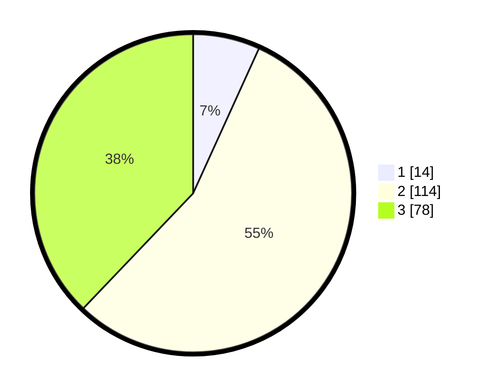

# Hasil

## Grafik

## Tabel

| No. | Nama Paslon    | Suara | Suara (raw) | Persentase |
|:--- |:-------------- | -----:| -----------:| ----------:|
| 1   | ANIES MUHAIMIN | 14    | [14][p-1]   | 6,80       |
| 2   | PRABOWO GIBRAN | 114   | [114][p-2]  | 55,34      |
| 3   | GANJAR MAHFUD  | 78    | [78][p-3]   | 37,86      |

[p-1]: https://github.com/gigit-pemilu/pemilu-2024/blob/main/pilpres/hitung-suara/sub/33-jawa-tengah/sub/10-klaten/sub/18-karanganom/sub/2014-jurangjero/sub/003-tps/sub/paslon-1.txt
[p-2]: https://github.com/gigit-pemilu/pemilu-2024/blob/main/pilpres/hitung-suara/sub/33-jawa-tengah/sub/10-klaten/sub/18-karanganom/sub/2014-jurangjero/sub/003-tps/sub/paslon-2.txt
[p-3]: https://github.com/gigit-pemilu/pemilu-2024/blob/main/pilpres/hitung-suara/sub/33-jawa-tengah/sub/10-klaten/sub/18-karanganom/sub/2014-jurangjero/sub/003-tps/sub/paslon-3.txt

## Foto C Plano

https://sirekap-obj-formc.kpu.go.id/51fd/pemilu/ppwp/33/10/18/20/14/3310182014003-20240216-221845--70e1826b-7812-4e01-81e2-c6abd1f08a6e.jpg

https://sirekap-obj-formc.kpu.go.id/51fd/pemilu/ppwp/33/10/18/20/14/3310182014003-20240216-221352--717bfa3c-536f-4cfd-8318-3ae46383bef5.jpg

https://sirekap-obj-formc.kpu.go.id/51fd/pemilu/ppwp/33/10/18/20/14/3310182014003-20240216-221734--b0d54aeb-5a80-433f-b1ec-cdd2eff20beb.jpg

## Metadata

| Key        | Value               |
| ---------- | ------------------- |
| Time Stamp | 2024-02-17 19:30:00 |

