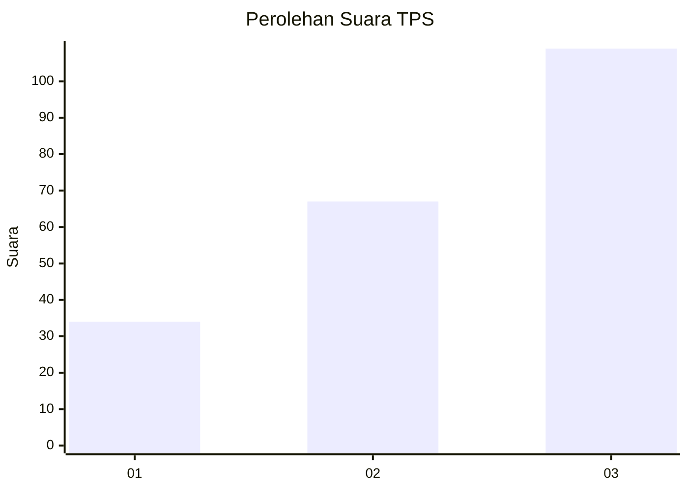
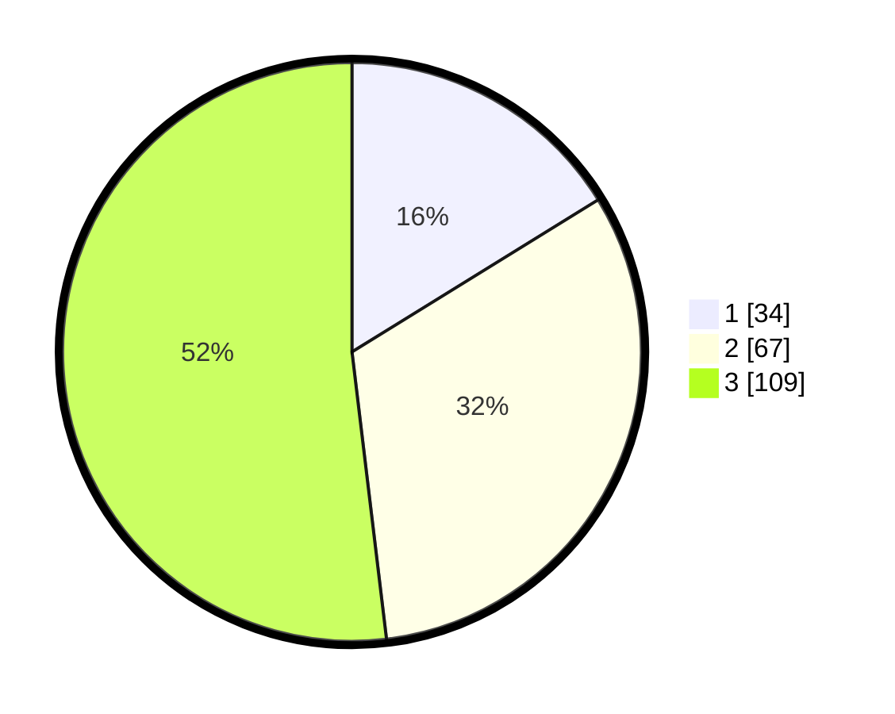

# Hasil

## Grafik

## Tabel

| No. | Nama Paslon    | Suara | Suara (raw) | Persentase |
|:--- |:-------------- | -----:| -----------:| ----------:|
| 1   | ANIES MUHAIMIN | 34    | [34][p-1]   | 16,19      |
| 2   | PRABOWO GIBRAN | 67    | [67][p-2]   | 31,90      |
| 3   | GANJAR MAHFUD  | 109   | [109][p-3]  | 51,90      |

[p-1]: https://github.com/gigit-pemilu/pemilu-2024-33-jawa-tengah/blob/main/pilpres/hitung-suara/sub/33-jawa-tengah/sub/10-klaten/sub/18-karanganom/sub/2017-gempol/sub/007-tps/sub/paslon-1.txt
[p-2]: https://github.com/gigit-pemilu/pemilu-2024-33-jawa-tengah/blob/main/pilpres/hitung-suara/sub/33-jawa-tengah/sub/10-klaten/sub/18-karanganom/sub/2017-gempol/sub/007-tps/sub/paslon-2.txt
[p-3]: https://github.com/gigit-pemilu/pemilu-2024-33-jawa-tengah/blob/main/pilpres/hitung-suara/sub/33-jawa-tengah/sub/10-klaten/sub/18-karanganom/sub/2017-gempol/sub/007-tps/sub/paslon-3.txt

## Foto C Plano

https://sirekap-obj-formc.kpu.go.id/c9e0/pemilu/ppwp/33/10/18/20/17/3310182017007-20240215-211221--17c1563d-fd70-4759-8a04-5d682e0966e8.jpg

https://sirekap-obj-formc.kpu.go.id/c9e0/pemilu/ppwp/33/10/18/20/17/3310182017007-20240215-211402--81d7b7d1-b882-4aa8-ab08-937ce450d5dd.jpg

https://sirekap-obj-formc.kpu.go.id/c9e0/pemilu/ppwp/33/10/18/20/17/3310182017007-20240215-213641--227d33e4-3645-48de-85bf-3e4dfa19fcb0.jpg

## Metadata

| Key        | Value               |
| ---------- | ------------------- |
| Time Stamp | 2024-02-16 00:30:27 |

